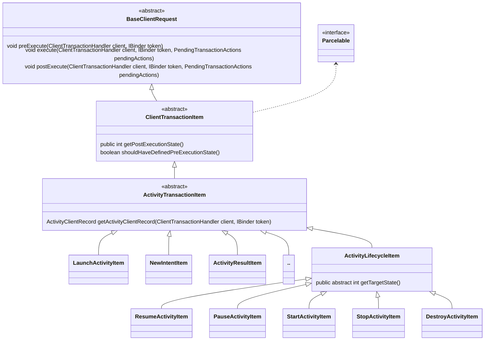
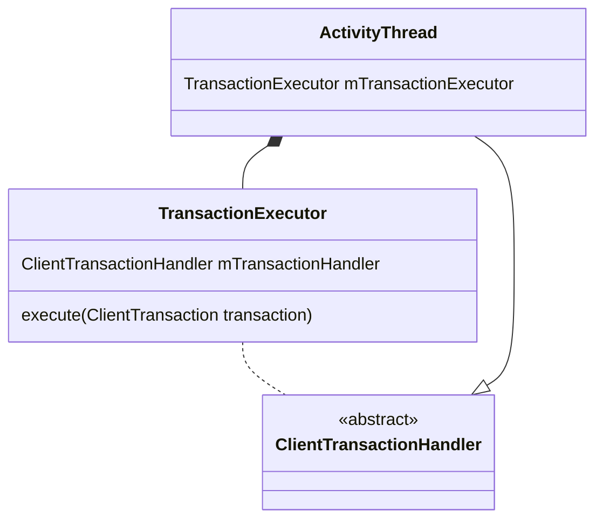
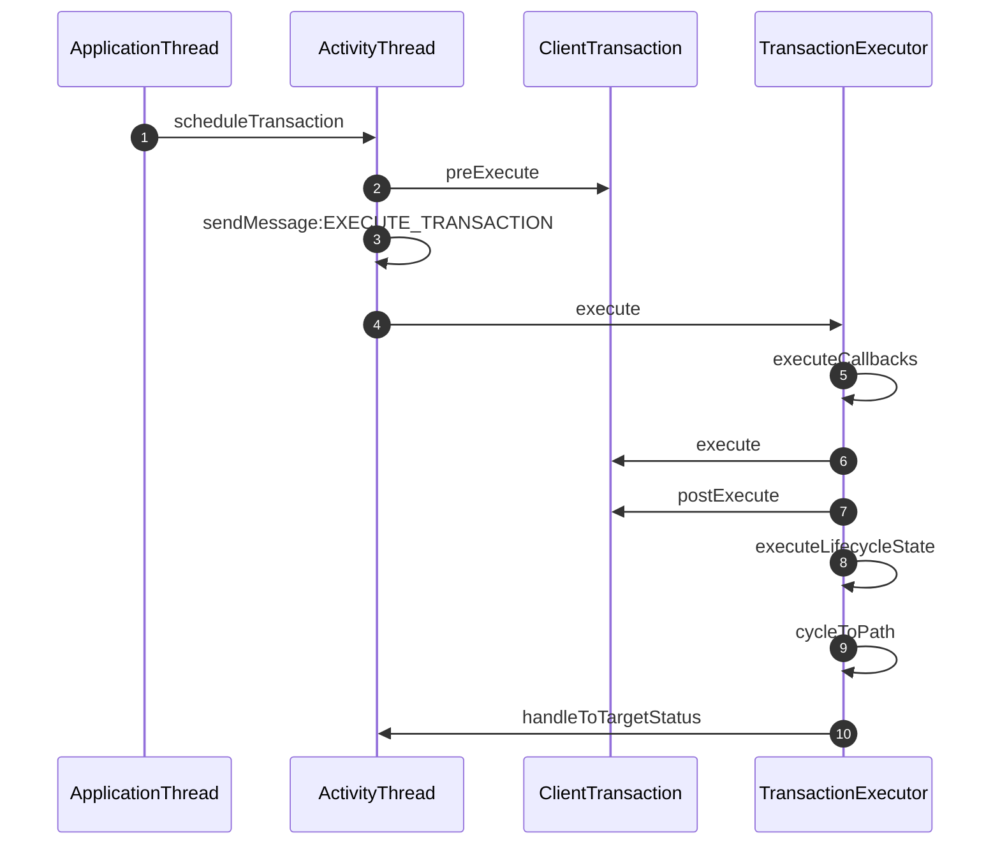

分析Android Activity的启动过程，发现Android 在Android9.0中引入了ClientTransaction这一系列的对象，来简化system_server与App进程中处理Activity启动相关的任务。这里就来分析一下。
<!--more-->


在服务端（system_server进程）主要有上面这些类,我们首先需要关注的就是`ClientTransaction`类，这个类在使用的时候主要是有以下几个成员：
```java
private List<ClientTransactionItem> mActivityCallbacks;
private ActivityLifecycleItem mLifecycleStateRequest;
private IApplicationThread mClient;
private IBinder mActivityToken;
```

`mClient`是对应的app的ApplicationThread，他是一个Binder对象，`mActivityToken`则是Activity的Binder Token,这两个在很多地方都会看到。而`mActivityCallbacks`为ClientTransactionItem对象，比如说`LaunchActivityItem`和`NewIntentItem`这些都是它的子类，同一个ClientTransactionItem中是可以有多个的。`mLifecycleStateRequest`为`ActivityLifecycleItem`，它的子类是`PauseActivityItem`、`StopActivityItem`这些，每一个是希望Activity执行到的一个状态。相关的类的类图如下：


启动Activity时候的代码调用在`ActivityTaskSupervisor`这个类的`realStartActivityLocked`方法中，代码如下：
```java
final ClientTransaction clientTransaction = ClientTransaction.obtain(  
        proc.getThread(), r.token);
clientTransaction.addCallback(LaunchActivityItem.obtain(new Intent(r.intent),  
        System.identityHashCode(r), r.info,  
        // TODO: Have this take the merged configuration instead of separate global  
        // and override configs.  
        mergedConfiguration.getGlobalConfiguration(),  
        mergedConfiguration.getOverrideConfiguration(), r.compat,  
        r.getFilteredReferrer(r.launchedFromPackage), task.voiceInteractor,  
        proc.getReportedProcState(), r.getSavedState(), r.getPersistentSavedState(),  
        results, newIntents, r.takeOptions(), isTransitionForward,  
        proc.createProfilerInfoIfNeeded(), r.assistToken, activityClientController,  
        r.shareableActivityToken, r.getLaunchedFromBubble(), fragmentToken));
final ActivityLifecycleItem lifecycleItem;  
if (andResume) {  
    lifecycleItem = ResumeActivityItem.obtain(isTransitionForward,  
            r.shouldSendCompatFakeFocus());  
} else {  
    lifecycleItem = PauseActivityItem.obtain();  
}  
clientTransaction.setLifecycleStateRequest(lifecycleItem);
mService.getLifecycleManager().scheduleTransaction(clientTransaction);
```

从上面的代码我们看到ClientTransaction以及其他的一些使用到的比较多的对象，Android系统中都做了对象池，内部基本上都是数组维护，我们这里不分析了。

启动Activity就是创建了一个LaunchActivityItem并且设置了对应的LifecycleStateRequest，最后是通过LifecycleManager调用scheduleTransaction来执行。这里的`mService`为`ActivityTaskManagerService`的实例，`lifecycleManager`为`ClientLifecycleManager`的实例，方法代码如下：
```java
void scheduleTransaction(ClientTransaction transaction) throws RemoteException {  
    final IApplicationThread client = transaction.getClient();  
    transaction.schedule();  
    if (!(client instanceof Binder)) {  
         transaction.recycle(); 
    }  
}
```

这里ClientTransaction会获取Client，也就是IApplicationThread,system_server这一端是ApplicationThread的客户端，因此schedule和recycle方法都会执行。主要看一下schedule方法：
```java
public void schedule() throws RemoteException {  
    mClient.scheduleTransaction(this);  
}
```

又调用了Client的scheduleTransaction方法，参数为我们的ClientTransaction方法，这是在客户端调用，那我们需要去服务端看这个方法的执行，实现也就是在ApplicationThread类当中。
```java
public void scheduleTransaction(ClientTransaction transaction) throws RemoteException {  
    ActivityThread.this.scheduleTransaction(transaction);  
}
```

`ActivityThread`是`ClientTransactionHandler`的子类，这个scheduleTransaction就在`ClientTransaction`当中，代码如下：
```java

void scheduleTransaction(ClientTransaction transaction) {  
    transaction.preExecute(this);  
    sendMessage(ActivityThread.H.EXECUTE_TRANSACTION, transaction);  
}

```

其中的`preExecute`方法就是直接调用了，内部实现就是分别调用所有的`activityCallback`的`preExecute`方法，以及`mLifecycleStateRequest`的`preExecute`方法，而execute没有直接调用，而是通过消息发出去了，实现就是`ActivityThread`的sendMessage，我们也都知道是用它的`H`这个Handler，可以在它的`handleMessage`中找到如下代码：
```java
case EXECUTE_TRANSACTION:  
    final ClientTransaction transaction = (ClientTransaction) msg.obj;  
    mTransactionExecutor.execute(transaction);  
    if (isSystem()) {  
        transaction.recycle();  
    }
```
可以看到这里是通过`TransactionExecutor`来调用`execute`，代码如下：
```java
public void execute(ClientTransaction transaction) {  
    final IBinder token = transaction.getActivityToken();  
    if (token != null) {  
        final Map<IBinder, ClientTransactionItem> activitiesToBeDestroyed =  
                mTransactionHandler.getActivitiesToBeDestroyed();  
        final ClientTransactionItem destroyItem = activitiesToBeDestroyed.get(token);  
        if (destroyItem != null) {  
            if (transaction.getLifecycleStateRequest() == destroyItem) {  
                 activitiesToBeDestroyed.remove(token);  
            }  
            if (mTransactionHandler.getActivityClient(token) == null) {  
                return;  
            }  
        }  
    } 
  
    executeCallbacks(transaction);  
    executeLifecycleState(transaction);  
    mPendingActions.clear();
}

public void executeCallbacks(ClientTransaction transaction) {  
    final List<ClientTransactionItem> callbacks = transaction.getCallbacks();  
    if (callbacks == null || callbacks.isEmpty()) {  
        return;  
    }  
  
    final IBinder token = transaction.getActivityToken();  
    ActivityClientRecord r = mTransactionHandler.getActivityClient(token);  
  
    final ActivityLifecycleItem finalStateRequest = transaction.getLifecycleStateRequest();  
    final int finalState = finalStateRequest != null ? finalStateRequest.getTargetState()  
            : UNDEFINED;  
    final int lastCallbackRequestingState = lastCallbackRequestingState(transaction);  
  
    final int size = callbacks.size();  
    for (int i = 0; i < size; ++i) {  
        final ClientTransactionItem item = callbacks.get(i);  
        final int postExecutionState = item.getPostExecutionState();  
  
        if (item.shouldHaveDefinedPreExecutionState()) {  
            final int closestPreExecutionState = mHelper.getClosestPreExecutionState(r,  
                    item.getPostExecutionState());  
            if (closestPreExecutionState != UNDEFINED) {  
                cycleToPath(r, closestPreExecutionState, transaction);  
            }  
        }  
  
        item.execute(mTransactionHandler, token, mPendingActions);  
        item.postExecute(mTransactionHandler, token, mPendingActions);  
        if (r == null) {  
            r = mTransactionHandler.getActivityClient(token);  
        }  
  
        if (postExecutionState != UNDEFINED && r != null) {  
            // Skip the very last transition and perform it by explicit state request instead.  
            final boolean shouldExcludeLastTransition =  
                    i == lastCallbackRequestingState && finalState == postExecutionState;  
            cycleToPath(r, postExecutionState, shouldExcludeLastTransition, transaction);  
        }  
    }  
}

```

execute中调用了executeCallbacks和executeLifecycleState这两个方法，我们上面贴出了前一个方法的代码，这里先来分析。
首先来介绍一下TransactionExecutor的一个成员变量`mTransactionHandler`我们可以发现TransactionExecutor的初始化是在ActivityThread中，这个的`mTransactionHandler`就是ActivityThread。
这里首先会先判断Activity是否需要执行到某一个状态，也就是通过`getPostExecutionState`来设置，比如NewItentItem中是有设置的，而LaunchActivityItem则不需要。如果Activity需要进入指定的状态，则会调用`cycleToPath`来执行到对应的状态，我们后面再分析。
随后就会调用item的execute方法和postExecute方法。我们就来看一下LaunchActivityItem的代码：
```java
public void execute(ClientTransactionHandler client, IBinder token,  
        PendingTransactionActions pendingActions) {  
    Trace.traceBegin(TRACE_TAG_ACTIVITY_MANAGER, "activityStart");  
    ActivityClientRecord r = new ActivityClientRecord(token, mIntent, mIdent, mInfo,  
            mOverrideConfig, mCompatInfo, mReferrer, mVoiceInteractor, mState, mPersistentState,  
            mPendingResults, mPendingNewIntents, mActivityOptions, mIsForward, mProfilerInfo,  
            client, mAssistToken, mShareableActivityToken, mLaunchedFromBubble,  
            mTaskFragmentToken);  
    client.handleLaunchActivity(r, pendingActions, null /* customIntent */);  
    Trace.traceEnd(TRACE_TAG_ACTIVITY_MANAGER);  
}
```

我们知道这里的client就是我们的ActivityThread，而这个handleLaunchActivity的实现也是在ActivityThread中实现，而启动Activity的参数都是在这个LaunchActivityItem里面的，他们通过Binder跨进程从system_server传到了app进程。这样一来原来放在ApplicationThread当中的handleLaunchActivity方法就抽离到LaunchActivity中了，ActivityThread这个文件中的很多代码就抽出去了。Activity启动的流程这里就不分析了，继续去看看后面的代码。

这里执行完了还是会检查是否需要把Activity推进到某一个状态，如果是`LaunchActivityItem`还是不需要的。我们继续去看`executeLifecycleState`的代码：
```java
private void executeLifecycleState(ClientTransaction transaction) {  
    final ActivityLifecycleItem lifecycleItem = transaction.getLifecycleStateRequest();  
    if (lifecycleItem == null) {  
        // No lifecycle request, return early.  
        return;  
    }  
  
    final IBinder token = transaction.getActivityToken();  
    final ActivityClientRecord r = mTransactionHandler.getActivityClient(token);  
  
    if (r == null) {  
        // Ignore requests for non-existent client records for now.  
        return;  
    }  
  
    // Cycle to the state right before the final requested state.  
    cycleToPath(r, lifecycleItem.getTargetState(), true /* excludeLastState */, transaction);  
  
    // Execute the final transition with proper parameters.  
    lifecycleItem.execute(mTransactionHandler, token, mPendingActions);  
    lifecycleItem.postExecute(mTransactionHandler, token, mPendingActions);  
}
```

可以看到其中还是首先调用了cycleToPath这个方法，但是我们需要注意这里这个方法的调用，`excludeLastState`这个值传的是`true`，也就是说如果我们设置的`LifecycleState`为`ResumeActivityItem`那么它会把状态设置为`ON_START`而不是`ON_RESUME`。为什么这样做呢，因为后面还会调用`lifecycleItem.execute`，在其中我们会自行把状态推进到我们需要的状态，`ResumeActivityItem`的代码如下：
```java
public void execute(ClientTransactionHandler client, ActivityClientRecord r,  
        PendingTransactionActions pendingActions) {  
    Trace.traceBegin(TRACE_TAG_ACTIVITY_MANAGER, "activityResume");  
    client.handleResumeActivity(r, true /* finalStateRequest */, mIsForward,  
            mShouldSendCompatFakeFocus, "RESUME_ACTIVITY");  
    Trace.traceEnd(TRACE_TAG_ACTIVITY_MANAGER);  
}  
  
@Override  
public void postExecute(ClientTransactionHandler client, IBinder token,  
        PendingTransactionActions pendingActions) {  
    ActivityClient.getInstance().activityResumed(token, client.isHandleSplashScreenExit(token));  
}
```

上面的代码中可以看到execute中是调用的`ActivityThread`的`handleResumeActivity`方法，从而让Activity执行resume并且进入`ON_RESUME`状态。
我们再来看一下`cycleToPath`方法：
```java
private void cycleToPath(ActivityClientRecord r, int finish, boolean excludeLastState,  
        ClientTransaction transaction) {  
    final int start = r.getLifecycleState();  
    final IntArray path = mHelper.getLifecyclePath(start, finish, excludeLastState);  
    performLifecycleSequence(r, path, transaction);  
}
```

其中首先是拿到Activity当前的状态，再通过`mHelper`拿到我们需要执行的所有状态，代码如下(异常判断代码移除了，这里关注重点)：
```java
public IntArray getLifecyclePath(int start, int finish, boolean excludeLastState) {  

  
    mLifecycleSequence.clear();  
    if (finish >= start) {  
        if (start == ON_START && finish == ON_STOP) {  
            mLifecycleSequence.add(ON_STOP);  
        } else {  
            // just go there  
            for (int i = start + 1; i <= finish; i++) {  
                mLifecycleSequence.add(i);  
            }  
        }  
    } else { // finish < start, can't just cycle down  
        if (start == ON_PAUSE && finish == ON_RESUME) {  
            // Special case when we can just directly go to resumed state.  
            mLifecycleSequence.add(ON_RESUME);  
        } else if (start <= ON_STOP && finish >= ON_START) {  
            // Restart and go to required state.  
  
            // Go to stopped state first.            for (int i = start + 1; i <= ON_STOP; i++) {  
                mLifecycleSequence.add(i);  
            }  
            // Restart  
            mLifecycleSequence.add(ON_RESTART);  
            // Go to required state  
            for (int i = ON_START; i <= finish; i++) {  
                mLifecycleSequence.add(i);  
            }  
        } else {  
            // Relaunch and go to required state  
  
            // Go to destroyed state first.            for (int i = start + 1; i <= ON_DESTROY; i++) {  
                mLifecycleSequence.add(i);  
            }  
            // Go to required state  
            for (int i = ON_CREATE; i <= finish; i++) {  
                mLifecycleSequence.add(i);  
            }  
        }  
    }  
  
    // Remove last transition in case we want to perform it with some specific params.  
    if (excludeLastState && mLifecycleSequence.size() != 0) {  
        mLifecycleSequence.remove(mLifecycleSequence.size() - 1);  
    }  
  
    return mLifecycleSequence;  
}
```

可以看到以上代码还是比较简单的，就是按照顺序把Android Activity生命周期状态，按照当前的状态和需要执行结束的状态，把需要执行的放到数组中，最后再看看最后的那个状态要不要移除掉。我们继续看`performLifecycleSequence`的代码：
```java
private void performLifecycleSequence(ActivityClientRecord r, IntArray path,  
        ClientTransaction transaction) {  
    final int size = path.size();  
    for (int i = 0, state; i < size; i++) {  
        state = path.get(i);  
        switch (state) {  
            case ON_CREATE:  
                mTransactionHandler.handleLaunchActivity(r, mPendingActions,  
                        null /* customIntent */);  
                break;  
            case ON_START:  
                mTransactionHandler.handleStartActivity(r, mPendingActions,  
                        null /* activityOptions */);  
                break;  
            case ON_RESUME:  
                mTransactionHandler.handleResumeActivity(r, false /* finalStateRequest */,  
                        r.isForward, false /* shouldSendCompatFakeFocus */,  
                        "LIFECYCLER_RESUME_ACTIVITY");  
                break;  
            case ON_PAUSE:  
                mTransactionHandler.handlePauseActivity(r, false /* finished */,  
                        false /* userLeaving */, 0 /* configChanges */,  
                        false /* autoEnteringPip */, mPendingActions,  
                        "LIFECYCLER_PAUSE_ACTIVITY");  
                break;  
            case ON_STOP:  
                mTransactionHandler.handleStopActivity(r, 0 /* configChanges */,  
                        mPendingActions, false /* finalStateRequest */,  
                        "LIFECYCLER_STOP_ACTIVITY");  
                break;  
            case ON_DESTROY:  
                mTransactionHandler.handleDestroyActivity(r, false /* finishing */,  
                        0 /* configChanges */, false /* getNonConfigInstance */,  
                        "performLifecycleSequence. cycling to:" + path.get(size - 1));  
                break;  
            case ON_RESTART:  
                mTransactionHandler.performRestartActivity(r, false /* start */);  
                break;  
            default:  
                throw new IllegalArgumentException("Unexpected lifecycle state: " + state);  
        }  
    }  
}
```

这里可以看到代码其实很简单，就是按照顺序调用`mTransactionHandler`也就是`ActivityThread`的各个生命周期需要执行的方法。

ActivityThread和TransactionExecutor的关系如下图：


这里也画一下时序图方便看代码，发送端的代码比较简单，这里只画一下接收和执行端的图


上面的分析是system_server调用，当然App进程也是可以自己调用的，比如下面的代码：
```java
private void scheduleResume(ActivityClientRecord r) {  
    final ClientTransaction transaction = ClientTransaction.obtain(this.mAppThread, r.token);  
    transaction.setLifecycleStateRequest(ResumeActivityItem.obtain(/* isForward */ false,  
            /* shouldSendCompatFakeFocus */ false));  
    executeTransaction(transaction);  
}
```

可以看到，在app进程中就直接调用TransactionExecutor的execut去执行了。
以上就是ClientTransaction的全部分析了。我也是在分析Android Activity启动的过程发现这些代码的，Activity的启动代码量巨大，在Android 9的时候把一部分代码抽离到`ClientTransaction`中去，在Android 10以后启动的相当一部分代码抽离到`ActivityTaskManagerService`中去了，让代码逻辑更清晰一点，不过绕来绕去的看代码也是很麻烦。

因此，这里先试试水，把其中的一小部分也就是`ClientTransaction`相关的先拿出来写一写。从我的角度看，为什么要抽出来`ClientTransaction`这个机制，原先所有的代码都需要在ApplicationThread中定义binder接口，而android随着各种屏幕的出现，小窗模式等等，这样的化每次有新功能都需要增加新的binder方法，而用了ClientTransaction则都可以通过`scheduleTransaction`来调用，同时ActivityThread内的代码也会有所减少，代码功能更加独立。

Android系统因为功能的代码，代码也更加复杂，很多地方因为许多的新功能多了很多逻辑判断，为我们看代码增加了难度。但是只要我们记住我们看的主线，关注我们一路传过来的值，关注我们自己会执行的那个分支，这样一路下来就可以把整个逻辑理清楚。

本文以Android13的代码分析，如果读者对照最好也是以同样版本的代码看。以上是本人关于Android代码阅读的一点分享，由于个人可能存在一些误区，难免会有理解错误，或者笔误，如有发现，欢迎指正，也欢迎读者与我交流Android技术。

(文中类图，时序图使用mermaid绘制，如果使用rss无法渲染，请点击原文查看)