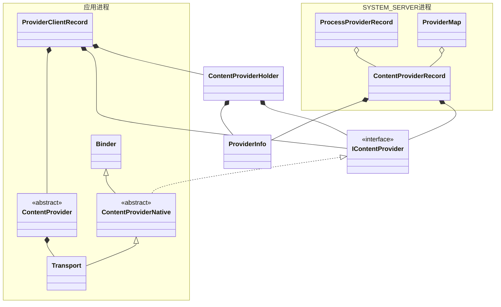
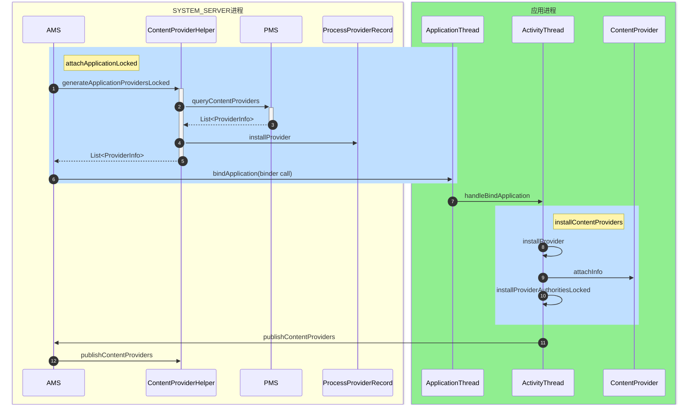

`ContentProvider`是Android应用开发的四大组件之一，并且源码相对于其他几个也是比较简单的。因此我们先来看看它的源码。`ContentProvider`的使用我们会涉及到外部程序调用应用的ContentProvider来查询数据，也有监听数据的变化，以及`ContentProvider`的安装。我们先来看安装部分的源码。
<!--more-->

`ContentProvider`根据它的名字就知道，他是一个内容提供者，它提供了整删改查的接口，方便Android应用跨应用跨进程的数据共享，在Android系统中，相册，通讯录等等都是通过`ContentProvider`来共享数据让其他应用可以使用。看源码，我们需要关注两个点，一个是`ContentProvider`如何安装的，另一个就是当我们发起一个查询的时候，是怎样和内容提供的那个进程进行交互的。

`ContentProvider`的安装触发通常有两个场景，一是外部程序需要使用`ContentProvider`的时候，另一个是在应用Application启动的时候，这个一般触发的场景有，启动Service，启动Activity。这所有场景的共同点都是拉起进程，初始化Application。这两大场景来安装`ContentProvider`除了开始的路径会有差别，后面的部分大致都相等。因此我们这里以启动App同时安装Provider作为分析路径。

`ContentProvider`相关的类有如下这些：

`PackageManager`解析出来的Provider信息通过`ProviderInfo`来保存，我们平时创建的`ContentProvider`它有一个内部类`Transport`，在它里面实现了Binder的客户端和服务端。通过它的Binder代理，AMS进程能够执行ContentProvider的增删改查，这不是本文的重点，下次再说。在App进程内，除了我们的ContentProvider对象，还会构建ProviderClientRecord对象，ContentProvider和它的binder对象和ProviderInfo信息会存在这个对象中。在服务端也有一个对应的`ContentProviderRecord`对象，里面存储了IcontentProvider binder对象和ProviderInfo。并且客户端和服务端的这些record都会存到Map中去，这样方便后续调用的时候查找。而构建所有这些record和把他们放入到Map中的过程，其实就是Provider的安装过程。

我们开始看代码，在应用进程创建完成之后，AMS会执行`attachApplicationLocked`从而来创建App的`Application`对象，因此我们从这里开始看，而进程的启动可以挖个坑以后再写。最初起点应该在`ActivityManagerService`的`attachApplicationLocked`方法中:
```java
boolean normalMode = mProcessesReady || isAllowedWhileBooting(app.info);  
List<ProviderInfo> providers = normalMode  
                                    ? mCpHelper.generateApplicationProvidersLocked(app)  
                                    : null;
...
final ProviderInfoList providerList = ProviderInfoList.fromList(providers);
thread.bindApplication(processName, appInfo,  
        app.sdkSandboxClientAppVolumeUuid, app.sdkSandboxClientAppPackage,  
        providerList, null, profilerInfo, null, null, null, testMode,  
        mBinderTransactionTrackingEnabled, enableTrackAllocation,  
        isRestrictedBackupMode || !normalMode, app.isPersistent(),  
        new Configuration(app.getWindowProcessController().getConfiguration()),  
        app.getCompat(), getCommonServicesLocked(app.isolated),  
        mCoreSettingsObserver.getCoreSettingsLocked(),  
        buildSerial, autofillOptions, contentCaptureOptions,  
        app.getDisabledCompatChanges(), serializedSystemFontMap,  
        app.getStartElapsedTime(), app.getStartUptime());
```

可以看到AMS中首先是通过`mCpHelper`去生成当前应用的Provider列表，之后调用应用进程的bindApplication的时候再带过去。`mCpHelper`是一个`ContentProviderHelper`对象，我们先来看看它的`generateApplicationProvidersLocked`方法：
```java
List<ProviderInfo> generateApplicationProvidersLocked(ProcessRecord app) {
	final List<ProviderInfo> providers;
	providers = AppGlobals.getPackageManager().queryContentProviders(  
                    app.processName, app.uid, ActivityManagerService.STOCK_PM_FLAGS  
                        | PackageManager.GET_URI_PERMISSION_PATTERNS  
                        | PackageManager.MATCH_DIRECT_BOOT_AUTO, /*metaDataKey=*/ null)  
                .getList();
    int numProviders = providers.size();  
	final ProcessProviderRecord pr = app.mProviders;  
	pr.ensureProviderCapacity(numProviders + pr.numberOfProviders());
	for (int i = 0; i < numProviders; i++) {  
	    // NOTE: keep logic in sync with installEncryptionUnawareProviders  
	    ProviderInfo cpi = providers.get(i);  
	    boolean singleton = mService.isSingleton(cpi.processName, cpi.applicationInfo,  
            cpi.name, cpi.flags);  
	    if (singleton && app.userId != UserHandle.USER_SYSTEM) {  
	        // This is a singleton provider, but a user besides the  
	        // default user is asking to initialize a process it runs        
	        // in...  well, no, it doesn't actually run in this process,        // it runs in the process of the default user.  Get rid of it.        
		    providers.remove(i);  
	        numProviders--;  
	        i--;  
	        continue;  
	    }  
	    final boolean isInstantApp = cpi.applicationInfo.isInstantApp();  
	    final boolean splitInstalled = cpi.splitName == null || ArrayUtils.contains(  
            cpi.applicationInfo.splitNames, cpi.splitName);  
	    if (isInstantApp && !splitInstalled) {  
	        // For instant app, allow provider that is defined in the provided split apk.  
		    // Skipping it if the split apk is not installed.       
		    providers.remove(i);  
		    numProviders--;  
	        i--;  
	        continue;  
	    }  
  
	    ComponentName comp = new ComponentName(cpi.packageName, cpi.name);  
	    ContentProviderRecord cpr = mProviderMap.getProviderByClass(comp, app.userId);  
	    if (cpr == null) {  
	        cpr = new ContentProviderRecord(mService, cpi, app.info, comp, singleton);  
	        mProviderMap.putProviderByClass(comp, cpr);  
	    }  
	    pr.installProvider(cpi.name, cpr);  
	    if (!cpi.multiprocess || !"android".equals(cpi.packageName)) {   
	        app.addPackage(cpi.applicationInfo.packageName, cpi.applicationInfo.longVersionCode,  
                mService.mProcessStats);  
	    }  
	    mService.notifyPackageUse(cpi.applicationInfo.packageName,  
            PackageManager.NOTIFY_PACKAGE_USE_CONTENT_PROVIDER);  
	}  
	return providers.isEmpty() ? null : providers;
}
```
上面第三行代码为调用PackageManagerService去读取当前应用所有的ContentProvider信息并存储到ProviderInfo列表中，具体代码在`ComputerEngine`中，这里不分析了。ProviderInfo中存储了每一个ContentProvider的信息，包括它的组件名称，查询的authority，运行的进程，读写的权限等等。这里我们需要注意一下，我们在Manifest文件中声明ContentProvider的时候，是可以指定它所运行的进程的，在这个地方，我们传进来而的app也是一个`ProcessRecord`进程，它对应的是我们的一个进程的记录而不是app的记录，因此，我们拿到的ProviderInfo也是当前进程需要启动的所有进程。

随后会开启一个循环对每一个Provider做处理，在37行，通过packagename和name组合出`ComponentName`，这个和其他的构造Activity，Service等的类似。随后会尝试从`ProviderMap`中获取已经存在的记录，正常情况下这里都是空，如果一个App有多个进程，并且provider可以在多个进程运行，那么这里可能是可以拿到缓存的。

如果没有拿到缓存，我们会开始创建`ContentProviderRecord`，这是ContentProvider在AMS当中的记录，而它也会放到`ProviderMap`中，这样下次使用的时候就不需要再次创建了。

43行会调用ProcessProviderRecord的installProvider，这里只是把这条record存放到ProcessRecord的mProviders中去。

我们再回到AMS的代码中去，AMS当中会把我们的`List<ProviderInfo>`包装成一个`ProviderInfoList`对象，最后调用到ApplicationThread的bindApplication方法，从而把这些东西传递到App进程。


来到ActivityThread的源码，bindApplication会把AMS带过来的数据封装成AppBindData，通过sendMessage把传递ActivityThread类，并且调用它的`handleBindApplication`方法，其中我们会看到如下代码：
```java
Application app;
app = data.info.makeApplicationInner(data.restrictedBackupMode, null);
if (!data.restrictedBackupMode) {  
    if (!ArrayUtils.isEmpty(data.providers)) {  
        installContentProviders(app, data.providers);  
    }  
}

mInstrumentation.callApplicationOnCreate(app);
```

上面第5行就是去安装ContentProviders。第二行是去创建我们的Application，其中会调用Application的attach方法，第9行是调用Application的onCreate方法，可见ContentProvider的一些方法是在他们两之间执行的，这也是为什么很多SDK通过使用ContentProvider来初始化他们的代码。继续看installContentProviders的代码：
```java
final ArrayList<ContentProviderHolder> results = new ArrayList<>();
for (ProviderInfo cpi : providers) {
	ContentProviderHolder cph = installProvider(context, null, cpi,  
        false /*noisy*/, true /*noReleaseNeeded*/, true /*stable*/);
    if (cph != null) {  
    cph.noReleaseNeeded = true;  
    results.add(cph);  
}
}
ActivityManager.getService().publishContentProviders(  
    getApplicationThread(), results);

```

上面的代码就是去遍历每一个ContentProvider去安装，我们继续看`installProvider`的代码：
```java
ContentProvider localProvider = null;
IContentProvider provider;
if (holder == null || holder.provider == null) {
	Context c = null;  
	ApplicationInfo ai = info.applicationInfo;  
	if (context.getPackageName().equals(ai.packageName)) {  
	    c = context;  
	}
	...
	final java.lang.ClassLoader cl = c.getClassLoader();  
	LoadedApk packageInfo = peekPackageInfo(ai.packageName, true);  
	if (packageInfo == null) {  
	    // System startup case.  
	    packageInfo = getSystemContext().mPackageInfo;  
	}  
	localProvider = packageInfo.getAppFactory()  
        .instantiateProvider(cl, info.name);  
	provider = localProvider.getIContentProvider();
	
	localProvider.attachInfo(c, info);
}
...
synchronized (mProviderMap) {
	IBinder jBinder = provider.asBinder();
	if (localProvider != null) {
		ComponentName cname = new ComponentName(info.packageName, info.name);  
	
		holder = new ContentProviderHolder(info);  
		holder.provider = provider;  
		holder.noReleaseNeeded = true;  
		pr = installProviderAuthoritiesLocked(provider, localProvider, holder);  
		mLocalProviders.put(jBinder, pr);  
		mLocalProvidersByName.put(cname, pr);

	}
	
	...
}
```

以上代码简化很多，仅保留启动App安装Provider的代码。第10行到第17行的代码，为通过LoadedApk通过反射去创建ContentProvider这个对象，随后通过它拿到IContentProvider对象，也就是它的Binder对象。随后调用`attachInfo`方法：
```java
private void attachInfo(Context context, ProviderInfo info, boolean testing) {
	mCallingAttributionSource = new ThreadLocal<>();
	mContext = context;  
	if (context != null && mTransport != null) {  
	    mTransport.mAppOpsManager = (AppOpsManager) context.getSystemService(  
            Context.APP_OPS_SERVICE);  
	}  
	mMyUid = Process.myUid();  
	if (info != null) {  
	    setReadPermission(info.readPermission);  
	    setWritePermission(info.writePermission);  
	    setPathPermissions(info.pathPermissions);  
	    mExported = info.exported;  
	    mSingleUser = (info.flags & ProviderInfo.FLAG_SINGLE_USER) != 0;  
	    setAuthorities(info.authority);  
	}  

	ContentProvider.this.onCreate();
}
```

可以看到其中是为ContentProvider设置一些信息，包括它的Context，以及把Manifest上面设置的一些属性，权限之类的保存到当前这个对象中，最后会调用`onCreate`方法，这会执行我们重写时写的代码。

再回到`installProvider`方法,在28行，会创建`ContentProviderHolder`，随后调用`installProviderAuthoritiesLocked`把Provider和它所对应的authority对应，并创建`ProviderClientRecord`,代码如下：
```java
private ProviderClientRecord installProviderAuthoritiesLocked(IContentProvider provider,  
        ContentProvider localProvider, ContentProviderHolder holder) {
	final String auths[] = holder.info.authority.split(";");  
	final int userId = UserHandle.getUserId(holder.info.applicationInfo.uid);
	...
	final ProviderClientRecord pcr = new ProviderClientRecord(  
        auths, provider, localProvider, holder);
    for (String auth : auths) {  
	    final ProviderKey key = new ProviderKey(auth, userId);  
	    final ProviderClientRecord existing = mProviderMap.get(key);
	    if (existing != null) {  
		} else {  
		    mProviderMap.put(key, pcr);  
		}
	}
	return pcr;
}
```

上面的代码很简单，就是创建了`ProviderClientRecord`，其中保存了auths，我们创建的`ContentProvider`，以及`IContentProvider`，ContentProviderHolder，最后把每个authority作为key， `ProviderClientRecord`作为value，存放到了`mProviderMap`中。

上面的代码执行完之后，在installProvider中，又分别以binder对象和`ComponentName`对象为key，`ProviderClientRecord`对象为value存放到map中。

这一切做完之后，我们还需要回到`installContentProviders`方法的最后，看看第10行的代码，看代码名称是发布我们的Provider，那我们继续到AMS中去看代码,其中主要调用了如下代码：
```java
mCpHelper.publishContentProviders(caller, providers);
```
继续去ContentHelper中看代码：
```java
void publishContentProviders(IApplicationThread caller, List<ContentProviderHolder> providers) {
	synchronized (mService) {
		final ProcessRecord r = mService.getRecordForAppLOSP(caller);
		for (int i = 0, size = providers.size(); i < size; i++) {
			ContentProviderHolder src = providers.get(i);
			ContentProviderRecord dst = r.mProviders.getProvider(src.info.name);
			if (dst == null) {  
			    continue;  
			}
			ComponentName comp = new ComponentName(dst.info.packageName, dst.info.name);  
			mProviderMap.putProviderByClass(comp, dst);
			String[] names = dst.info.authority.split(";");  
			for (int j = 0; j < names.length; j++) {  
			    mProviderMap.putProviderByName(names[j], dst);  
			}
			r.addPackage(dst.info.applicationInfo.packageName,  
	        dst.info.applicationInfo.longVersionCode, mService.mProcessStats);
	        synchronized (dst) {  
			    dst.provider = src.provider;  
			    dst.setProcess(r);  
			    dst.notifyAll();  
			    dst.onProviderPublishStatusLocked(true);  
			}
		}
	}      
}

```

上面的代码第3行，通过我们传过来的`IApplicationThread`来获取到我们的进程在AMS当中对应的ProcessRecord。随后会遍历每一个`ContentProviderHolder`，检查ProcessRecord当中的Record是否都有，随后会把`ProcessRecord`当中所存储的的`CotentProviderRecord`按照类名和authority分别存储到`mProviderMap`当中，`ContentProviderHolder`会存储到`ContentProviderRecord`当中。

最后也放一下整个流程的流程图方便看代码：


至此，就执行完了所有的ContentProvider安装的工作。至于使用ContentProvider的场景，我们之后在继续分析。本文以Android13的代码分析，如果读者对照最好也是以同样版本的代码看。以上是本人关于Android代码阅读的一点分享，由于个人可能存在一些误区，难免会有理解错误，或者笔误，如有发现，欢迎指正，也欢迎读者与我交流Android技术。

(文中类图，时序图使用mermaid绘制，如果使用rss无法渲染，请点击原文查看)