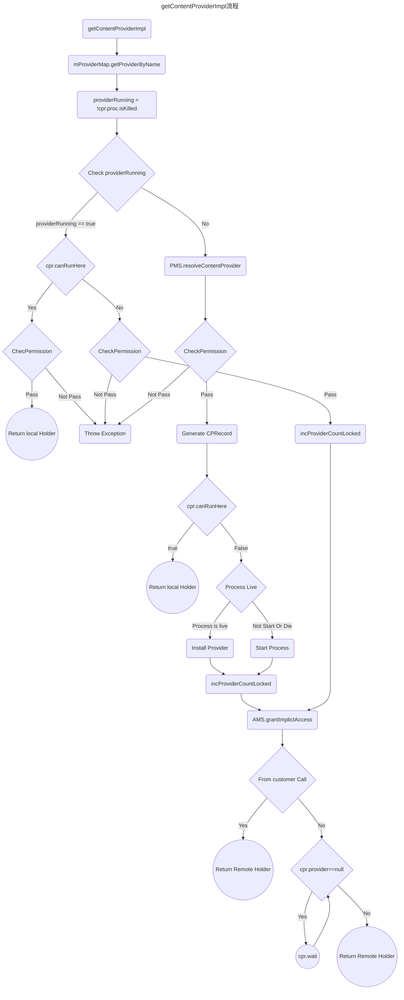

之前已经分析过在应用启动的时候安装ContentProvider的流程了，现在我们再从使用者的角度看看是怎样去拿到ContentProvider的。
<!--more-->

在使用ContentProvider的时候，我们通常会使用`Context`拿到`ContentResolver`，然后在执行CURD的操作，比如我们要查询手机中的联系人，通常会这样做：
```java
String[] projection = new String[]    {
	Profile._ID,        
	Profile.DISPLAY_NAME_PRIMARY,        
	Profile.LOOKUP_KEY,        
	Profile.PHOTO_THUMBNAIL_URI    };  
Cursor profileCursor = getContentResolver().query(
Profile.CONTENT_URI,
projection , null, null,null);
```

这里先重点分析一下拿到`ContentProvider`的过程。首先来看看这个`ContentResolver`是什么东西。通过源码我们可以看到它是一个抽象类，实现了`ContentInterface`接口，`ContentInterface`中则定义了CRUD的相关方法。我们可以在`ContextImpl`中找到`getContentResolver()`，通过源码我们知道，实际上我们拿到的是`ApplicationContentResolver`对象。

这里看完，我们可以继续看`query`方法，实现在`ContentResolver`类当中。
```java
IContentProvider unstableProvider = acquireUnstableProvider(uri);
IContentProvider stableProvider = null;  
Cursor qCursor = null;  
try {
	try {  
	    qCursor = unstableProvider.query(mContext.getAttributionSource(), uri, projection,  
            queryArgs, remoteCancellationSignal);  
	} catch (DeadObjectException e) {
		unstableProviderDied(unstableProvider);  
		stableProvider = acquireProvider(uri);  
		if (stableProvider == null) {  
		    return null;  
		}  
		qCursor = stableProvider.query(mContext.getAttributionSource(), uri, projection,  
        queryArgs, remoteCancellationSignal);
	}
	qCursor.getCount();
	final IContentProvider provider = (stableProvider != null) ? stableProvider  
        : acquireProvider(uri);  
	final CursorWrapperInner wrapper = new CursorWrapperInner(qCursor, provider);  
	stableProvider = null;  
	qCursor = null;  
	return wrapper;
} catch (RemoteException e) {
	return null;
} finally {
	if (qCursor != null) {  
	    qCursor.close();  
	}
	if (unstableProvider != null) {  
	    releaseUnstableProvider(unstableProvider);  
	}  
	if (stableProvider != null) {  
	    releaseProvider(stableProvider);  
	}
}

```

上面的代码看起来还是比较简单的，首先是是去调用`acquireUnstableProvider`拿到`unstableProvider`，通过它去取数据，如果拿不到再去调用`acquireProvider`拿`stableProvider`，最后把`stableProvider`和数据使用`CursorWrappInner`包装返回给调用者，在finally中把cursor关掉，把provider给释放掉。

我们先来看看拿`stableProvider`的逻辑：
```java
public final IContentProvider acquireUnstableProvider(Uri uri) {  
    if (!SCHEME_CONTENT.equals(uri.getScheme())) {  
        return null;  
    }  
    String auth = uri.getAuthority();  
    if (auth != null) {  
        return acquireUnstableProvider(mContext, uri.getAuthority());  
    }  
    return null;  
}
```

简单说一下，上面首先会判断我们的URL是否为`content:`开头，因为这是`ContentProvider`的scheme。之后会到url中拿到authority， autority包括这几个部分：`[userinfo@]host[:port]`
。最后通过authority去调用`ApplicationContentResolver`中的同名方法。
```java
protected IContentProvider acquireUnstableProvider(Context c, String auth) {  
    return mMainThread.acquireProvider(c,  
            ContentProvider.getAuthorityWithoutUserId(auth),  
            resolveUserIdFromAuthority(auth), false);  
}


```
上面的方法会从我们的authority分别拿出userId和host，当然userId有可能是不传的，就会默认使用当前用户。我们继续去看`ActivityThread.acquireProvider()`代码：
```java
public final IContentProvider acquireProvider(  
        Context c, String auth, int userId, boolean stable) {  
    final IContentProvider provider = acquireExistingProvider(c, auth, userId, stable);  
    if (provider != null) {  
        return provider;  
    }
    ContentProviderHolder holder = null;
    final ProviderKey key = getGetProviderKey(auth, userId);
    try {
	    synchronized (key) {
		    holder = ActivityManager.getService().getContentProvider( getApplicationThread(), c.getOpPackageName(), auth, userId, stable);
		    if (holder != null && holder.provider == null && !holder.mLocal) {
			    synchronized (key.mLock) {
				    if(key.mHolder != null) {
				    } else {
					    key.mLock.wait(ContentResolver.CONTENT_PROVIDER_READY_TIMEOUT_MILLIS)
				    }
				    holder = key.mHolder;
			    }
		    }
	    }
    } finally {
	    synchronized (key.mLock) {  
		    key.mHolder = null;  
		}
    }
    holder = installProvider(c, holder, holder.info, true, holder.noReleaseNeeded, stable);
    return holder.provider;
}
```


这里我们有一个参数`stable`，因此我们前面获取`stableProvider`和`unstableProvider`都会走到这个方法里面来。
第3行代码，我们首先会到已存在的Provider列表中去拿，代码如下：
```java
public final IContentProvider acquireExistingProvider(  
        Context c, String auth, int userId, boolean stable) {  
    synchronized (mProviderMap) {  
        final ProviderKey key = new ProviderKey(auth, userId);  
        final ProviderClientRecord pr = mProviderMap.get(key);  
        if (pr == null) {  
            return null;  
        }  
  
        IContentProvider provider = pr.mProvider;  
        IBinder jBinder = provider.asBinder();  
        if (!jBinder.isBinderAlive()) {  
	        //处理Binder不存活的情况
            handleUnstableProviderDiedLocked(jBinder, true);  
            return null;  
        }  
  
        ProviderRefCount prc = mProviderRefCountMap.get(jBinder);  
        if (prc != null) {  
            incProviderRefLocked(prc, stable);  //增加引用计数
        }  
        return provider;  
    }  
}
```
可以看到此处为通过auth构建出来的key到`mProviderMap`中查找`ProviderClientRecord`，而这个就是我们之前分析安装Provider时候所创建并且放置到这个map中去的。后面会检查Binder是否仍然存活，并返回。
在这里我们需要注意一点，如果安装我们之前分析安装的流程，我们在自己的app里面拿自己的`ContentProvider`这里是肯定可以拿到的，但是如果是其他的应用提供的`ContentProvider`这里很显然是拿不到的。因此我们需要继续回到`acquireProvider`方法去看其他部分的代码。

在第11行中，我们会到AMS中去获取`ContentProviderHolder`，如果拿到了远端的holder，但是我们本地的ProviderKey中的holder为空，说明我们本地还没有安装这个ContentProvider，需要等待，也就是执行第16行代码进入等待状态。而这个地方的解除等待在`ContentProviderHelper`类的`publishContentProviders`方法中，可以去之前分析安装过程的文章最后一部分查看。

而拿到holder之后，最后又去执行了一次`installProvider`方法，这里的安装跟我们之前的启动App安装是有一些不同的，我们放到后面再来分析。

然而前面的去AMS拿`ContentProviderHolder`代码我们还没有看，具体代码也仍然在`ContentProviderHelper`中，现在去看一下它的`getContentProviderImpl()`方法，内容比较长，先一点一点的贴代码：

```java
//ContentProviderHelper.java getContentProviderImpl
synchronized (mService) {
	ProcessRecord r = null;  
	if (caller != null) {  
	    r = mService.getRecordForAppLOSP(caller);
    }

	UserManagerService userManagerService = UserManagerService.getInstance();
	if (!isAuthorityRedirectedForCloneProfile(name)  
        || !userManagerService.isMediaSharedWithParent(userId)) {  //。mediastore需要特殊判断，这里会把那些情况给过滤掉
	    cpr = mProviderMap.getProviderByName(name, userId);  
	}
	...
	
	ProcessRecord dyingProc = null;  
	if (cpr != null && cpr.proc != null) {  
	    providerRunning = !cpr.proc.isKilled(); //检查ContentProvider目标进程是否被杀掉
	    if (cpr.proc.isKilled() && cpr.proc.isKilledByAm()) {   
		    dyingProc = cpr.proc;   //如果被杀了或者正在被杀就记录
		}
	}

	if (providerRunning) {
		cpi = cpr.info;
		if (r != null && cpr.canRunHere(r)) {
			checkAssociationAndPermissionLocked(r, cpi, callingUid, userId, checkCrossUser,  
	        cpr.name.flattenToShortString(), startTime);
	        ContentProviderHolder holder = cpr.newHolder(null, true);
	        holder.provider = null;
			return holder;
		}
		//PLACEHOLDER1
	}
	//PLACEHOLDER2
}

```

以上的代码是我们会遇到的第一种情况，首先去拿到进程`ProcessRecord`，之后根据Provider的authority name和userId到ProviderMap中拿已有的`ContentProviderRecord`。拿到之后首先检查ContentProvider提供方的进程是否正在运行中，如果在运行中，并且`canRunHere`检查为true， 就会检查是否有权限来执行，有权限就会创建一个`ContentProviderHolder`传递出去。
`canRunHere`所做的判断代码如下：
```java
public boolean canRunHere(ProcessRecord app) {  
    return (info.multiprocess || info.processName.equals(app.processName))  
            && uid == app.info.uid;  
}
```
解释下就是首先判断Provider是否支持多个进程中运行，也就是在Manifest为provider配置了`multiprocess=true`，另外检查Provider所在进程和当前调用是否为同一个进程，这两者条件满足一个就可以。同时还要满足当前进程的UID和Provider的进程UID相同，这个在两者为同一个应用，或者两者共享签名，或共享UID的情况下满足。这种情况下就可以直接使用ContentProvider。这种情况会创建新的ContentProviderHolder传递到App进程，其中会携带ContentProviderRecord过去。此时我们看到的传到App进程的`ContentProviderConnection`也是为空，至于这个对象的用处是什么我们后面会分析。同时还会把Holder的成员provider设置为空，这个有什么用呢，可以后面再看`installProvider`方法。

在这里还有一个检查权限和是否可以联合运行的方法`checkAssociationAndPermissionLocked`，代码如下：
```java
if ((msg = checkContentProviderAssociation(callingApp, callingUid, cpi)) != null) {  
    throw new SecurityException("Content provider lookup " + cprName  
            + " failed: association not allowed with package " + msg);  
}

if ((msg = checkContentProviderPermission(  
            cpi, Binder.getCallingPid(), Binder.getCallingUid(), userId, checkUser,  
            callingApp != null ? callingApp.toString() : null))  
        != null) {  
    throw new SecurityException(msg);  
}

```

里面又分别调用了两个方法，第一个用于检查两个进程是否可以联合使用，默认是允许的，除非是系统内置应用或者预装应用会有比较严格的检查，我们这里不必关注。可以去看一下权限检查，这个比较重要：
```java
private String checkContentProviderPermission(ProviderInfo cpi, int callingPid, int callingUid,  
        int userId, boolean checkUser, String appName) {  
    boolean checkedGrants = false;  
    if (checkUser) { //对于普通应用这个值传过来的为true
	    int tmpTargetUserId = mService.mUserController.unsafeConvertIncomingUser(userId);  
		if (tmpTargetUserId != UserHandle.getUserId(callingUid)) {  
			//检查是否有临时授权，这个一般是在Manifest中添加<grant-uri-permission>或者android:grantUriPermissions
		    if (mService.mUgmInternal.checkAuthorityGrants(  
            callingUid, cpi, tmpTargetUserId, checkUser)) {  
		        return null;  //检查通过直接返回成功
		    }  
		    checkedGrants = true; 
		}
		userId = mService.mUserController.handleIncomingUser(callingPid, callingUid, userId,  
        false, ActivityManagerInternal.ALLOW_NON_FULL,  
        "checkContentProviderPermissionLocked " + cpi.authority, null);
        if (userId != tmpTargetuserId) {
	        checkGrants = false;
        }
    }
    if (ActivityManagerService.checkComponentPermission(cpi.readPermission,  
        callingPid, callingUid, cpi.applicationInfo.uid, cpi.exported)  
        == PackageManager.PERMISSION_GRANTED) {  //检查读权限，授权过返回
	    return null;  
	}
	if (ActivityManagerService.checkComponentPermission(cpi.writePermission,  
        callingPid, callingUid, cpi.applicationInfo.uid, cpi.exported)  
        == PackageManager.PERMISSION_GRANTED) {  //写权限检查，授权过则返回成功
	    return null;  
	}
	PathPermission[] pps = cpi.pathPermissions;  
if (pps != null) {  
    int i = pps.length;  
    while (i > 0) {  
        i--;  
        PathPermission pp = pps[i];  
        String pprperm = pp.getReadPermission();  
        if (pprperm != null && ActivityManagerService.checkComponentPermission(pprperm,  
                callingPid, callingUid, cpi.applicationInfo.uid, cpi.exported)  
                == PackageManager.PERMISSION_GRANTED) {  
            return null;  
        }  
        String ppwperm = pp.getWritePermission();  
        if (ppwperm != null && ActivityManagerService.checkComponentPermission(ppwperm,  
                callingPid, callingUid, cpi.applicationInfo.uid, cpi.exported)  
                == PackageManager.PERMISSION_GRANTED) {  
            return null;  
        }  
    }  
}
    
}

```

关于权限，前面的代码我已经加了相关的注释，我们可以对比[官方文档](https://developer.android.com/guide/topics/providers/content-provider-creating?hl=zh-cn#Permissions),其中共检查了四种权限，分别是临时授权，路径授权，单独的读写授权和单一读写程序级别的授权。关于权限检查的更多内容，这里我们也先略过。此时我们可以继续回来继续分析`getContentProviderImpl`方法。我们继续看上面留的PLACEHOLDER 1处的代码：

```java
checkAssociationAndPermissionLocked(r, cpi, callingUid, userId, checkCrossUser, 
        cpr.name.flattenToShortString(), startTime);
conn = incProviderCountLocked(r, cpr, token, callingUid, callingPackage,  
        callingTag, stable, true, startTime, mService.mProcessList,  
        expectedUserId);
        
```

其中还有一些关于OOM设置的代码这里先跳过了，上面主要的代码也是检查权限以及这个`incProviderCountLocked`方法：
```java
private ContentProviderConnection incProviderCountLocked(ProcessRecord r,  
        final ContentProviderRecord cpr, IBinder externalProcessToken, int callingUid,  
        String callingPackage, String callingTag, boolean stable, boolean updateLru,  
        long startTime, ProcessList processList, @UserIdInt int expectedUserId) {  
    final ProcessProviderRecord pr = r.mProviders;  
    for (int i = 0, size = pr.numberOfProviderConnections(); i < size; i++) {  
        ContentProviderConnection conn = pr.getProviderConnectionAt(i);  
        if (conn.provider == cpr) {  
            conn.incrementCount(stable);  
            return conn;  
        }  
    }  
  
    ContentProviderConnection conn = new ContentProviderConnection(cpr, r, callingPackage,  
            expectedUserId);  
    conn.startAssociationIfNeeded();  
    conn.initializeCount(stable);  
    cpr.connections.add(conn);  
    if (cpr.proc != null) {  
        cpr.proc.mProfile.addHostingComponentType(HOSTING_COMPONENT_TYPE_PROVIDER);  
    }  
    pr.addProviderConnection(conn);  
    mService.startAssociationLocked(r.uid, r.processName, r.mState.getCurProcState(),  
            cpr.uid, cpr.appInfo.longVersionCode, cpr.name, cpr.info.processName);  
    if (updateLru && cpr.proc != null  
            && r.mState.getSetAdj() <= ProcessList.PERCEPTIBLE_LOW_APP_ADJ) {  
        processList.updateLruProcessLocked(cpr.proc, false, null);  
    }  
    return conn;  
}
```

这里有不少关于Association相关的代码，而我们的应用一般不会走到这里。我们只需要关注其中创建`Connection`以及为他创建引用计数。关于它的计数，我们放到最好再看一下。

PLACEHOLDER 2处，首先处理的就是provider为运行的情况，这种情况就会回到Provider的进程去安装ContentProvider，这部分代码我们之前已经分析过了，这里略过。而我们是在使用者进程调用的此处的caller也不为空，再往后，则应该是如下的代码：
```java
mService.grantImplicitAccess(userId, null, callingUid,  
        UserHandle.getAppId(cpi.applicationInfo.uid));

if (caller != null) {
	synchronized (cpr) {  
	    if (cpr.provider == null) {  
	        if (cpr.launchingApp == null) {  
	            return null;  
	        }  
  
	        if (conn != null) {  
	            conn.waiting = true;  
	        }  
	    }  
	} 
	return cpr.newHolder(conn, false);
}
```
这里可以看到，就是先给调用的uid授权，设置wait 为`true`,创建一个ContentProviderHolder返回。这里是带着`ContentProviderConnection`和`IContentProvider`的。

代码讲解的部分只介绍了我们认为caller不为空的情况，实际上是更加复杂的，这里就把其中的完整流程流程图放在这里，如有需要可参考流程图以及之前的App启动时候的`ContentProvider`安装一起看。



看了这么多，我们就可以继续回去看App进程的代码了。在App进程就是执行我们前面说的installProvider过程。
我们可以继续分析query的过程，看代码我们知道调用的是`IContentProvider`的query方法,对于同UID的进程，`IContentProvider`为我们在`instalProvider`创建的本地的ContentProvider中的`mTransport`而其他的则是`AMS`调用带过来的`IcontentProvider`远端接口，我们这里以非本进程的情况来分析，它的获取是如下代码：
```java
//android.content.ContentProviderNative.java
static public IContentProvider asInterface(IBinder obj)  
{  
    if (obj == null) {  
        return null;  
    }  
    IContentProvider in =  
        (IContentProvider)obj.queryLocalInterface(descriptor);  
    if (in != null) {  
        return in;  
    }  
  
    return new ContentProviderProxy(obj);  
}
```

也就是说，如果是相同的UID的进程拿到的为`Transport`对象，如果是其他的则拿到的是`ContentProviderProxy`对象。

前面我们还有关于`ContentProviderConnection`还有很多东西没有介绍，这里继续看一下。首先是`incProviderCountLocked`方法中所调用的`conn.incrementCount(stable)`。在我看代码的过程中stable这个变量唯有这里使用了，我们继续看它的源码：
```java
public int incrementCount(boolean stable) {  
    synchronized (mLock) {  
        if (stable) {  
            mStableCount++;  
            mNumStableIncs++;  
        } else {  
            mUnstableCount++;  
            mNumUnstableIncs++;  
        }  
        return mStableCount + mUnstableCount;  
    }  
}
```
可以看到这个类主要记录了Stable和UnStable的调用次数，实际上AMS这一端stable和unstable似乎除了计数之外没有什么区别。但是在客户端`installProvider`的时候却是有区别的。我们之前分析的启动时候安装的情况stable都是为`true`，我们可以看看`ActivityThread.installProvider`如下的代码：
```java
if (noReleaseNeeded) {  
    prc = new ProviderRefCount(holder, client, 1000, 1000);  
} else {  
    prc = stable  
            ? new ProviderRefCount(holder, client, 1, 0)  
            : new ProviderRefCount(holder, client, 0, 1);  
}  
mProviderRefCountMap.put(jBinder, prc);
```
`ProviderRefCount`用于记录Provider的引用计数，其中用stableCount和unstableCount来计数，当我们不需要释放Provider的时候，两个数字都设置为了1000，当我们是stable的时候只设置stable数为1，unstable数量为0，当为unstable的时候也同理。之前我们是有看到对于已经存在的provider是通过`incProviderRefLocked`来增加起计数的。那我们有了增加计数，那么使用完之后也应该需要减少计数。在query的`finally`代码块中有如下代码：
```java
if (unstableProvider != null) {  
    releaseUnstableProvider(unstableProvider);  
}  
if (stableProvider != null) {  
    releaseProvider(stableProvider);  
}
```
他们最终调用的为`ActivityThread.releaseProvider`方法：
```java
public final boolean releaseProvider(IContentProvider provider, boolean stable) {  
    if (provider == null) {  
        return false;  
    }  
  
    IBinder jBinder = provider.asBinder();  
    synchronized (mProviderMap) {  
        ProviderRefCount prc = mProviderRefCountMap.get(jBinder);  
        if (prc == null) {  
            // The provider has no ref count, no release is needed.  
            return false;  
        }  
  
        boolean lastRef = false;  
        if (stable) {  
            if (prc.stableCount == 0) {  
                return false;  
            }  
            prc.stableCount -= 1;  
            if (prc.stableCount == 0) {  
                lastRef = prc.unstableCount == 0;  
                try {  
                   
                    ActivityManager.getService().refContentProvider(  
                            prc.holder.connection, -1, lastRef ? 1 : 0);  
                } catch (RemoteException e) {  
                    //do nothing content provider object is dead any way  
                }  
            }  
        } else {  
            if (prc.unstableCount == 0) {  
                return false;  
            }  
            prc.unstableCount -= 1;  
            if (prc.unstableCount == 0) {  
                lastRef = prc.stableCount == 0;  
                if (!lastRef) {  
                    try {  
                    
                        ActivityManager.getService().refContentProvider(  
                                prc.holder.connection, 0, -1);  
                    } catch (RemoteException e) {  
                        //do nothing content provider object is dead any way  
                    }  
                }  
            }  
        }  

        return true;  
    }  
}
```

代码主要分了两个分支，分别对stable和unstable的情况进行处理，他们都是先把本地对应的`ProviderRefCount`中的数字减一，但是调用`AMS.refContentProvider`却不一样，stable count减为0的时候会直接调用，而unstable为0的时候要stableCount不为0才会调用。传递的参数也有区别，代码很简单就不详解了。直接去看`ContentProviderHelper`的`refContentProvider`方法。
```java
boolean refContentProvider(IBinder connection, int stable, int unstable) {  
    ContentProviderConnection conn;  
    try {  
        conn = (ContentProviderConnection) connection;  
    } catch (ClassCastException e) {  
        
    }  
    if (conn == null) {  
        throw new NullPointerException("connection is null");  
    }  
  
    try {  
        conn.adjustCounts(stable, unstable);  
        return !conn.dead;  
    } finally {  
        
    }
}
```
这里的代码其实比较简单，就是调用`ContentProviderConnection`的`adjustCounts`，这个方法的代码如下：
```java
public void adjustCounts(int stableIncrement, int unstableIncrement) {  
    synchronized (mLock) {  
        if (stableIncrement > 0) {  
            mNumStableIncs += stableIncrement;  
        }  
        final int stable = mStableCount + stableIncrement;  
        if (stable < 0) {  
            throw new IllegalStateException("stableCount < 0: " + stable);  
        }  
        if (unstableIncrement > 0) {  
            mNumUnstableIncs += unstableIncrement;  
        }  
        final int unstable = mUnstableCount + unstableIncrement;  
        if (unstable < 0) {  
            throw new IllegalStateException("unstableCount < 0: " + unstable);  
        }  
        if ((stable + unstable) <= 0) {  
            throw new IllegalStateException("ref counts can't go to zero here: stable="  
                                            + stable + " unstable=" + unstable); 
        }  
        mStableCount = stable;  
        mUnstableCount = unstable;  
    }  
}
```
这里就是来根据传过来的参数来调整`stableCount`和`unstableCount`，也就完成了这几个count的变化。也就是完成了AMS端的减少计数。

到此位置，我们也就拿到了`IContentProvider`，也就可以使用它提供的`CRUD`方法，进行数据的增删改查了。至于具体是如何查询数据，如何做到数据的跨进程共享，如何绕过Binder传输限制1MB实现跨进程传输数据，限于篇幅下次再来分析。

