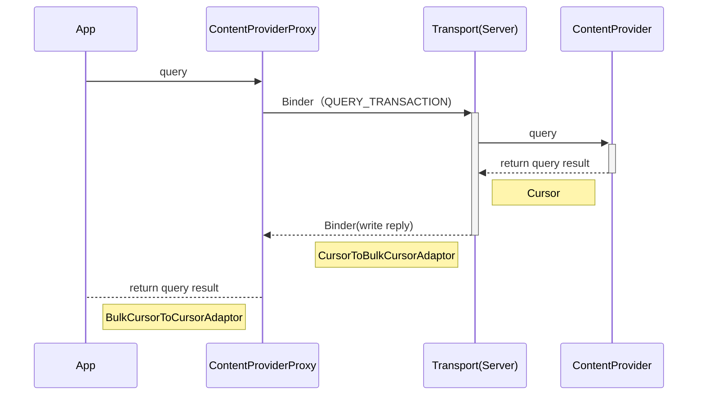
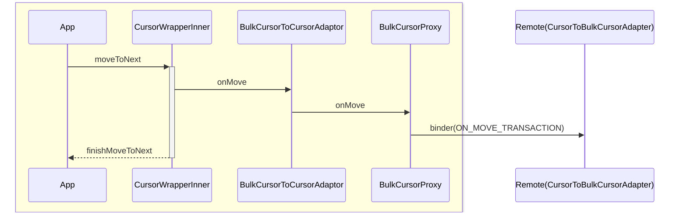
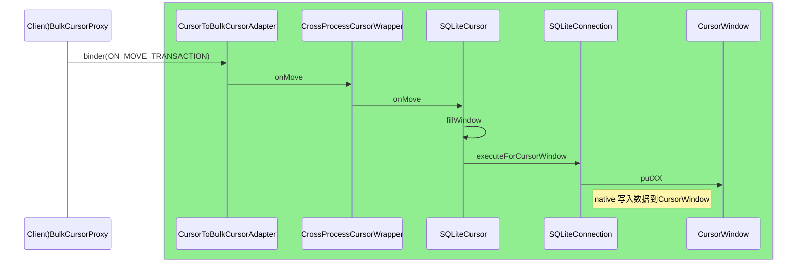

之前已经分析了启动应用安装ContentProvider，使用时获取ContentProvider，我们这里再分析一下使用ContentProvider查询数据已经监听ContentProvider数据变化的情况。
<!--more-->

### 查询数据
上次的文章已经介绍了使用`query`的方法，并且已经介绍完了通过`acquireProvider`获取到`ContentProvider`，如果是是本地应用的话拿到的是`Transport`对象，如果是查询其他应用（不严谨的说法，其他应用也要排查userId不同，且不共享签名），则拿到的是`ContentProviderProxy`，这里我们要分析的查询是其他应用的情况，因此我们需要关注`ContentProviderProxy`的`query`方法。
```java
@Override  
public Cursor query(@NonNull AttributionSource attributionSource, Uri url,  
        @Nullable String[] projection, @Nullable Bundle queryArgs,  
        @Nullable ICancellationSignal cancellationSignal)  
        throws RemoteException {  
    BulkCursorToCursorAdaptor adaptor = new BulkCursorToCursorAdaptor();  
    Parcel data = Parcel.obtain();  
    Parcel reply = Parcel.obtain();  
    try {  
        data.writeInterfaceToken(IContentProvider.descriptor);  
  
        attributionSource.writeToParcel(data, 0);  
        url.writeToParcel(data, 0);  
        int length = 0;  
        if (projection != null) {  
            length = projection.length;  
        }  
        data.writeInt(length);  
        for (int i = 0; i < length; i++) {  
            data.writeString(projection[i]);  
        }  
        data.writeBundle(queryArgs);  
        data.writeStrongBinder(adaptor.getObserver().asBinder());  
        data.writeStrongBinder(  
                cancellationSignal != null ? cancellationSignal.asBinder() : null);  
  
        mRemote.transact(IContentProvider.QUERY_TRANSACTION, data, reply, 0);  
  
        DatabaseUtils.readExceptionFromParcel(reply);  
  
        if (reply.readInt() != 0) {  
            BulkCursorDescriptor d = BulkCursorDescriptor.CREATOR.createFromParcel(reply);  
            Binder.copyAllowBlocking(mRemote, (d.cursor != null) ? d.cursor.asBinder() : null);  
            adaptor.initialize(d);  
        } else {  
            adaptor.close();  
            adaptor = null;  
        }  
        return adaptor;  
    } catch (RemoteException ex) {  
        adaptor.close();  
        throw ex;  
    } catch (RuntimeException ex) {  
        adaptor.close();  
        throw ex;  
    } finally {  
        data.recycle();  
        reply.recycle();  
    }  
}
```

这个代码比较简单，把需要查询的条件写入到Parcel中，然后通过mRemote进行binder调用，在reply中拿到远端执行的结果。如果执行成功了，则通过`BulkCursorDescriptor`来读取reply中的数据，主要是拿到了其中IBulkCursor的Binder对象和CursorWindow这个对象。在查询的流程中会涉及到很多的类，我这里画了使用端和服务端会使用到的Cursor所涉及到相关类和接口。


其中`BulkCursorToCursorAdapter`为客户端使用，用于读取服务端通过binder传过来的数据，其中的封装和使用，我们后面还会继续看到。关于服务端的我们先继续往后看代码，随后会涉及到相关的类。

可以看看Provider服务端是如何把这些东西放到reply中的。我们这个时候可以看一下`ContentProviderNative`的`onTransact`的`QUERY_TRANSACTION`的这一分支：

```java
data.enforceInterface(IContentProvider.descriptor);  
  
AttributionSource attributionSource = AttributionSource.CREATOR  
        .createFromParcel(data);  
Uri url = Uri.CREATOR.createFromParcel(data);  
  
// String[] projection  
int num = data.readInt();  
String[] projection = null;  
if (num > 0) {  
    projection = new String[num];  
    for (int i = 0; i < num; i++) {  
        projection[i] = data.readString();  
    }  
}  
  
Bundle queryArgs = data.readBundle();  
IContentObserver observer = IContentObserver.Stub.asInterface(  
        data.readStrongBinder());  
ICancellationSignal cancellationSignal = ICancellationSignal.Stub.asInterface(  
        data.readStrongBinder());  
```
这是其中的第一部分代码，就是把binder传过来的查询需要的数据进行反序列化。
```java
Cursor cursor = query(attributionSource, url, projection, queryArgs,  
        cancellationSignal);
```
第二部分为调用query进行查询，我们知道在数据提供端，其实是`Transport`，可以看看它的`query`方法。
```java
@Override  
public Cursor query(@NonNull AttributionSource attributionSource, Uri uri,  
        @Nullable String[] projection, @Nullable Bundle queryArgs,  
        @Nullable ICancellationSignal cancellationSignal) {  
    uri = validateIncomingUri(uri);  
    uri = maybeGetUriWithoutUserId(uri);  
    if (enforceReadPermission(attributionSource, uri)  
            != PermissionChecker.PERMISSION_GRANTED) {  
        if (projection != null) {  
            return new MatrixCursor(projection, 0);  
        }  
  
       Cursor cursor;  
        final AttributionSource original = setCallingAttributionSource(  
                attributionSource);  
        try {  
            cursor = mInterface.query(  
                    uri, projection, queryArgs,  
                    CancellationSignal.fromTransport(cancellationSignal));  
        } catch (RemoteException e) {  
            throw e.rethrowAsRuntimeException();  
        } finally {  
            setCallingAttributionSource(original);  
        }  
        if (cursor == null) {  
            return null;  
        }  
  
        // Return an empty cursor for all columns.  
        return new MatrixCursor(cursor.getColumnNames(), 0);  
    }  
    traceBegin(TRACE_TAG_DATABASE, "query: ", uri.getAuthority());  
    final AttributionSource original = setCallingAttributionSource(  
            attributionSource);  
    try {  
        return mInterface.query(  
                uri, projection, queryArgs,  
                CancellationSignal.fromTransport(cancellationSignal));  
    } catch (RemoteException e) {  
        throw e.rethrowAsRuntimeException();  
    } finally {  
        setCallingAttributionSource(original);  
        Trace.traceEnd(TRACE_TAG_DATABASE);  
    }  
}
```

其中的代码也是比较简单的，首先调用`enforceReadPermission`检查是否有使用这个`ContentProvider`的权限，如果有权限则调用`mInterface.query`，我们看源码就知道，这个`mInterface`也就是一个`ContentProvider`，也就是我们开发过程实现的那个`ContentProvider`，query方法也就是我们自己的实现。

我们先不着急分析后面的代码，我们前面说过如果是本进程的ContentProvider查询会直接调用`Transport`的`query`方法，那么就不存在binder调用，而是直接调用了我们所实现的query。这个实现还是很妙的，值得我们学习。对于我们跨进程的调用，还需要看`ContentProviderNative`的`onTransact`后面的代码，也就是我们要说的第三部分：
```java
if (cursor != null) {  
    CursorToBulkCursorAdaptor adaptor = null;  
  
    try {  
        adaptor = new CursorToBulkCursorAdaptor(cursor, observer,  
                getProviderName());  
        cursor = null;  
  
        BulkCursorDescriptor d = adaptor.getBulkCursorDescriptor();  
        adaptor = null;  
  
        reply.writeNoException();  
        reply.writeInt(1);  
        d.writeToParcel(reply, Parcelable.PARCELABLE_WRITE_RETURN_VALUE);  
    } finally {  
        // Close cursor if an exception was thrown while constructing the adaptor.  
        if (adaptor != null) {  
            adaptor.close();  
        }  
        if (cursor != null) {  
            cursor.close();  
        }  
    }  
} else {  
    reply.writeNoException();  
    reply.writeInt(0);  
}
```

这里在拿到数据的时候，通过`CursorToBulkCursorAdapter`把刚刚查询到Cursor进行了包装，并且通过BulkCursorDescriptor写入到reply中。这样我们刚刚调用端就可以拿到了。
我们看`CursorToBulkCursorAdapter`可以看到，它的内部又用`CrossProcessCursorWrapper`来对Cursor进行了封装。

我们已经完成查询，并且获取到Cursor的封装，接下来我们就可以看一下数据的读取了。通过我们前面的Cursor的各个相关类的关系图，我们知道在客户端我们所拿到的是`BulkCursorToCursorAdapter`,它的初始化代码如下：
```java
public void initialize(BulkCursorDescriptor d) {  
    mBulkCursor = d.cursor;  
    mColumns = d.columnNames;  
    mWantsAllOnMoveCalls = d.wantsAllOnMoveCalls;  
    mCount = d.count;  
    if (d.window != null) {  
        setWindow(d.window);  
    }  
}
```

以下为服务端和客户端交互的流程时序图,通过这个图我们可以具体看到查询过程服务端和客户端交互，以及两边封装的类：


### 服务端传输数据到调用端

可以知道我们主要从服务端拿到两个东西，一个是`BulkCursor`它是后面我们的数据移动的Binder操作类，`CursorWindow`则用来存放当前位置的数据。当我们调用`Cursor`的`moveToNext`的时候，就会调用`BulkCursorToCursorAdapter`的`onMove`方法，进而又会通过binder调用`CursorToBulkCursorAdapter`的`onMove`方法，代码如下：
```java
@Override  
public boolean onMove(int oldPosition, int newPosition) {  
    throwIfCursorIsClosed();  
  
    try {  
        if (mWindow == null  
                || newPosition < mWindow.getStartPosition()  
                || newPosition >= mWindow.getStartPosition() + mWindow.getNumRows()) {  
            setWindow(mBulkCursor.getWindow(newPosition));  
        } else if (mWantsAllOnMoveCalls) {  
            mBulkCursor.onMove(newPosition);  
        }  
    } catch (RemoteException ex) {   
        return false;  
    }  
  
    if (mWindow == null) {  
        return false;  
    }  
  
    return true;  
}
```


当window还没有初始化的时候，会调用`setWindow`，`setWindow`很简单，但是`mBulkCursor.getWindow`却不简单：
```java
@Override  
public CursorWindow getWindow(int position) {  
    synchronized (mLock) {  
        throwIfCursorIsClosed();  
  
        if (!mCursor.moveToPosition(position)) {  
            closeFilledWindowLocked();  
            return null;  
        }  
  
        CursorWindow window = mCursor.getWindow();  
        if (window != null) {  
            closeFilledWindowLocked();  
        } else {  
            window = mFilledWindow;  
            if (window == null) {  
                mFilledWindow = new CursorWindow(mProviderName);  
                window = mFilledWindow;  
            } else if (position < window.getStartPosition()  
                    || position >= window.getStartPosition() + window.getNumRows()) {  
                window.clear();  
            }  
            mCursor.fillWindow(position, window);  
        }  
  
        if (window != null) {  
	        window.acquireReference();  
        }  
        return window;  
    }  
}
```

我们可以看到此处会调用`fillWindow`,而此处的`mCursor`为`CrossProcessCursorWrapper`的实例，`fillWindow`则会调用如下代码：
```java
@Override  
public void fillWindow(int position, CursorWindow window) {  
    if (mCursor instanceof CrossProcessCursor) {  
        final CrossProcessCursor crossProcessCursor = (CrossProcessCursor)mCursor;  
        crossProcessCursor.fillWindow(position, window);  
        return;  
    }  
  
    DatabaseUtils.cursorFillWindow(mCursor, position, window);  
}
```

这样就会把每一个postion的数据填充到`CursorWindow`当中，但是这样会有个问题，为什么客户端能直接拿到呢。我们可以看看`CursorWindow`的内部。
```java
public CursorWindow(String name, @BytesLong long windowSizeBytes) {  
    if (windowSizeBytes < 0) {  
        throw new IllegalArgumentException("Window size cannot be less than 0");  
    }  
    mStartPos = 0;  
    mName = name != null && name.length() != 0 ? name : "<unnamed>";  
    mWindowPtr = nativeCreate(mName, (int) windowSizeBytes);  
    if (mWindowPtr == 0) {  
        throw new AssertionError(); 
    }  
    mCloseGuard.open("CursorWindow.close");  
}
```
我们从这里可以看到，CursorWindow保存数据并没有直接放在java中的，而是在natvie中实现的。我们可以在`CursorWindow.cpp`中找到`nativeCreate`的实现，我们在其中会发现如下的代码：
```c++
//CursorWindow::create
status_t CursorWindow::create(const String8 &name, size_t inflatedSize, CursorWindow **outWindow) {  
    *outWindow = nullptr;  
  
    CursorWindow* window = new CursorWindow();  
    if (!window) goto fail;  
  
    window->mName = name;  
    window->mSize = std::min(kInlineSize, inflatedSize);  
    window->mInflatedSize = inflatedSize;  
    window->mData = malloc(window->mSize);  
    if (!window->mData) goto fail;  
    window->mReadOnly = false;  
  
    window->clear();  
    window->updateSlotsData();  
  
    *outWindow = window;  
    return OK;  
  
fail:  
    LOG(ERROR) << "Failed create";  
fail_silent:  
    delete window;  
    return UNKNOWN_ERROR;  
}
```
但是直接用内存的话，如果我们改变CursorWindow内的数据的时候，在使用端是没办法直接拿到更新的数据的。其实在给插入数据的时候，调用`maybeInflate`。
```c++
status_t CursorWindow::maybeInflate() {  
    int ashmemFd = 0;  
    void* newData = nullptr;  
  
    // Bail early when we can't expand any further  
    if (mReadOnly || mSize == mInflatedSize) {  
        return INVALID_OPERATION;  
    }  
  
    String8 ashmemName("CursorWindow: ");  
    ashmemName.append(mName);  
  
    ashmemFd = ashmem_create_region(ashmemName.string(), mInflatedSize);  
    ...
  
    newData = ::mmap(nullptr, mInflatedSize, PROT_READ | PROT_WRITE, MAP_SHARED, ashmemFd, 0);  
    ...
  
    {  
        // Migrate existing contents into new ashmem region  
        uint32_t slotsSize = sizeOfSlots();  
        uint32_t newSlotsOffset = mInflatedSize - slotsSize;  
        memcpy(static_cast<uint8_t*>(newData),  
                static_cast<uint8_t*>(mData), mAllocOffset);  
        memcpy(static_cast<uint8_t*>(newData) + newSlotsOffset,  
                static_cast<uint8_t*>(mData) + mSlotsOffset, slotsSize);  
  
        free(mData);  
        mAshmemFd = ashmemFd;  
        mData = newData;  
        mSize = mInflatedSize;  
        mSlotsOffset = newSlotsOffset;  
  
        updateSlotsData();  
    }  
  
    return OK;  
...
}
```
从代码可以看到，当我们不是只读模式，且size不是和inflateSize相同的时候，会去创建匿名内存，把原来的数据复制的新的匿名内存中去。而会把匿名内存的FD保存到`mAshmemFd`当中。这样在客户端就可以拿到这个fd，从而可以读取到数据。因为这样做，也只是把fd和CursorWindow的一些基本信息从服务端传到了Client，这样服务端往匿名内存中写数据，客户端也就可以拿到其中的数据了。这样做既可以减少Binder调用的数据量，也可以解决掉Binder传输有1MB的限制。为了验证我们的想法，可以看看代码：
```c++
status_t CursorWindow::writeToParcel(Parcel* parcel) {  
    LOG(DEBUG) << "Writing to parcel: " << this->toString();  
  
    if (parcel->writeString8(mName)) goto fail;  
    if (parcel->writeUint32(mNumRows)) goto fail;  
    if (parcel->writeUint32(mNumColumns)) goto fail;  
    if (mAshmemFd != -1) {  
        if (parcel->writeUint32(mSize)) goto fail;  
        if (parcel->writeBool(true)) goto fail;  
        if (parcel->writeDupFileDescriptor(mAshmemFd)) goto fail;  
    } else {  
        // Since we know we're going to be read-only on the remote side,  
        // we can compact ourselves on the wire.        size_t slotsSize = sizeOfSlots();  
        size_t compactedSize = sizeInUse();  
        if (parcel->writeUint32(compactedSize)) goto fail;  
        if (parcel->writeBool(false)) goto fail;  
        void* dest = parcel->writeInplace(compactedSize);  
        if (!dest) goto fail;  
        memcpy(static_cast<uint8_t*>(dest),  
                static_cast<uint8_t*>(mData), mAllocOffset);  
        memcpy(static_cast<uint8_t*>(dest) + compactedSize - slotsSize,  
                static_cast<uint8_t*>(mData) + mSlotsOffset, slotsSize);  
    }  
    return OK;  
  
fail:  
    LOG(ERROR) << "Failed writeToParcel";  
fail_silent:  
    return UNKNOWN_ERROR;  
}
```
可以看到在服务端转成Parcel的时候，是写入了name，numRow，numColumn, size, ashMemFd这些，同样，在客户端也会读取这些东西。代码就不贴了。

下面再理一下执行onMoveToNext时候的流程。在客户端的调用如下：


服务端的调用如下,前面的onMove调用在使用SQLiteCursor的时候会有一些不同，这里以读取SQLite数据库为例，内容有简化：


### ContentObserver监听的注册
当我们想要监听一个ContentProvider的变化时，可以按照如下的方法创建一个`ContentObserver`，并调用`registerContentObserver`来注册监听，通过传入的Uri来设置指定的数据源，通过Uri的path可以设置监听指定数据源中的某一部分数据的变化。
```kotlin
val contentObserver = object: ContentObserver(Handler.getMain()) {  
    override fun onChange(selfChange: Boolean) {  
        super.onChange(selfChange)  
        //do something while receive onChange  
    }  
}  
contentResolver.registerContentObserver(Uri.parse("content://sms"), true, contentObserver)
```
我们继承的这个`ContentObserver`有一个内部类`Transport`，它实现了 `IContentObserver.Stub`， 这个和`ContentProvider`的内部类实现类似，也是实现了binder的数据交互。`registerContentObserver`方法也在`ContentResolver`中，代码如下：
```java
public final void registerContentObserver(Uri uri, boolean notifyForDescendents,  
        ContentObserver observer, @UserIdInt int userHandle) {  
    try {  
        getContentService().registerContentObserver(uri, notifyForDescendents,  
                observer.getContentObserver(), userHandle, mTargetSdkVersion);  
    } catch (RemoteException e) {  
        throw e.rethrowFromSystemServer();  
    }  
}
```

可以看到上面的代码调用了`ContentService`的`registerContentObserver`方法，这里拿到的是一个binder接口的实现`IContentService`的代理类，在binder另一端真正执行这个方法的是在`ContentService`中，代码如下：
```java
@Override  
public void registerContentObserver(Uri uri, boolean notifyForDescendants,  
        IContentObserver observer, int userHandle, int targetSdkVersion) {  
    final int uid = Binder.getCallingUid();  
    final int pid = Binder.getCallingPid();  
    userHandle = handleIncomingUser(uri, pid, uid,  
            Intent.FLAG_GRANT_READ_URI_PERMISSION, true, userHandle);  
  
    final String msg = LocalServices.getService(ActivityManagerInternal.class)  
            .checkContentProviderAccess(uri.getAuthority(), userHandle);  
    ...
    synchronized (mRootNode) {  
        mRootNode.addObserverLocked(uri, observer, notifyForDescendants, mRootNode,  
                uid, pid, userHandle);  
    }  
}
```
服务端的主要代码如上，其中传过来的observer为`IContentObserver`，它就是我们刚刚说到的和Transport相同的接口。其中主要就是调用了`mRootNode.addObserverLocked`，`mRootNode`是内部类`ObserverNode`的实例。继续看代码之前先介绍一下这个类，这个类内部又有`ObserverEntry`内部类，我们的`Observer`会存放到这个Entry内部。`ObserverNode`有两个成员`mChildren`和`mObservers`,分别表示子一级的`ObserverNode`和当前路径级的`ObserverEntry`，从而组成了如下的树状结构。


从`addObserverLocked`这个方法的代码我们也能知晓该树状结构的构成，代码如下：
```java
private void addObserverLocked(Uri uri, int index, IContentObserver observer,  
                               boolean notifyForDescendants, Object observersLock,  
                               int uid, int pid, int userHandle) {  
    // If this is the leaf node add the observer  
    if (index == countUriSegments(uri)) {  
        mObservers.add(new ObserverEntry(observer, notifyForDescendants, observersLock,  
                uid, pid, userHandle, uri));  
        return;  
    }  
  
    // Look to see if the proper child already exists  
    String segment = getUriSegment(uri, index);  
    if (segment == null) {  
        throw new IllegalArgumentException("Invalid Uri (" + uri + ") used for observer");  
    }  
    int N = mChildren.size();  
    for (int i = 0; i < N; i++) {  
        ObserverNode node = mChildren.get(i);  
        if (node.mName.equals(segment)) {  
            node.addObserverLocked(uri, index + 1, observer, notifyForDescendants,  
                    observersLock, uid, pid, userHandle);  
            return;  
        }  
    }  
  
    // No child found, create one  
    ObserverNode node = new ObserverNode(segment);  
    mChildren.add(node);  
    node.addObserverLocked(uri, index + 1, observer, notifyForDescendants,  
            observersLock, uid, pid, userHandle);  
}
```

这样操作完，也就完成了添加`Observer`的操作。
### 数据更新的发布与分发
那数据更新的部分呢，当我们执行了数据整删改之后，需要调用如下代码通知数据变化：
```java
getContext().getContentResolver().notifyChange(uri, null);
```

这个`notifyChange`方法有几个实现，最终会调用到如下这个：
```java
public void notifyChange(@NonNull Uri[] uris, ContentObserver observer, @NotifyFlags int flags,  
        @UserIdInt int userHandle) {  
    try {  
        getContentService().notifyChange(  
                uris, observer == null ? null : observer.getContentObserver(),  
                observer != null && observer.deliverSelfNotifications(), flags,  
                userHandle, mTargetSdkVersion, mContext.getPackageName());  
    } catch (RemoteException e) {  
        throw e.rethrowFromSystemServer();  
    }  
}
```
其中`getContentService`会获取到`IContentService`在本地的代理，而最终会通过Binder调用到system_server中的`ContentService`中的`notifyChange`方法：
```java
@Override  
public void notifyChange(Uri[] uris, IContentObserver observer,  
        boolean observerWantsSelfNotifications, int flags, int userId,  
        int targetSdkVersion, String callingPackage) {  
  
    final int callingUid = Binder.getCallingUid();  
    final int callingPid = Binder.getCallingPid();  
    final int callingUserId = UserHandle.getCallingUserId();  
  
    
    final ObserverCollector collector = new ObserverCollector();  
  
   
  
    for (Uri uri : uris) {  
        final int resolvedUserId = handleIncomingUser(uri, callingPid, callingUid,  
                Intent.FLAG_GRANT_WRITE_URI_PERMISSION, true, userId);  
        final Pair<String, Integer> provider = Pair.create(uri.getAuthority(), resolvedUserId);  
        if (!validatedProviders.containsKey(provider)) {  
            final String msg = LocalServices.getService(ActivityManagerInternal.class)  
                    .checkContentProviderAccess(uri.getAuthority(), resolvedUserId);  
            if (msg != null) {  
                if (targetSdkVersion >= Build.VERSION_CODES.O) {  
                    throw new SecurityException(msg);  
                } else {  
                    if (msg.startsWith("Failed to find provider")) {  
                        // Sigh, we need to quietly let apps targeting older API  
                      } else {  
                        Log.w(TAG, "Ignoring notify for " + uri + " from "  
                                + callingUid + ": " + msg);  
                        continue;  
                    }  
                }  
            }  
  
            // Remember that we've validated this access  
            final String packageName = getProviderPackageName(uri, resolvedUserId);  
            validatedProviders.put(provider, packageName);  
        }  
  
        synchronized (mRootNode) {  
            final int segmentCount = ObserverNode.countUriSegments(uri);  
            mRootNode.collectObserversLocked(uri, segmentCount, 0, observer,  
                    observerWantsSelfNotifications, flags, resolvedUserId, collector);  
        }  
    }  
  
    final long token = clearCallingIdentity();  
    try {  
        // Actually dispatch all the notifications we collected  
        collector.dispatch();  
        .....
        }  
    } finally {  
        Binder.restoreCallingIdentity(token);  
    }  
}
```

以上代码略有简化，只保留了和ContentObserver通知相关的代码，SyncManager相关的代码未放在这里。这段代码最开始是先遍历传入的Uri列表，对检查对应Uri的`ContentProvider`是否有权限，如果有权限则会调用`collectObserversLocked`把满足条件的`Observer`放到`ObserverCollector`中去，代码如下:
```java
//ObserverNode.collectObserversLocked
public void collectObserversLocked(Uri uri, int segmentCount, int index,  
        IContentObserver observer, boolean observerWantsSelfNotifications, int flags,  
        int targetUserHandle, ObserverCollector collector) {  
    String segment = null;  
    if (index >= segmentCount) {  
        // This is the leaf node, notify all observers  
        collectMyObserversLocked(uri, true, observer, observerWantsSelfNotifications,  
                flags, targetUserHandle, collector);  
    } else if (index < segmentCount){  
        segment = getUriSegment(uri, index);  
        // Notify any observers at this level who are interested in descendants 
        collectMyObserversLocked(uri, false, observer, observerWantsSelfNotifications,  
                flags, targetUserHandle, collector);  
    }  
  
    int N = mChildren.size();  
    for (int i = 0; i < N; i++) {  
        ObserverNode node = mChildren.get(i);  
        if (segment == null || node.mName.equals(segment)) {  
            // We found the child,  
            node.collectObserversLocked(uri, segmentCount, index + 1, observer,  
                    observerWantsSelfNotifications, flags, targetUserHandle, collector);  
            if (segment != null) {  
                break;  
            }  
        }  
    }  
}
```
传入的segmentCount为Uri的path的数量加上authority的数量，比如`content://sms/inbox`这个uri它的segmentCount就是2，而从外面传如的index为0。它会先调用`collectMyObserversLocked`方法来遍历当前Node层级的`ObserverEntry`,代码如下：
```java
private void collectMyObserversLocked(Uri uri, boolean leaf, IContentObserver observer,  boolean observerWantsSelfNotifications, int flags, int targetUserHandle, ObserverCollector collector) {  
    int N = mObservers.size();  
    IBinder observerBinder = observer == null ? null : observer.asBinder();  
    for (int i = 0; i < N; i++) {  
        ObserverEntry entry = mObservers.get(i);   
       boolean selfChange = (entry.observer.asBinder() == observerBinder);  
        if (selfChange && !observerWantsSelfNotifications) {  
            continue;  
        }  
  
        // Does this observer match the target user?  
        if (targetUserHandle == UserHandle.USER_ALL  
                || entry.userHandle == UserHandle.USER_ALL  
                || targetUserHandle == entry.userHandle) {  
            // Make sure the observer is interested in the notification  
            if (leaf) {  
                 if ((flags&ContentResolver.NOTIFY_SKIP_NOTIFY_FOR_DESCENDANTS) != 0  && entry.notifyForDescendants) {  
                    continue;  
                }  
            } else {  
                if (!entry.notifyForDescendants) {  
                    continue;  
                }  
            }   
            collector.collect(entry.observer, entry.uid, selfChange, uri, flags,  targetUserHandle);  
        }  
    }  
}
```

可以看到以上代码就是遍历我们之前注册observer时候的`mObservers`列表，分别检查了用户id是否相等，是否满足`notifyForDescendants`和flag等参数后调用`collector.collect`方法。
```java
public void collect(IContentObserver observer, int uid, boolean selfChange, Uri uri,  
        int flags, int userId) {  
    final Key key = new Key(observer, uid, selfChange, flags, userId);  
    List<Uri> value = collected.get(key);  
    if (value == null) {  
        value = new ArrayList<>();  
        collected.put(key, value);  
    }  
    value.add(uri);  
}
```
Collector中则是以observer,uid,selfChange，flag,userId组合成key,Uri作为value放入`collected`map中。而这些只是完成了一个层级的Observer收集，`collectObserversLocked`方法中还会遍历`mChildren`,找到其中的name与segment相同的子Node，再进行收集。收集完成之后，则是调用`collector.dispatch()`，看名字就知道是去通知对应的`Observer`，具体实现逻辑如下：
```java
public void dispatch() {  
    for (int i = 0; i < collected.size(); i++) {  
        final Key key = collected.keyAt(i);  
        final List<Uri> value = collected.valueAt(i);  
  
        final Runnable task = () -> {  
            try {  
                key.observer.onChangeEtc(key.selfChange,  
                        value.toArray(new Uri[value.size()]), key.flags, key.userId);  
            } catch (RemoteException ignored) {  
            }  
        };      
        final boolean noDelay = (key.flags & ContentResolver.NOTIFY_NO_DELAY) != 0;  
        final int procState = LocalServices.getService(ActivityManagerInternal.class)  
                .getUidProcessState(key.uid);  
        if (procState <= ActivityManager.PROCESS_STATE_IMPORTANT_FOREGROUND || noDelay) {  
            task.run();  
        } else {  
            BackgroundThread.getHandler().postDelayed(task, BACKGROUND_OBSERVER_DELAY);  
        }  
    }  
}
```

这个方法则是遍历collected这个ArrayMap，从每一个key当中取出observer，并使用`Runnable`封装，在根据flags和当前的进程状态决定是立即通知变化还是延迟通知变化。而这里所调用的`onChangeEtc`则会通过Binder调用，从而调用到客户端的Observer。

这便完成了`ContentProvider`内容变化的通知。

### 总结
本文介绍了使用`ContentProvider`进行数据的查询、查处来的数据进行窗口移动、注册数据变化监听以及数据变化接受这几块的代码分析，加上前面两篇关于`ContentProvider`的文章，基本上可以对于`ContentProvider`整个体系有详细的了解。整删改查这四种操作中，查是比较复杂的，把它看完，增删改这三种流程，想要看明白就会简单很多，因此这里也便不再分析了。

从Android `ContentProvider`的设计和代码实现中我们可以学到很多东西。其中之一是前面介绍到`IContentProvider`在自己调用和其他App调用的区别，以及对于代码的巧妙封装，使得代码的实现比较优雅，同时代码量比较少，对于同UID应用来说性能又比较优。另外就是通过CursoWindow的实现，突破Binder数据传输的限制。ObserverNode中使用树来实现了Observer监听。

当然这只是我的一人之言，因为关注点不同，在看代码的过程中还是会有一些细节被我忽略，但是可能对于其他人来说又比较重要的。如果你对`ContentProvider`也有自己的见解，又或是我有错误的解读，欢迎留言交流。
