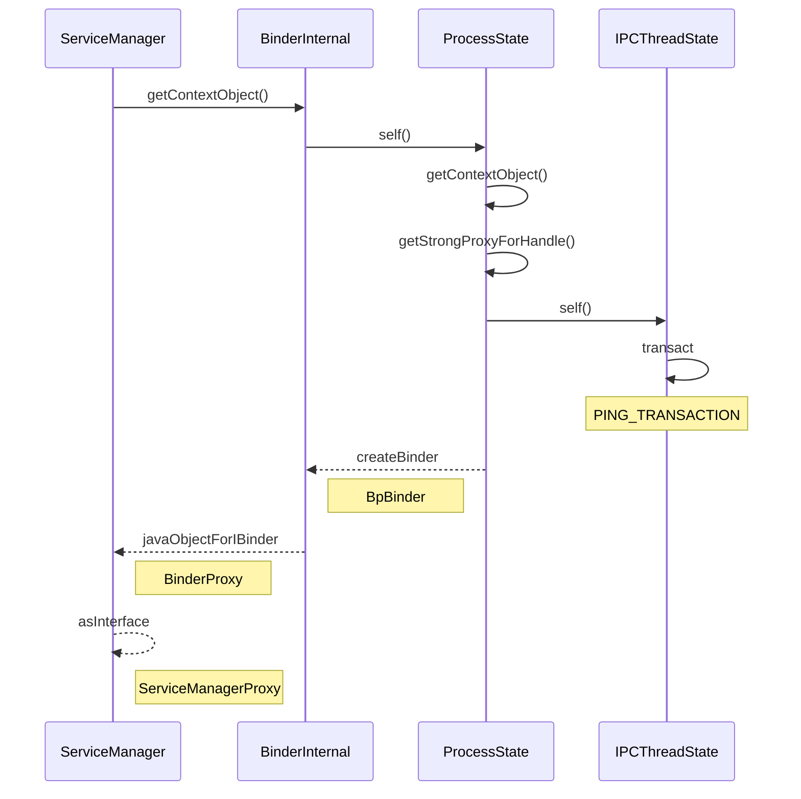

阅读Android系统源码，Binder是绕不过去的东西，前面看ContentProvider，Activity都有Binder的身影，因此决定还是先把Binder的部分看一看。本文主要简单介绍一下Binder的历史和它的基本架构，介绍Binder的ServiceManager我们在使用的时候如何去拿到它，同时推荐一些Binder的学习资料。
<!--more-->

### Binder简介

对于普通的Android的应用开发来说，进程的概念是被弱化的。这得益于系统已经帮助我们把Activity,ContentProvider,Broadcast,Service等涉及到跨进程的组件做了很好的封装。我们知道Android也是基于Linux进行开发的，那比如存在跨进程，也就必然存在跨进程通讯。Linux当中跨进程通讯常常使用共享内存、信号量、管道等方式，不过Android中为了安全和使用的便利性，则大部分地方都是使用了Binder。

Binder并不是新提出来的一套跨进程通信机制，它是基于OpenBinder实现的。Binder最早是Be公司开发的， George Hoffman需要一种机制让Be的互联网设备的Javascript UI层与地秤系统服务发生交互，边开发了Binder。后来Be公司的工程师加入了PalmSource开发Palm OS，再后来加入Android，Binder也一直被他们采用，并且也在一直演化，对这段历史感兴趣的话，可以看看《[安卓传奇：Android缔造团队回忆录](https://book.douban.com/subject/36149272/)》这本书。开源的OpenBinder是可以工作在Linux内核中的，在2015年已经被合并到Linux 内核3.19版本当中，不仅仅Android，华为的鸿蒙系统当中也在使用Binder。

### Binder基本架构


Android中的Binder包括Binder驱动，ServiceManager，Binder服务，他们的关系大概如上图所示。Binder驱动位于Linux内核层，它主要用于实现多个进程之间的通信。ServiceManager位于Android Framework层，用于Binder服务的注册和查找，相当于网络服务中的DNS。而Binder服务的Server端和Client端就是典型的C/S架构，它们通过Binder驱动来进行交互。Android中有两种Binder服务，一种是类似于AMS，PMS这种的系统服务，它们是有名称的服务，注册在ServiceManager当中，Client可以通过名称查找到他们进行使用。还存在另一种匿名Binder服务，比如我们自己通过AIDL创建的，这种我们会直接通过其他的Binder服务把Binder引用传递到客户端，从而双方可以进行通讯。

Binder驱动的源码是在Linux当中的，暂时先不关注了。我这里主要会去看Android Framework层当中Binder相关的代码。ServiceManager本身也是一个Binder，它的ID为0，因此可以很简单的拿到，它的初始化我就不关注了。首先会去关注我们在应用层如何去拿到ServiceManager，因为只有拿到它才能够使用它去注册Binder和获取Binder。其实我们再去看看ServiceManger的`addService`如何注册一个Binder服务，以及`getService` 如何获取一个Binder服务。这些看完之后，我们也就知道了Binder的完整运行过程，因为`addService`和`getService`本身也是binder调用，其中我们也会分析Framwork调用kernel相关的代码。最后我们再看看匿名Binder，AIDL,这样差不多就可以对于Framework层的Binder有了全面的了解。

### 获取ServiceManager

ServiceManager本身是存在一个单独的进程的，并且是在系统启动的时候就启动了它。而我们在其他进程想要通过它来注册服务或者获取服务，就需要首先拿到它的`Ibinder`对象。通常会用如下的方式获取：

```java
private static IServiceManager getIServiceManager() {  
    if (sServiceManager != null) {  
        return sServiceManager;  
    }  
  
    // Find the service manager  
    sServiceManager = ServiceManagerNative  
            .asInterface(Binder.allowBlocking(BinderInternal.getContextObject()));  
    return sServiceManager;  
}
```

上面的代码首先会拿本地的缓存，拿不到才会真正调用获取ServiceManager的步骤，我们先看看这个`BinderInternal.getContextObject()`方法，它是一个native方法，它的实现在`base/core/jni/android_util_Binder.cpp`当中，代码如下：

```c++
static jobject android_os_BinderInternal_getContextObject(JNIEnv* env, jobject clazz)  
{  
    sp<IBinder> b = ProcessState::self()->getContextObject(NULL);  
    return javaObjectForIBinder(env, b);  
}
```

首先调用`ProcessState::self()`来拿到`ProcessState`实例,它内部会执行如下代码：

```c++
sp<ProcessState> ProcessState::init(const char *driver, bool requireDefault)  
{  
  
    if (driver == nullptr) {  
        std::lock_guard<std::mutex> l(gProcessMutex);  
        if (gProcess) {  
            verifyNotForked(gProcess->mForked);  
        }  
        return gProcess;  
    }  
  
    [[clang::no_destroy]] static std::once_flag gProcessOnce;  
    std::call_once(gProcessOnce, [&](){  
        if (access(driver, R_OK) == -1) {  
            driver = "/dev/binder";  
        }  
  
        int ret = pthread_atfork(ProcessState::onFork, ProcessState::parentPostFork,  
                                 ProcessState::childPostFork);  //注册fork进程的监听
        LOG_ALWAYS_FATAL_IF(ret != 0, "pthread_atfork error %s", strerror(ret));  
  
        std::lock_guard<std::mutex> l(gProcessMutex);  
        gProcess = sp<ProcessState>::make(driver);  //智能指针初始化
    });  
  
    if (requireDefault) {
	    ... 
    }  
  
    verifyNotForked(gProcess->mForked);  
    return gProcess;  
}
```

上面的代码传入的参数driver值为`/dev/binder`也就是binder驱动的地址，requireDefault为`false`。上面的代码中的`std:call_once`方法为android的libc所提供，就是保证下面的代码段只会执行一次，这个实现也就是为了实现单例，和Java代码中的其实是差不多的。代码中的`make`方法内部实际会调用`ProcessState`的构造方法，代码如下：

```c++
ProcessState::ProcessState(const char* driver)  
      : mDriverName(String8(driver)),  
        mDriverFD(-1),  
        mVMStart(MAP_FAILED),  
        mThreadCountLock(PTHREAD_MUTEX_INITIALIZER),  
        mThreadCountDecrement(PTHREAD_COND_INITIALIZER),  
        mExecutingThreadsCount(0),  
        mWaitingForThreads(0),  
        mMaxThreads(DEFAULT_MAX_BINDER_THREADS),  
        mStarvationStartTimeMs(0),  
        mForked(false),  
        mThreadPoolStarted(false),  
        mThreadPoolSeq(1),  
        mCallRestriction(CallRestriction::NONE) {  
    base::Result<int> opened = open_driver(driver);  
  
    if (opened.ok()) {  
        mVMStart = mmap(nullptr, BINDER_VM_SIZE, PROT_READ, MAP_PRIVATE | MAP_NORESERVE, opened.value(), 0);  
        if (mVMStart == MAP_FAILED) {  
            close(opened.value());    //mmap失败，关闭binder文件描述符
            opened = base::Error()  
                    << "Using " << driver << " failed: unable to mmap transaction memory.";  
            mDriverName.clear();  
        }  
    }  
    verifyNotForked(gProcess->mForked); //检查当前的实例不是fork之后的只进程的实例否则报错
    if (opened.ok()) {  
        mDriverFD = opened.value();  //记录binder的文件描述符
    }  
}
```

`open_driver`内部就是调用linux的系统调用`open`打开binder驱动，并通过`ioctl`获取驱动打开状态以及进行驱动的一些设置如最大线程数等，这里就查看相关代码了。

打开驱动后又会调用`mmap`把进行内存映射并保存内存指针到`mVMStart`上，其中内存映射的大小为`BINDER_VM_SIZE`，定义如下：

```c++
#define BINDER_VM_SIZE ((1 * 1024 * 1024) - sysconf(_SC_PAGE_SIZE) * 2)
#define _SC_PAGE_SIZE           0x0028
```

其中`sysconf(_SC_PAGE_SIZE)`之前的值为4k，最新的Android 15改成了16K，那我们这里仍然以来版本计算，可以得到值为1016Kb,这也就是我们使用Binder交互时候数据传输的限制。

这里我们拿到了binder的文件描述符，也完成了内存映射，也就完成了`ProcessState`的初始化。`ProcessState`这个对象如它的名字，在每个进程当中只会有一个实例。

有了实例我们又可以继续看`getContextObject`，主要代码如下：

```c++
sp<IBinder> ProcessState::getContextObject(const sp<IBinder>& /*caller*/)  
{  
    sp<IBinder> context = getStrongProxyForHandle(0);  
  
    if (context) {  
          internal::Stability::markCompilationUnit(context.get());  //更新Binder的Stability，展示可以跳过
    } 
    return context;  
}
```

上面主要关注`getStrongProxyForHandle(0)`，这里传入的id为0，也就是专属于`ServiceManager`的，此方法代码如下：

```c++
ProcessState::handle_entry* ProcessState::lookupHandleLocked(int32_t handle)  
{  
    const size_t N=mHandleToObject.size();  
    if (N <= (size_t)handle) {  
        handle_entry e;  
        e.binder = nullptr;  
        e.refs = nullptr;  
        status_t err = mHandleToObject.insertAt(e, N, handle+1-N);  
        if (err < NO_ERROR) return nullptr;  
    }  
    return &mHandleToObject.editItemAt(handle);  
}


sp<IBinder> ProcessState::getStrongProxyForHandle(int32_t handle)  
{  
    sp<IBinder> result;  
  
    AutoMutex _l(mLock);  
  
    handle_entry* e = lookupHandleLocked(handle);  
  
    if (e != nullptr) {  
        IBinder* b = e->binder;  
        if (b == nullptr || !e->refs->attemptIncWeak(this)) {  
            if (handle == 0) {  
                IPCThreadState* ipc = IPCThreadState::self();  
                CallRestriction originalCallRestriction = ipc->getCallRestriction();  //获取当前的调用限制
                ipc->setCallRestriction(CallRestriction::NONE);  //设置限制为空
  
                Parcel data;  
                status_t status = ipc->transact(  
                        0, IBinder::PING_TRANSACTION, data, nullptr, 0); //调用ping，获取当前Binder的状态 
  
                ipc->setCallRestriction(originalCallRestriction);  //恢复原先的限制
  
                if (status == DEAD_OBJECT)  
                   return nullptr;  
            }  
  
            sp<BpBinder> b = BpBinder::PrivateAccessor::create(handle);  
            e->binder = b.get();  
            if (b) e->refs = b->getWeakRefs();  
            result = b;  
        } else {  
	        result.force_set(b);  
	        e->refs->decWeak(this);  
        }  
    }  
  
    return result;  
}


struct handle_entry {  
    IBinder* binder;  
    RefBase::weakref_type* refs;  
};

Vector<handle_entry> mHandleToObject;
```

`handle_entry`为结构提，其中存放了`IBinder`和`refs`,`refs`为一个弱引用，用于记录`Binder`的使用数量，这些entry有存放在动态数组`mHandleToObject`当中。
查找过程很简单，就是数组中有则返回，无则插入一条。对于`ServiceManager`，此处会调用`IPCThreadState`的相关方法，首先看看它的`self`方法：

```c++
IPCThreadState* IPCThreadState::self()  
{  
    if (gHaveTLS.load(std::memory_order_acquire)) {  
restart:  
        const pthread_key_t k = gTLS;  
        IPCThreadState* st = (IPCThreadState*)pthread_getspecific(k);  
        if (st) return st;  
        return new IPCThreadState;  
    }  
  
    // Racey, heuristic test for simultaneous shutdown.  
    if (gShutdown.load(std::memory_order_relaxed)) {  
        ALOGW("Calling IPCThreadState::self() during shutdown is dangerous, expect a crash.\n");  
        return nullptr;  
    }  
  
    pthread_mutex_lock(&gTLSMutex);  
    if (!gHaveTLS.load(std::memory_order_relaxed)) {  
        int key_create_value = pthread_key_create(&gTLS, threadDestructor);  
        if (key_create_value != 0) {  
            pthread_mutex_unlock(&gTLSMutex);  
            ALOGW("IPCThreadState::self() unable to create TLS key, expect a crash: %s\n",  
                    strerror(key_create_value));  
            return nullptr;  
        }  
        gHaveTLS.store(true, std::memory_order_release);  
    }  
    pthread_mutex_unlock(&gTLSMutex);  
    goto restart;  
}
```

这里的`gHaveTLS`类型为`atomic<bool>`和java中的`AtomicBoolean`一样都是原子类型安全的Boolean，这里的TLS不是https中我们说的那个TLS而是表示Thread Local Storage，这里我们就可以明白，此处我们是把`IPCThreadState`存放在Thread Local中，从而保证每一个线程拥有一个`IPCThreadState`对象，这个类的构造函数如下：

```c++
IPCThreadState::IPCThreadState()  
      : mProcess(ProcessState::self()),  
        mServingStackPointer(nullptr),  
        mServingStackPointerGuard(nullptr),  
        mWorkSource(kUnsetWorkSource),  
        mPropagateWorkSource(false),  
        mIsLooper(false),  
        mIsFlushing(false),  
        mStrictModePolicy(0),  
        mLastTransactionBinderFlags(0),  
        mCallRestriction(mProcess->mCallRestriction) {  
    pthread_setspecific(gTLS, this);  //key 为gTLS， value为IPCThreadState，存到ThreadLocal中。
    clearCaller();  
    mIn.setDataCapacity(256);  
    mOut.setDataCapacity(256);  
}

void IPCThreadState::clearCaller()  
{  
    mCallingPid = getpid();  
    mCallingSid = nullptr;  // expensive to lookup  
    mCallingUid = getuid();  
}
```

构造方法中除了设置`mIn`和`mOut`这两个`Parcel`外，就是设置`Calling`的`uid`、`pid`为当前调用进程的值。

回到`getStrongProxyForHandle`方法，检查binder状态的代码看我的注释就好，可以继续看第41行，它内部调用了如下代码：

```c++
static sp<BpBinder> create(int32_t handle) { return BpBinder::create(handle); }
```

而这个create方法内部也主要调用了如下代码：

```c++
return sp<BpBinder>::make(BinderHandle{handle}, trackedUid);
```

这里使用了强引用指针，我们解析以下实际上是调用了如下代码：

```c++
BpBinder(BinderHandle{handle}, trackedUid);
```

也就是创建了一个`BpBinder`,在它的构造方法中会调用如下代码：

```c++
IPCThreadState::self()->incWeakHandle(this->binderHandle(), this);


void IPCThreadState::incWeakHandle(int32_t handle, BpBinder *proxy)  
{  
    LOG_REMOTEREFS("IPCThreadState::incWeakHandle(%d)\n", handle);  
    mOut.writeInt32(BC_INCREFS);  
    mOut.writeInt32(handle);  
    if (!flushIfNeeded()) {  
        // Create a temp reference until the driver has handled this command.  
        proxy->getWeakRefs()->incWeak(mProcess.get());  
        mPostWriteWeakDerefs.push(proxy->getWeakRefs());  
    }  
}
```

上面写入`mOut`的数据，在将来调用`flushCommands`的时候会与Binder驱动交互，这个后面再分析。到这里我们就拿到ServiceManager的`BpBinder`对象了，但是我们现在还是在native层，因此还需要把对象返回到java层，我们这个时候可以看`javaObjectForIBinder`方法的代码：

```c++
jobject javaObjectForIBinder(JNIEnv* env, const sp<IBinder>& val)  
{  
    if (val->checkSubclass(&gBinderOffsets)) {  
        // It's a JavaBBinder created by ibinderForJavaObject. Already has Java object.  
        jobject object = static_cast<JavaBBinder*>(val.get())->object();  
        return object;  
    }  
  
    BinderProxyNativeData* nativeData = new BinderProxyNativeData();  
    nativeData->mOrgue = new DeathRecipientList;  
    nativeData->mObject = val;  
  
    jobject object = env->CallStaticObjectMethod(gBinderProxyOffsets.mClass,  
            gBinderProxyOffsets.mGetInstance, (jlong) nativeData, (jlong) val.get());  
    if (env->ExceptionCheck()) {  
        // In the exception case, getInstance still took ownership of nativeData.  
        return NULL;  
    }  
    BinderProxyNativeData* actualNativeData = getBPNativeData(env, object);  
    if (actualNativeData == nativeData) {  
        // Created a new Proxy  
        uint32_t numProxies = gNumProxies.fetch_add(1, std::memory_order_relaxed);  
        uint32_t numLastWarned = gProxiesWarned.load(std::memory_order_relaxed);  
        ....  
    } else {  
        delete nativeData;  
    }  
  
    return object;  
}
```

上面的代码首先去看看我们现在的指针中的类是否为Java层`Binder`类的子类，这种情况在binder由`ibinderForJavaObject`创建，我们这里不是。因此会使用下面的代码，这里`gBinderProxyOffsets`的相关值如下：

```c++
const char* const kBinderProxyPathName = "android/os/BinderProxy";
jclass clazz = FindClassOrDie(env, kBinderProxyPathName);  
gBinderProxyOffsets.mClass = MakeGlobalRefOrDie(env, clazz);  
gBinderProxyOffsets.mGetInstance = GetStaticMethodIDOrDie(env, clazz, "getInstance",  
        "(JJ)Landroid/os/BinderProxy;");  
gBinderProxyOffsets.mSendDeathNotice =  
        GetStaticMethodIDOrDie(env, clazz, "sendDeathNotice",  
                               "(Landroid/os/IBinder$DeathRecipient;Landroid/os/IBinder;)V");  
gBinderProxyOffsets.mNativeData = GetFieldIDOrDie(env, clazz, "mNativeData", "J");
```

也就是说这里会调用`BinderProxy`的`getInstance`方法来创建`BinderProxy`实例，代码如下：

```java
private static BinderProxy getInstance(long nativeData, long iBinder) {  
    BinderProxy result;  
    synchronized (sProxyMap) {  
        try {  
            result = sProxyMap.get(iBinder);  
            if (result != null) {  
                return result;  
            }  
            result = new BinderProxy(nativeData);  
        } catch (Throwable e) {  
NativeAllocationRegistry.applyFreeFunction(NoImagePreloadHolder.sNativeFinalizer,  nativeData);  
            throw e;  
        }  
        NoImagePreloadHolder.sRegistry.registerNativeAllocation(result, nativeData);  
        sProxyMap.set(iBinder, result);  
    }  
    return result;  
}
```

主要就是把nativeData放到BinderProxy对象当中，并且用iBinder做为key放到缓存map当中去。到这里native层的代码就全部分析完了。可以继续回到java层的代码。接下来就是调用`ServiceManagerNative.asInterface`方法，代码如下：

```java
public static IServiceManager asInterface(IBinder obj) {  
    if (obj == null) {  
        return null;  
    }  
    return new ServiceManagerProxy(obj);  
}
```

其中就是用`ServiceManagerProxy`对我们刚刚拿到的`BinderProxy`进行代理。这样便完成了获取`ServiceManager`的整个流程。

获取ServiceManager的时序图如下所示：



我们现在所分析的流程，本质上还是客户端去获取一个Binder的流程，当然这个binder比较特殊，它直接写死了id为0。可以再回顾一下刚刚涉及到的类。
首先是`ProcessState`，每个进程都会有一个它的实例，它用于维护打开binder驱动的文件描述符、维护binder线程池以及创建`IPCThreadState`等。`IPCThreadState`则用于具体的Binder连接，它会通过ThreadLocal依附于线程，与Binder驱动交互的相关代码都在它的内部。客户端在native端的binder对象为BpBinder，在java端的对象则为BinderProxy。


### Binder学习资料
我的文章只会介绍Android Framework层Binder相关的知识，Binder驱动是在Kernel当中的，我不会涉及。另外ServiceManager也是一个系统的守护进程，系统启动的时候也就会启动，我可能也不会分析了。因此推荐以下资料，方便大家在学习Binder，同时对于我没有涉及到的部分也可以参考。
1. [Binder学习指南](https://weishu.me/2016/01/12/binder-index-for-newer/) 这个介绍的还比较通俗易懂
2. [Gityuan Binder系列详解](https://gityuan.com/2015/10/31/binder-prepare/)基于Android 6.0，内容详细，从驱动到应用层全部都有讲解
3. [Android深入浅出之Binder机制](https://www.cnblogs.com/innost/archive/2011/01/09/1931456.html) 邓平凡老师的讲解，可以大概弄清楚binder的机制。

到这里分析完这个流程，我们后面就可以分析addService流程了，待到下次文章继续分享。相互交流才能更好的提高，欢迎读者朋友评论交流。
