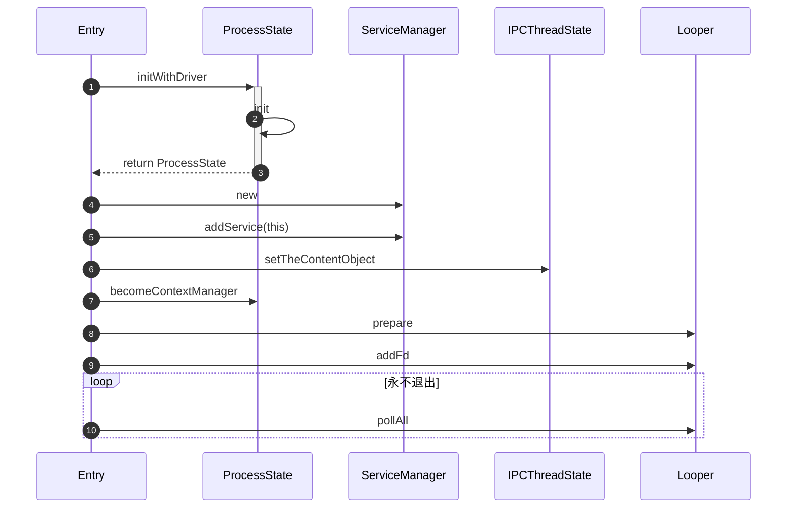

之前已经分析过获取ServiceManager了，不过那是在使用端，在分析使用ServiceManager去获取服务或者添加服务的时候发现，我使用的Android Studio for Platform默认没有把ServiceManager的源码导入。并且同时我们不知道ServiceManager的服务端是怎么启动，怎么响应的，因此决定还是需要分析一下这块的代码。
<!--more-->

首先简单画了一下启动的流程，如下图所示（Entry表示我们的调用入口，也就是后面所说的main函数）：



ServiceManager的启动是在系统启动的时候进行启动的，它的启动是使用Linux系统的服务启动方式进行配置，配置文件在`servicemanager.rc`当中，配置如下：
```
service servicemanager /system/bin/servicemanager  
    class core animation  
    user system  
    group system readproc  
    critical  
    onrestart restart apexd  
    ...
    task_profiles ServiceCapacityLow  
    shutdown critical
```

具体系统如何调用这个Service的我们这里不必关心，我们可以直接来看ServiceManager启动相关的代码，代码在`frameworks/native/cmds/servicemanager`目录下面。启动的逻辑在`main.cpp`的`main`方法中，代码如下：
```c++
int main(int argc, char** argv) {  
	...
    const char* driver = argc == 2 ? argv[1] : "/dev/binder";  
    sp<ProcessState> ps = ProcessState::initWithDriver(driver);  
    ps->setThreadPoolMaxThreadCount(0);  //设置最大线程数，因为serviceManager不使用`startThreadPool`启动线程池，因此设置为0
    ps->setCallRestriction(ProcessState::CallRestriction::FATAL_IF_NOT_ONEWAY);  
    sp<ServiceManager> manager = sp<ServiceManager>::make(std::make_unique<Access>());  
    if (!manager->addService("manager", manager, false /*allowIsolated*/, IServiceManager::DUMP_FLAG_PRIORITY_DEFAULT).isOk()) {  
        LOG(ERROR) << "Could not self register servicemanager";  
    }  
  
    IPCThreadState::self()->setTheContextObject(manager);  
    ps->becomeContextManager();  
    sp<Looper> looper = Looper::prepare(false /*allowNonCallbacks*/);  
    BinderCallback::setupTo(looper);  
    ClientCallbackCallback::setupTo(looper, manager);  
    while(true) {  
        looper->pollAll(-1);  
    }  
    // 应该不会走到,除非发生了错误
    return EXIT_FAILURE;  
}
```

代码如上，数量不多，并且其中看到了不少熟悉的类名，首先是使用`ProcessState`类去调用它的`initWithDriver`,这里最终也会走到`init`方法，做的事情也是创建`ProcessState`实例，并且打开Binder驱动，获取驱动的FD，可以参考前面的文章。

第7行代码，我们可以看到，创建了一个`ServiceManager`对象，这个对象与我们之前分析的`ServiceManager`是不同的，它是`ServiceManager`的Binder服务端，这个代码也跟我们的初始化代码在同一个目录。拿到这个`manager`后面做的第一件事情就是调用`addService`把自己也加进去，`addService`的代码后面再来分析。

再看12行代码，`setTheContextObject`处传入了`manager`，这里`IPCThreadState`初始化代码之前也已经分析过，此处略过，这个方法也只是把manager作为它的成员放入，暂时略过，直接看后面的`becomeContextManager`源码：
```c++
bool ProcessState::becomeContextManager()  
{  
    AutoMutex _l(mLock);  
    flat_binder_object obj {  
        .flags = FLAT_BINDER_FLAG_TXN_SECURITY_CTX,  
    };  
	//与Binder交互，发送命令BINDER_SET_CONTEXT_MGR_EXT，让当前进程成为Binder的上下文管理者
    int result = ioctl(mDriverFD, BINDER_SET_CONTEXT_MGR_EXT, &obj);  
    
    if (result != 0) {  
        android_errorWriteLog(0x534e4554, "121035042");  
  
        int unused = 0;  
        // 执行失败，则重置该参数
        result = ioctl(mDriverFD, BINDER_SET_CONTEXT_MGR, &unused);  
    }  
    ...
    return result == 0;  
}
```

上面的代码就是告诉binder驱动，当前的进程要成为binder的上下文管理者，驱动内部作何处理我们便不再深究。

继续看我们前面的代码，就出现了熟悉的`Looper`,这个Java层的Looper用法和功能都一样，`preapre`之后又在死循环中调用`pollAll`，从而我们的代码就会永远在这里执行而不会退出。但是Looper在这里有什么用处，我们需要看看前面的代码。首先是15行的调用，其源码如下：
```c++
static sp<BinderCallback> setupTo(const sp<Looper>& looper) {  
    sp<BinderCallback> cb = sp<BinderCallback>::make();  
  
    int binder_fd = -1;  
    IPCThreadState::self()->setupPolling(&binder_fd); 
  
    int ret = looper->addFd(binder_fd,  
                            Looper::POLL_CALLBACK,  
                            Looper::EVENT_INPUT,  
                            cb,  
                            nullptr /*data*/);  
    return cb;  
}
```

第5行代码调用的`setupPolling`代码如下：
```c++
status_t IPCThreadState::setupPolling(int* fd)  
{  
    if (mProcess->mDriverFD < 0) {  //当前驱动没有成功打开时候，直接返回报错
        return -EBADF;  
    }  
  
    mOut.writeInt32(BC_ENTER_LOOPER);  //写入Binder调用命令
    flushCommands();  
    *fd = mProcess->mDriverFD;  //保存Binder驱动的文件描述符到fd当中
    return 0;  
}

void IPCThreadState::flushCommands()  
{  
    if (mProcess->mDriverFD < 0)  
        return;  
    talkWithDriver(false);  //与驱动进行交互
    if (mOut.dataSize() > 0) {  //二次确认，未成功则继续交互
        talkWithDriver(false);  
    }   
}

```

可以看到上面的代码主要是与Binder驱动交互，并且执行命令进入Binder的循环，且拿到binder驱动的文件描述符，其中`talkWithDriver`为与binder交互的具体流程，后续在介绍其代码。

拿到binder驱动的文件描述符后执行Looper的addFd方法，最终执行的方法代码如下：
```c++
//Looper.cpp
int Looper::addFd(int fd, int ident, int events, const sp<LooperCallback>& callback, void* data) {  
	...
  
    { // 此代码段上锁
        AutoMutex _l(mLock);  
    
        if (mNextRequestSeq == WAKE_EVENT_FD_SEQ) mNextRequestSeq++;  
        const SequenceNumber seq = mNextRequestSeq++;  
  
        Request request;  
        request.fd = fd;  
        request.ident = ident;  
        request.events = events;  
        request.callback = callback;  
        request.data = data;  
  
        epoll_event eventItem = createEpollEvent(request.getEpollEvents(), seq);  
        auto seq_it = mSequenceNumberByFd.find(fd);  
        if (seq_it == mSequenceNumberByFd.end()) {  //列表中不存在该fd
            int epollResult = epoll_ctl(mEpollFd.get(), EPOLL_CTL_ADD, fd, &eventItem);  
            if (epollResult < 0) {  
                ... 
                return -1;  
            }  
            mRequests.emplace(seq, request);  
            mSequenceNumberByFd.emplace(fd, seq);  
        } else {  
            int epollResult = epoll_ctl(mEpollFd.get(), EPOLL_CTL_MOD, fd, &eventItem);  
            if (epollResult < 0) {  
                ...
                return -1;
            }  
            const SequenceNumber oldSeq = seq_it->second;  
            mRequests.erase(oldSeq);  
            mRequests.emplace(seq, request);  
            seq_it->second = seq;  
        }  
    } // release lock  
    return 1;  
}
```

上面的代码使用我们的fd创建了epoll_event,并且调用系统调用`epoll_ctl`来进行注册，只是代码中判断了fd在不再`mSequenceNumberByFd`当中，在的话使用的是`EPOLL_CTL_ADD`，不在则使用`EPOLL_CTL_MOD`。
这里我们需要了解一下`epoll`，它是linux中的一种高效、可扩展的I/O时间通知机制，而我们这里做的就是监听Binder驱动的FD，当Binder驱动中有变化通知到epoll的文件描述符，也就是我们这里的Looper的回调就可以收到，具体监听的事件为`Looper::EVENT_INPUT`，从而也就会执行`BinderCallback`的`handlePolledCommands`方法，这个我们留到后面再分析。

看到这，我们可以再看一下main方法的第16行代码，调用的`ClientCallbackCallback.setupTo`方法，这个类也同样是一个`LooperCallback`的子类，其代码如下：
```c++
static sp<ClientCallbackCallback> setupTo(const sp<Looper>& looper, const sp<ServiceManager>& manager) {  
    sp<ClientCallbackCallback> cb = sp<ClientCallbackCallback>::make(manager);  
  
    int fdTimer = timerfd_create(CLOCK_MONOTONIC, 0 /*flags*/);  
    
    itimerspec timespec {  
        .it_interval = {  
            .tv_sec = 5,  
            .tv_nsec = 0,  
        },  
        .it_value = {  
            .tv_sec = 5,  
            .tv_nsec = 0,  
        },  
    };  
  
    int timeRes = timerfd_settime(fdTimer, 0 /*flags*/, &timespec, nullptr);  

    int addRes = looper->addFd(fdTimer,  
                               Looper::POLL_CALLBACK,  
                               Looper::EVENT_INPUT,  
                               cb,  
                               nullptr);  
  
    return cb;  
}
```

这里`addFd`的代码和之前的一样，但是前面这个`timerfd`令人感到疑惑，查询一番之后才知道，这里是linux中的定时机制，timerfd为一个基于文件描述符的定时接口，我们这里的代码则是每个5秒钟触发一次，也就是说每隔5秒就会执行一次这个对象的`handleEvent`方法。

当有客户端请求添加Service或者查询Service等操作的时候，BinderCallbak的`handlePolledCommands`就会执行去处理，内部会调用如下代码：
```c++
IPCThreadState::self()->handlePolledCommands();
```
上面的代码就是会去读取binder传过来的数据，进行处理，具体内容留到后面再分析。
