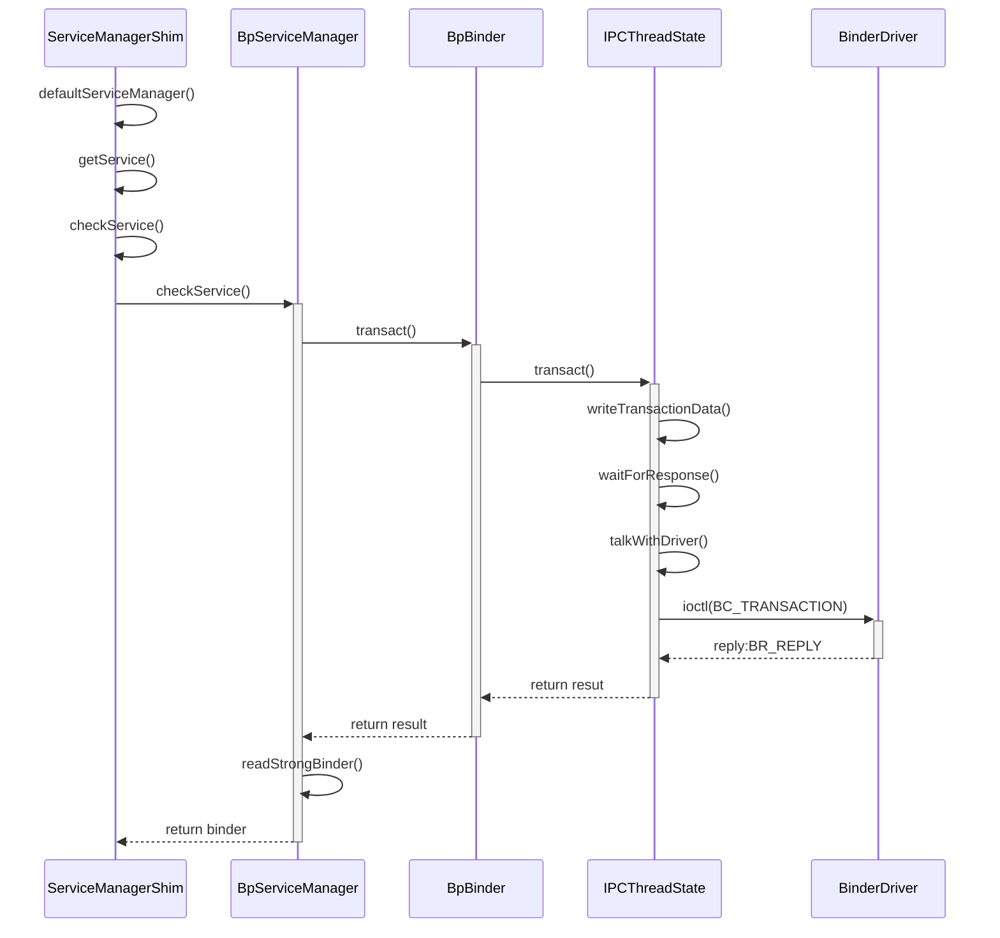
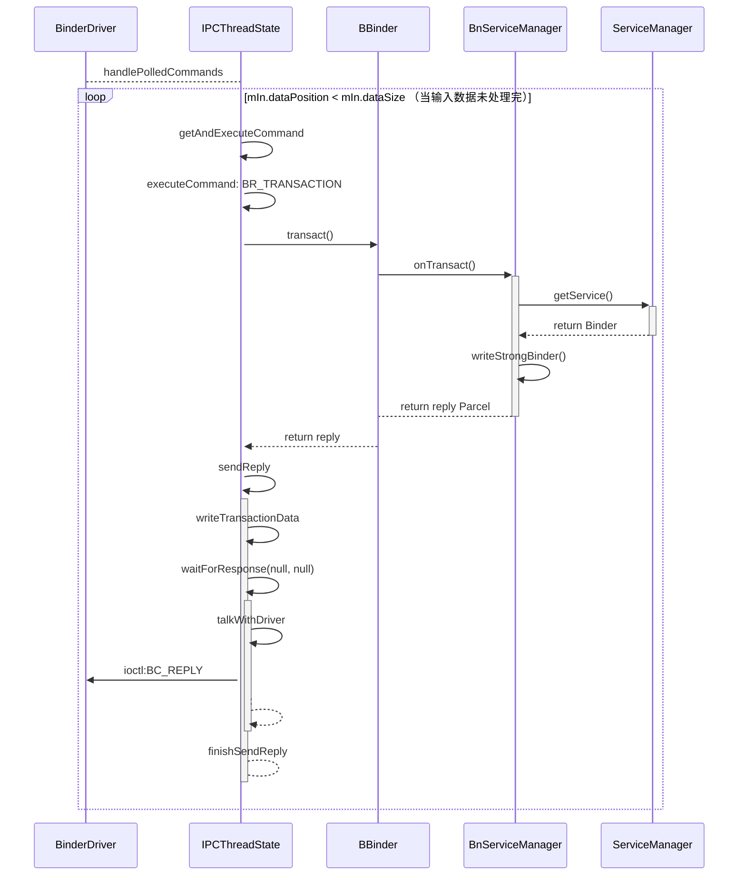

通过ServiceManager添加服务和获取服务分别为`addService`和`getService`，两者流程上其实是有一些类似的，其中我们可以看到binder通讯的全过程。为了让内容更有意义，添加服务选择从Java层的代码触发，获取服务则选择从Native层触发。

<!--more-->

### 添加服务

我们以添加`ActivityManagerService`为例分析添加一个Service。首先先画个简单的流程图，介绍涉及到的类和调用的方法，不过步骤进行了省略，详细看后面的代码解析。


#### ServiceManagerProxy请求添加Service

其代码在`ActivityManagerService`的`setSystemProcess`方法当中，具体调用如下：
```java
ServiceManager.addService(Context.ACTIVITY_SERVICE, this, /* allowIsolated= */ true,  
        DUMP_FLAG_PRIORITY_CRITICAL | DUMP_FLAG_PRIORITY_NORMAL | DUMP_FLAG_PROTO);
```

具体实现如下：
```java
@UnsupportedAppUsage(maxTargetSdk = Build.VERSION_CODES.R, trackingBug = 170729553)  
public static void addService(String name, IBinder service, boolean allowIsolated,  
        int dumpPriority) {  
    try {  
        getIServiceManager().addService(name, service, allowIsolated, dumpPriority);  
    } catch (RemoteException e) {  
    }  
}
```

其中`getIServiceManager`的代码我们已经分析过了，我们之前拿到的`IServiceManager`的实例为`ServiceManagerProxy`，这里可以直接去看它的这个方法：
```java
public void addService(String name, IBinder service, boolean allowIsolated, int dumpPriority)  
        throws RemoteException {  
    mServiceManager.addService(name, service, allowIsolated, dumpPriority);  
}
```

这里调用了`mServiceManager`的同名方法，而这个成员变量的初始化如下：
```java
mServiceManager = IServiceManager.Stub.asInterface(remote);
```

这里的`remote`就是我们之前构造函数传入的`BinderProxy`,而上面的函数后我们发获取到的对象则为`IServiceMaanager.Stub.Proxy`，我们可以看一下它的同名方法：
```java
@Override public void addService(java.lang.String name, android.os.IBinder service, boolean allowIsolated, int dumpPriority) throws android.os.RemoteException  
{  
  android.os.Parcel _data = android.os.Parcel.obtain();  
  android.os.Parcel _reply = android.os.Parcel.obtain();  
  try {  
    _data.writeInterfaceToken(DESCRIPTOR);  
    _data.writeString(name);  
    _data.writeStrongBinder(service);  
    _data.writeBoolean(allowIsolated);  
    _data.writeInt(dumpPriority);  
    boolean _status = mRemote.transact(Stub.TRANSACTION_addService, _data, _reply, 0);  
    _reply.readException();  
  }  
  finally {  
    _reply.recycle();  
    _data.recycle();  
  }  
}
```

这里我们看到就是把设置的数据和binder写入到`Parcel`之后 调用`transact`。这里我们可以看一下`Parcel`首先是写入了`InterfaceToken`，也就是`IServiceManager`的描述符，其次才是其他内容。我们主要关注一下如何写入Binder的。其最终调用的方法在`android_os_Parcel.cpp`中，代码如下：
```c++
static void android_os_Parcel_writeStrongBinder(JNIEnv* env, jclass clazz, jlong nativePtr, jobject object)  
{  
    Parcel* parcel = reinterpret_cast<Parcel*>(nativePtr);  
    if (parcel != NULL) {  
        const status_t err = parcel->writeStrongBinder(ibinderForJavaObject(env, object));  
        if (err != NO_ERROR) {  
            signalExceptionForError(env, clazz, err);  
        }  
    }  
}
```
我们主要关注第5行，这里有一个`ibinderForJavaObject`，用于从javaobject中拿到binder的native对象，我们可以看一下其源码：
```c++
sp<IBinder> ibinderForJavaObject(JNIEnv* env, jobject obj)  {  
    if (obj == NULL) return NULL;  
  
    // 如果是Binder实例
    if (env->IsInstanceOf(obj, gBinderOffsets.mClass)) {  
        JavaBBinderHolder* jbh = (JavaBBinderHolder*)  
            env->GetLongField(obj, gBinderOffsets.mObject);  
        return jbh->get(env, obj);  
    }  
    // 如果是BinderProxy实例
    if (env->IsInstanceOf(obj, gBinderProxyOffsets.mClass)) {  
        return getBPNativeData(env, obj)->mObject;  
    }  
    return NULL;  
}

BinderProxyNativeData* getBPNativeData(JNIEnv* env, jobject obj) {  
    return (BinderProxyNativeData *) env->GetLongField(obj, gBinderProxyOffsets.mNativeData);  
}


```


这个地方会判断我们的传过来的javaobject是`Binder`的实例还是`BinderProxy`的实例，前者对应Binder的服务端，后者对应的是客户端，我们刚刚传过来的AMS则是服务端。这里是从javaobject拿到`mObject`成员变量，对应native的类`JavaBBinderHolder`,最后调用它的`get`方法拿到`JavaBinder`对象。此处算是完成了我们Java层的Binder在Native层的对应对象的获取。现在就可以看看`Parcel`的`writeStrongBinder`方法了:
```c++
status_t Parcel::writeStrongBinder(const sp<IBinder>& val)  {  
    return flattenBinder(val);  
}
```

其中又调用了`flattenBinder`,这个方法比较长，我们先一点点的贴代码：
```c++
BBinder* local = nullptr;  
if (binder) local = binder->localBinder();  
if (local) local->setParceled();

if (isForRpc()) {
...
}
```
这里`binder`是我们刚刚的拿到的`JavaBBinder`，它的`localBinder()`实现如下：
```c++
BBinder* BBinder::localBinder()  {  
    return this;  
}
```
也就是说返回了自己。另外这里我们不是RPC，所以其中的代码我们不需要关注，继续看后面的代码：
```c++
flat_binder_object obj;
if (binder != nullptr) {  
    if (!local) {  
       ...//如果我们传入的不是BBinder，而是BpBinder执行这里的逻辑，省略
    } else {  
        int policy = local->getMinSchedulerPolicy();  
        int priority = local->getMinSchedulerPriority();  
  
        if (policy != 0 || priority != 0) {  
            // override value, since it is set explicitly  
            schedBits = schedPolicyMask(policy, priority);  
        }  
        obj.flags = FLAT_BINDER_FLAG_ACCEPTS_FDS;  
        .... 
        obj.hdr.type = BINDER_TYPE_BINDER;  
        obj.binder = reinterpret_cast<uintptr_t>(local->getWeakRefs());  
        obj.cookie = reinterpret_cast<uintptr_t>(local);  
    }  
} else {  
    ...
}
obj.flags |= schedBits;
```

上面的代码主要是将binder的一些参数拍平放到`flat_binder_object`当中。其中binder是放置到`cookie`字段，binder的弱引用放到了`binder`字段。
```c++
status_t status = writeObject(obj, false);  
if (status != OK) return status;  
  
return finishFlattenBinder(binder);
```
这里才开始真正的把数据写入 ，可以先看看这个`writeObject`方法:
```c++
status_t Parcel::writeObject(const flat_binder_object& val, bool nullMetaData)  
{  
    const bool enoughData = (mDataPos+sizeof(val)) <= mDataCapacity;  
    const bool enoughObjects = mObjectsSize < mObjectsCapacity;  
    if (enoughData && enoughObjects) {  
restart_write:  
        *reinterpret_cast<flat_binder_object*>(mData+mDataPos) = val; //把数据写如内存  
        ...
        // Need to write meta-data?  
        if (nullMetaData || val.binder != 0) {  
            mObjects[mObjectsSize] = mDataPos;  
            acquire_object(ProcessState::self(), val, this);  
            mObjectsSize++;  
        }  
        return finishWrite(sizeof(flat_binder_object));  //调整dataPos和当前DateSize
    }  
	...
    goto restart_write;  
}
```

上面主要就是把binder写入内存当中，其他的则是处理内存不足的情况，有申请内存的代码，这里我们无须关注。可以在看一下前面的`finishFlattenBinder`方法：
```c++
status_t Parcel::finishFlattenBinder(const sp<IBinder>& binder)  {  
    internal::Stability::tryMarkCompilationUnit(binder.get());  
    int16_t rep = internal::Stability::getRepr(binder.get());  
    return writeInt32(rep);  
}
```

这个方法主要为binder设置`Repr`，并且把值也写入到Parcel当中去，默认值为`Level::SYSTEM`，我们不再深入看其代码。

到这里大概就看完了Parcel写数据的代码了。可以看看`transact`方法，这里的`mRemote`为`BinderProxy`，它的`transact`方法中主要调用了一下代码：
```java
final boolean result = transactNative(code, data, reply, flags);  
if (reply != null && !warnOnBlocking) {  
    reply.addFlags(Parcel.FLAG_IS_REPLY_FROM_BLOCKING_ALLOWED_OBJECT);  
}  
return result;
```
它的native实现在`android_util_Binder.cpp`中，代码如下：
```c++
static jboolean android_os_BinderProxy_transact(JNIEnv* env, jobject obj,  
        jint code, jobject dataObj, jobject replyObj, jint flags) 
{  
    Parcel* data = parcelForJavaObject(env, dataObj);  //从java层的Parcel对象获取native层的Parcel对象
    ...
    Parcel* reply = parcelForJavaObject(env, replyObj);  
    ...
    IBinder* target = getBPNativeData(env, obj)->mObject.get(); //获取native层的BinderProxy对象 
    if (target == NULL) {  
        ...
        return JNI_FALSE;  
    }  
  
    status_t err = target->transact(code, *data, reply, flags);  
    ...
    return JNI_FALSE;
}
```

上面主要就 是获取native层的Parcel对象和Binder对象，并且调用binder的`transact`方法。这里的Binder对象是什么呢，回顾之前分析的`javaObjectForIBinder`方法，可知此处拿到的应该是BpBinder对象。我们就可以看它的代码了：
```c++
status_t BpBinder::transact(  
    uint32_t code, const Parcel& data, Parcel* reply, uint32_t flags)  
{  
    // 只有binder或者的时候才能执行 
    if (mAlive) {  
        bool privateVendor = flags & FLAG_PRIVATE_VENDOR;  
        // 用户层的flag移除
        flags = flags & ~FLAG_PRIVATE_VENDOR;  
  
        if (code >= FIRST_CALL_TRANSACTION && code <= LAST_CALL_TRANSACTION) {  
            ... //Stability 相等判断，此处略过
        }  
  
        status_t status;  
        if (CC_UNLIKELY(isRpcBinder())) {  
            ...
        } else {  
            status = IPCThreadState::self()->transact(binderHandle(), code, data, reply, flags);  
        }  
        ....
        if (status == DEAD_OBJECT) mAlive = 0;  
  
        return status;  
    }  
  
    return DEAD_OBJECT;  
}
```

因为`ServiceManager`的id为`0`，此处`binderHandle()`拿到的值应为`0`。此处主要也是调用了`IPCThreadState`的`transact`方法：
```c++
status_t IPCThreadState::transact(int32_t handle,  
                                  uint32_t code, const Parcel& data,  
                                  Parcel* reply, uint32_t flags)  
{  
    status_t err;  
  
    flags |= TF_ACCEPT_FDS;  
    err = writeTransactionData(BC_TRANSACTION, flags, handle, code, data, nullptr);  
  
    if (err != NO_ERROR) {  
        if (reply) reply->setError(err);  
        return (mLastError = err);  
    }  
  
    if ((flags & TF_ONE_WAY) == 0) {  
        if (reply) {  
            err = waitForResponse(reply);  
        } else {  
            Parcel fakeReply;  
            err = waitForResponse(&fakeReply);  
        }  
    } else {  
        err = waitForResponse(nullptr, nullptr);
    }  
  
    return err;  
}
```


这里主要调用了两个方法，分别是`writeTransactionData`和`waitForResponse`,我们分别看一下。首先是`writeTransactionData`,它的第一个参数为`BC_TRANSACTION`,这是用于与Binder驱动交互的命令，除了这个之外还有其他一些，可以在`binder.h`当中找到。现在可以看`writeTransactionData`的代码：
```c++
status_t IPCThreadState::writeTransactionData(int32_t cmd, uint32_t binderFlags,  
    int32_t handle, uint32_t code, const Parcel& data, status_t* statusBuffer)  
{  
    binder_transaction_data tr;  
  
    tr.target.ptr = 0; /* Don't pass uninitialized stack data to a remote process */  
    tr.target.handle = handle;  
    tr.code = code;  
    tr.flags = binderFlags;  
    tr.cookie = 0;  
    tr.sender_pid = 0;  
    tr.sender_euid = 0;  
  
    const status_t err = data.errorCheck();  
    if (err == NO_ERROR) {  
        tr.data_size = data.ipcDataSize();  
        tr.data.ptr.buffer = data.ipcData();  
        tr.offsets_size = data.ipcObjectsCount()*sizeof(binder_size_t);  
        tr.data.ptr.offsets = data.ipcObjects();  
    } else if (statusBuffer) {  
        ...
    } else {  
        return (mLastError = err);  
    }  
  
    mOut.writeInt32(cmd);  
    mOut.write(&tr, sizeof(tr));  
  
    return NO_ERROR;  
}
```

这个方法中所做的事情为，把我们传入的data和code以及要调用的binder的id等都放到`binder_transaction_data`中去，同时又把这个tr和调用binder驱动的命令`BC_TRANSACTION`一起写入到`mOut`当中去，这个`mOut`也是一个Parcel对象。到这里，数据都写完了，但是binder驱动在那里读取处理这个数据呢，我们继续看`waitForResponse`,前面我们因为有传reply过来，因此会调用到第17行的`waitForResponse`方法，代码如下：
```c++
status_t IPCThreadState::waitForResponse(Parcel *reply, status_t *acquireResult)  
{  
    uint32_t cmd;  
    int32_t err;  
  
    while (1) {  
        if ((err=talkWithDriver()) < NO_ERROR) break;  
        err = mIn.errorCheck();  
        if (err < NO_ERROR) break;  
        if (mIn.dataAvail() == 0) continue;  
  
        cmd = (uint32_t)mIn.readInt32();  
  
        switch (cmd) {  
        case BR_ONEWAY_SPAM_SUSPECT:  
            [[fallthrough]];  
        ......
        case BR_ACQUIRE_RESULT:  
            {  
                const int32_t result = mIn.readInt32();  
                if (!acquireResult) continue;  
                *acquireResult = result ? NO_ERROR : INVALID_OPERATION;  
            }  
            goto finish;  
  
        case BR_REPLY:  
            {  
                binder_transaction_data tr;  
                err = mIn.read(&tr, sizeof(tr));  
                if (err != NO_ERROR) goto finish;  
  
                if (reply) {  
                    if ((tr.flags & TF_STATUS_CODE) == 0) {  
                        reply->ipcSetDataReference(  
                            reinterpret_cast<const uint8_t*>(tr.data.ptr.buffer),  
                            tr.data_size,  
                            reinterpret_cast<const binder_size_t*>(tr.data.ptr.offsets),  
                            tr.offsets_size/sizeof(binder_size_t),  
                            freeBuffer);  
                    } else {  
                        ....
                } else {  
                   ...
                    continue;  
                }  
            }  
            goto finish;  
  
        default:  
            err = executeCommand(cmd);  
            if (err != NO_ERROR) goto finish;  
            break;  
        }  
    }  
  
finish:  
    if (err != NO_ERROR) {  
        if (acquireResult) *acquireResult = err;  
        if (reply) reply->setError(err);  
        mLastError = err;  
    }  
  
    return err;  
}
```

#### talkWithDriver分析
这里开启了一个while的无限循环，首先调用`talkWithDriver`,看名字就知道是与Binder驱动进行交互，这里首先会看看这个方法有没有报错，没有报错又会检查`mIn`是否有报错。我们前面看到过`mOut`,这里又有`mIn`，它们是用来做什么的呢，我们看一下`talkWithDriver`，可以发现一些东西：
```c++
status_t IPCThreadState::talkWithDriver(bool doReceive)  
{  
    if (mProcess->mDriverFD < 0) {  
        return -EBADF;  
    }  
  
    binder_write_read bwr;  
  
    const bool needRead = mIn.dataPosition() >= mIn.dataSize();  
    const size_t outAvail = (!doReceive || needRead) ? mOut.dataSize() : 0;  
  
    bwr.write_size = outAvail;  
    bwr.write_buffer = (uintptr_t)mOut.data();  
  
    // This is what we'll read.  
    if (doReceive && needRead) {  
        bwr.read_size = mIn.dataCapacity();  
        bwr.read_buffer = (uintptr_t)mIn.data();  
    } else {  
        bwr.read_size = 0;  
        bwr.read_buffer = 0;  
    }  
  
    // 无数据需要读写，直接返回
    if ((bwr.write_size == 0) && (bwr.read_size == 0)) return NO_ERROR;  
  
    bwr.write_consumed = 0;  
    bwr.read_consumed = 0;  
    status_t err;  
    do {  
        
#if defined(__ANDROID__)  
        if (ioctl(mProcess->mDriverFD, BINDER_WRITE_READ, &bwr) >= 0)  
            err = NO_ERROR;  
        else  
            err = -errno;  
#else  
        err = INVALID_OPERATION;  
#endif  
        if (mProcess->mDriverFD < 0) {  
            err = -EBADF;  
        }  
    } while (err == -EINTR);  

  
    if (err >= NO_ERROR) {  
        if (bwr.write_consumed > 0) {  
            if (bwr.write_consumed < mOut.dataSize())  
                ...
            else {  
                mOut.setDataSize(0);  
                processPostWriteDerefs();  
            }  
        }  
        if (bwr.read_consumed > 0) {  
            mIn.setDataSize(bwr.read_consumed);  
            mIn.setDataPosition(0);  
        }  
        ...
        return NO_ERROR;  
    }  
  
    return err;  
}
```

这个方法传参的默认值为true，也就是需要接受结果。在这里我们看到有一个新的数据结构`binder_write_read`，此处会把`mOut`中的数据指针写入到它的`write_buffer`当中，同时把`mIn`的数据指针写入到`read_buffer`中，此处的写指的是向binder驱动中写。随后我们看到是在一个循环当中调用系统调用`ioctl`来与binder驱动进行交互，这里使用循环的原因是，当我们调用这个系统调用的时候可能会遇到遇到中断，我们之前的调用未能执行，因此需要一直等待到执行为止。

到这里我们就分析完了添加Service调用端的所有代码，此时我们需要看一下ServiceManager服务端与Binder进行交互的代码。

#### ServiceManager服务端处理添加Service

我们之前[分析ServiceManager启动](https://isming.me/2024-09-05-binder-sm-start/)的时候，知道最后会注册Looper的监听，当Binder驱动有消息的时候,BinderCallbak的`handleEvent`就会执行去处理,那么当我们在客户端请求添加Binder服务的时候，这里也会执行。这个方法中执行了如下代码：
```c++
IPCThreadState::self()->handlePolledCommands();
```

这里我们可以看一下详细的源码：
```c++
status_t IPCThreadState::handlePolledCommands()  
{  
    status_t result;  
    do {  
	    //读取缓存数据知道处理完成
        result = getAndExecuteCommand();  
    } while (mIn.dataPosition() < mIn.dataSize());  
	//减少binder的引用数量，此处也会和驱动交互
    processPendingDerefs();  
    //若有为执行的命令，全部执行
    flushCommands();  
    return result;  
}
```

此处我们主要关注`getAndExecuteCommand`方法，后面都已经加了注释，此处不需要详细关注。`getAndExecuteCommand`方法当中也是首先调用`talkWithDriver`方法，这个方法前面分析过了，不再分析，这样执行完之后，`mIn`当中就会拿到客户端请求传输过来的数据了，之后就从数据中拿取命令和数据进行执行，代码如下：
```c++
size_t IN = mIn.dataAvail();  
if (IN < sizeof(int32_t)) return result;  
cmd = mIn.readInt32();   //读取命令
pthread_mutex_lock(&mProcess->mThreadCountLock);  //为了增加线程计数上锁
mProcess->mExecutingThreadsCount++;  
if (mProcess->mExecutingThreadsCount >= mProcess->mMaxThreads &&  
        mProcess->mStarvationStartTimeMs == 0) {  
    mProcess->mStarvationStartTimeMs = uptimeMillis();  
}  
pthread_mutex_unlock(&mProcess->mThreadCountLock);  
  
result = executeCommand(cmd);  //执行命令
  
pthread_mutex_lock(&mProcess->mThreadCountLock);  
mProcess->mExecutingThreadsCount--;
if (mProcess->mWaitingForThreads > 0) {  
    pthread_cond_broadcast(&mProcess->mThreadCountDecrement);  
}  
pthread_mutex_unlock(&mProcess->mThreadCountLock);
```

代码很多，但是大多都是为了给binder线程计数增减的。我们主要去看一下`executeCommand`中的代码，该方法中代码很多，而我们在客户端执行的是`BC_TRANSACTION`，因此这里应该收到的是`BR_TRANSACTION`命令，因此只需要看该分支的代码：
```c++
BBinder* obj;  
RefBase::weakref_type* refs;  
status_t result = NO_ERROR;  
  
switch ((uint32_t)cmd) {
	...
	case BR_TRANSACTION:
		binder_transaction_data_secctx tr_secctx;  
		binder_transaction_data& tr = tr_secctx.transaction_data;
		result = mIn.read(&tr, sizeof(tr)); //读取binder携带过来的数据到tr中

		Parcel buffer;  
		//将数据的引用放入Parcel当中
		buffer.ipcSetDataReference(  
		    reinterpret_cast<const uint8_t*>(tr.data.ptr.buffer),  
		    tr.data_size,  
		    reinterpret_cast<const binder_size_t*>(tr.data.ptr.offsets),  
		    tr.offsets_size/sizeof(binder_size_t), freeBuffer);
		//设置调用这的uid，pid，flag等信息
		mCallingPid = tr.sender_pid;  
		mCallingSid = reinterpret_cast<const char*>(tr_secctx.secctx);  
		mCallingUid = tr.sender_euid;  
		mLastTransactionBinderFlags = tr.flags;
		if (tr.target.ptr) {  //ServiceManager的binder无ptr
			//非serviceManager的binder，tr.cookie为本地的BBinder对象指针
		    if (reinterpret_cast<RefBase::weakref_type*>(  
	            tr.target.ptr)->attemptIncStrong(this)) {  
			        error = reinterpret_cast<BBinder*>(tr.cookie)->transact(tr.code, buffer,  
                &reply, tr.flags);  
	        reinterpret_cast<BBinder*>(tr.cookie)->decStrong(this);  
		    } else {  
		        error = UNKNOWN_TRANSACTION;  
		    }  
  
		} else {  
		//ServiceManager使用the_context_object这个BBinder对象。
		    error = the_context_object->transact(tr.code, buffer, &reply, tr.flags);  
		}
		if ((tr.flags & TF_ONE_WAY) == 0) {  
		    if (error < NO_ERROR) reply.setError(error);  
  
		    constexpr uint32_t kForwardReplyFlags = TF_CLEAR_BUF;  
		    sendReply(reply, (tr.flags & kForwardReplyFlags));  //写入回复
		} else {
		...
		}
		...
}

return result;
```

上面的代码已经做了省略，逻辑就是首先从`mIn`这块内存中拿到数据，并且放Parcel中，随后把uid,pid相关的属性设置到当前进程。之后是获取BBinder对象去执行`transact`方法，对于普通的binder，对于普通的binder，会ptr这个字段，并且`tr.cookie`就是本地的BBinder对象指针，而对于ServiceManager，这里就会使用在启动ServiceManager时候调用`setTheContextObject`所设置的BBinder对象，也就是服务端的`ServiceManager`。这里transact执行完成之后会调用`sendReply`将执行结果通过binder驱动传递回binder调用端，从而完成整个流程。这里先看`transact`，分析完再来分析`sendReply`。

`transact`方法在`BBinder`类当中，在其中会调用`onTransact`方法，而到`ServiceManager`，它的`onTransact`的实现在`BnServiceManager`当中，这个类则是通过`AIDL`工具生成的。因为没有源码，根据经验我们这边可以知道它会调用`ServiceManager`的`addService`方法，而其中最重要的代码如下：
```c++
mNameToService[name] = Service {  
    .binder = binder,  
    .allowIsolated = allowIsolated,  
    .dumpPriority = dumpPriority,  
    .debugPid = ctx.debugPid,  
};  
  
auto it = mNameToRegistrationCallback.find(name);  
if (it != mNameToRegistrationCallback.end()) {  
    for (const sp<IServiceCallback>& cb : it->second) {  
        mNameToService[name].guaranteeClient = true;  
        // permission checked in registerForNotifications  
        cb->onRegistration(name, binder);  
    }  
}
```

看代码可知道，这里把Binder放到Service结构体当中，随后放入`mNameToService`当中，`mNameToService`是一个map。而`mNameToRegistrationCallback`中为服务注册的回调，当注册完成之后会调用它的`onRegistration`方法。

前面我们还有一个`sendReply`方法我们还未分析，这里再看一下：
```c++
status_t IPCThreadState::sendReply(const Parcel& reply, uint32_t flags)  
{  
    status_t err;  
    status_t statusBuffer;  
    err = writeTransactionData(BC_REPLY, flags, -1, 0, reply, &statusBuffer);  
    if (err < NO_ERROR) return err;  
  
    return waitForResponse(nullptr, nullptr);  
}
```
`writeTransactionData`当中就是把我们的reply打包成为`binder_transaction_data`写入mOut当中，这里的命令为`BC_REPLY`，执行完之后调用`waitForResponse`,其中会调用`talkWithDriver`来回应，之后便结束了服务端的相应。客户端随后可以读取客户端的`mIn`数据可以获取reply的数据。到这里就分析完了Service注册的流程。


### 获取服务(getService)分析

之前分析`getIServiceManager`和`addService`我们都是从java层的代码出发去往后走分析代码，而`getService`其实有一些地方跟他们是类似的，为了减少重复流程的分析，这里从Native层的使用场景出发。这里以获取`ICameraService`为例。
#### 获取defaultServiceManager
我们的起点在`frameworks/av/camera/ndk/impl/ACameraManager.cpp`当中，调用代码如下：
```c++
const char*  kCameraServiceName  = "media.camera";
....

sp<IServiceManager> sm = defaultServiceManager();
sp<IBinder> binder;  
do {  
    binder = sm->getService(String16(kCameraServiceName));  
    if (binder != nullptr) {  
        break;  
    }  
    usleep(kCameraServicePollDelay);  
} while(true);
```

这里使用`defaultServiceManager`来拿到ServiceManager，其源码如下：
```c++
//frameworks/native/libs/binder/IServiceManager.cpp
sp<IServiceManager> defaultServiceManager()  
{  
    std::call_once(gSmOnce, []() {  
        sp<AidlServiceManager> sm = nullptr;  
        while (sm == nullptr) {  
            sm = interface_cast<AidlServiceManager>(ProcessState::self()->getContextObject(nullptr));  
            if (sm == nullptr) {  
                sleep(1); 
            }  
        }  
  
        gDefaultServiceManager = sp<ServiceManagerShim>::make(sm);  
    });  
  
    return gDefaultServiceManager;  
}
```

这个代码跟我们之前java层的代码比较类似，也是先拿`ContentObject`，而`ServiceManagerShim`相当于是native层的ServiceManager的代理。native层的代码因为不需要把对象转成Java的消耗，代码其实更加简单一点。这里我们拿到了ServiceManagerShim，就可以继续去看它的`getService`方法了。

#### 请求getService

```c++
sp<IBinder> ServiceManagerShim::getService(const String16& name) const  
{  
    static bool gSystemBootCompleted = false;  
  
    sp<IBinder> svc = checkService(name);  
    if (svc != nullptr) return svc;  
  
    const bool isVendorService =  
        strcmp(ProcessState::self()->getDriverName().c_str(), "/dev/vndbinder") == 0;  
    constexpr int64_t timeout = 5000;  
    int64_t startTime = uptimeMillis();  
    // 如果是Vendor的服务，不能够访问系统的属性
    if (!gSystemBootCompleted && !isVendorService) {  
#ifdef __ANDROID__  
        char bootCompleted[PROPERTY_VALUE_MAX];  
        property_get("sys.boot_completed", bootCompleted, "0");  
        gSystemBootCompleted = strcmp(bootCompleted, "1") == 0 ? true : false;  
#else  
        gSystemBootCompleted = true;  
#endif  
    }  
    // 如果拿不到binder service就等待，系统服务和vendor时间有区分，直到超时才停止
    const useconds_t sleepTime = gSystemBootCompleted ? 1000 : 100;  
    int n = 0;  
    while (uptimeMillis() - startTime < timeout) {  
        n++;  
        usleep(1000*sleepTime);  
  
        sp<IBinder> svc = checkService(name);  
        if (svc != nullptr) {  
            return svc;  
        }  
    }  
    return nullptr;  
}
```

这里就是调用`checkService`去获取Service，源码如下：
```c++
sp<IBinder> ServiceManagerShim::checkService(const String16& name) const  
{  
    sp<IBinder> ret;  
    if (!mTheRealServiceManager->checkService(String8(name).c_str(), &ret).isOk()) {  
        return nullptr;  
    }  
    return ret;  
}
```

这里我们调用了`mTheRealServiceManager`的`checkService`方法，这个变量的实例为ServiceManager的BpBinder子类，也是由AIDL生成，其代码如下：
```c++
Parcel data, reply;
data.writeInterfaceToken(IServiceManager::getInterfaceDescriptor()); data.writeString16(name); 
remote()->transact(CHECK_SERVICE_TRANSACTION, data, &reply); 
return reply.readStrongBinder();
```
这里跟之前分析`addService`的部分类似，只有最后多了一个`readStrongBinder`,`addService`为`writeStrongBinder`到data，这里是读取binder调用返回的数据。后续流程也跟`addService`类似，这里就不再分析了。我们更关注这个binder我们是怎么拿到的，因此需要看三个地方的代码，一个是ServiceManger拿到binder并且写入到驱动给我们的过程，第二个地方是`IPCThreadState`当中接收数据的处理，最后就是通过`readStrongBinder`拿到binder的处理了。

客户端请求获取Binder服务的流程大概如下图所示：



#### ServiceManager服务端getService
前面分析addService我们已经知道服务端调用路径是BBinder.transcat-->BnServiceManager.onTransact-->ServiceManger.addService,这里的服务端也是类似，具体可以看下面的流程图。



我们就省略与Binder交互的许多代码，可以直接去看`getService`的代码了：
```c++
Status ServiceManager::getService(const std::string& name, sp<IBinder>* outBinder) {  
    *outBinder = tryGetService(name, true);  
    return Status::ok();  
}

sp<IBinder> ServiceManager::tryGetService(const std::string& name, bool startIfNotFound) {  
    auto ctx = mAccess->getCallingContext();  
  
    sp<IBinder> out;  
    Service* service = nullptr;  
    if (auto it = mNameToService.find(name); it != mNameToService.end()) {  
        service = &(it->second);  
  
        if (!service->allowIsolated) {  //是否允许多用户环境运行
            uid_t appid = multiuser_get_app_id(ctx.uid);  
            bool isIsolated = appid >= AID_ISOLATED_START && appid <= AID_ISOLATED_END;  
  
            if (isIsolated) {  
                return nullptr;  
            }  
        }  
        out = service->binder;  
    }  
  
    if (!mAccess->canFind(ctx, name)) {  //SELinux 权限检查
        return nullptr;  
    }  
  
    if (!out && startIfNotFound) { 
        tryStartService(name);  
    }  
  
    return out;  
}

```

`ServiceManger`中获取Binder就是从我们之前添加Service的时候的那个`ServiceMap`中查找，当查找后做一些权限检查，当找不到的情况下，因为我们传如的`startIfNotFound`,因此会调用`tryStartService`去启动对应的Service，其代码如下：
```c++
void ServiceManager::tryStartService(const std::string& name) {  
    std::thread([=] {  
        if (!base::SetProperty("ctl.interface_start", "aidl/" + name)) {  
            ...
    }).detach();  
}
```
代码很简单，就是启动了一个线程，其中设置系统的properties，系统便会尝试启动这个服务，具体我们这里就不分析了。

#### IPCThreadState接收数据处理

在服务端发送数据时候会调用binder执行`BC_REPLY`,而客户端后收到`BR_REPLY`命令，也就是会执行`waitForResponse`中的如下部分：
```c++
status_t IPCThreadState::waitForResponse(Parcel *reply, status_t *acquireResult)  
{
....
case BR_REPLY:  
    {  
        binder_transaction_data tr;  
        err = mIn.read(&tr, sizeof(tr));  
        ALOG_ASSERT(err == NO_ERROR, "Not enough command data for brREPLY");  
        if (err != NO_ERROR) goto finish;  
  
        if (reply) {  
            if ((tr.flags & TF_STATUS_CODE) == 0) {  
                reply->ipcSetDataReference(  
                    reinterpret_cast<const uint8_t*>(tr.data.ptr.buffer),  
                    tr.data_size,  
                    reinterpret_cast<const binder_size_t*>(tr.data.ptr.offsets),  
                    tr.offsets_size/sizeof(binder_size_t),  
                    freeBuffer);  
            } else {  
	            ...
            }  
        } else {  
            ...
            continue;  
        }  
    }  
    goto finish;
.....
}
```

也就是执行上面的`ipcSetDataReference`,可以看一下其源码：
```c++
void Parcel::ipcSetDataReference(const uint8_t* data, size_t dataSize,  
    const binder_size_t* objects, size_t objectsCount, release_func relFunc)  
{  

    freeData();  //初始化Parcel状态
  
    mData = const_cast<uint8_t*>(data);  
    mDataSize = mDataCapacity = dataSize;  
    mObjects = const_cast<binder_size_t*>(objects);  
    mObjectsSize = mObjectsCapacity = objectsCount;  
    mOwner = relFunc;  
  
    binder_size_t minOffset = 0;  
    for (size_t i = 0; i < mObjectsSize; i++) {  
        binder_size_t offset = mObjects[i];  
        if (offset < minOffset) {  
            
            mObjectsSize = 0;  
            break;  
        }  
        const flat_binder_object* flat  
            = reinterpret_cast<const flat_binder_object*>(mData + offset);  
        uint32_t type = flat->hdr.type;  
        if (!(type == BINDER_TYPE_BINDER || type == BINDER_TYPE_HANDLE ||  
              type == BINDER_TYPE_FD)) {  
            ....  
            break;  
        }  
        minOffset = offset + sizeof(flat_binder_object);  
    }  
    scanForFds();  
}
```

代码比较简单，主要就是把data传入Parcel中，但是除此之外我们需要关注一下传入的relFunc,传入的方法为`freeBuffer`，此方法的执行会在下一次调用freeData的时候执行，它的实现如下：
```c++
void IPCThreadState::freeBuffer(Parcel* parcel, const uint8_t* data,  
                                size_t /*dataSize*/,  
                                const binder_size_t* /*objects*/,  
                                size_t /*objectsSize*/)  
{  
    ALOG_ASSERT(data != NULL, "Called with NULL data");  
    if (parcel != nullptr) parcel->closeFileDescriptors();  
    IPCThreadState* state = self();  
    state->mOut.writeInt32(BC_FREE_BUFFER);  
    state->mOut.writePointer((uintptr_t)data);  
    state->flushIfNeeded();  
}
```
看到这里，我们知道会调用binder发送这个`BC_FREE_BUFFER`命令，这样驱动内部会清理内存，这样就完成了Parcel和内存缓冲区的空间清理。

#### readStrongBinder
`readStrongBinder`和我们之前看过的`writeStrongBinder`应该是一个相反的过程，直接看代码：
```c++
status_t Parcel::readStrongBinder(sp<IBinder>* val) const  
{  
    status_t status = readNullableStrongBinder(val);  
    return status;  
}
```

上面的代码会调用`readNullableStrongBinder`,而其内部又会调用`unflattenBinder`,代码如下：
```c++
status_t Parcel::unflattenBinder(sp<IBinder>* out) const  
{  
    if (isForRpc()) {  
        ...  
        return finishUnflattenBinder(binder, out);  
    }  
  
    const flat_binder_object* flat = readObject(false);  
  
    if (flat) {  
        switch (flat->hdr.type) {  
            case BINDER_TYPE_BINDER: {  
                sp<IBinder> binder =  
                        sp<IBinder>::fromExisting(reinterpret_cast<IBinder*>(flat->cookie));  
                return finishUnflattenBinder(binder, out);  
            }  
            case BINDER_TYPE_HANDLE: {  
                sp<IBinder> binder =  
                    ProcessState::self()->getStrongProxyForHandle(flat->handle);  
                return finishUnflattenBinder(binder, out);  
            }  
        }  
    }  
    return BAD_TYPE;  
}
```

其中readObject为从Parcel中读取`flat_binder_object`对象，当请求的进程和服务在同一个进程时候，这里的type就是`BINDER_TYPE_BINDER`,当请求的进程和服务不在同一个进程则为`BINDER_TYPE_HANDLE`，因此我们这里是`BINDER_TYPE_HANDLE`。`getStrongProxyForHandle`我们之前在分析获取`ServiceManager`的时候已经分析过了，只不过那个地方`handle`为固定的0，而这里则是从驱动中传过来的值，最后我们会拿到一个`BpBinder`，也就完成了查找的过程。

分析完添加服务，查找服务，一直之前介绍的启动ServiceManager和获取ServiceManager基本上就把Binder除了驱动部分的东西都覆盖了。还剩下应用层应该如何使用Binder以及，我们的匿名binder是怎么查找的，这个留待下次在写。

如果你也对于Android系统源码感兴趣，欢迎与我交流。