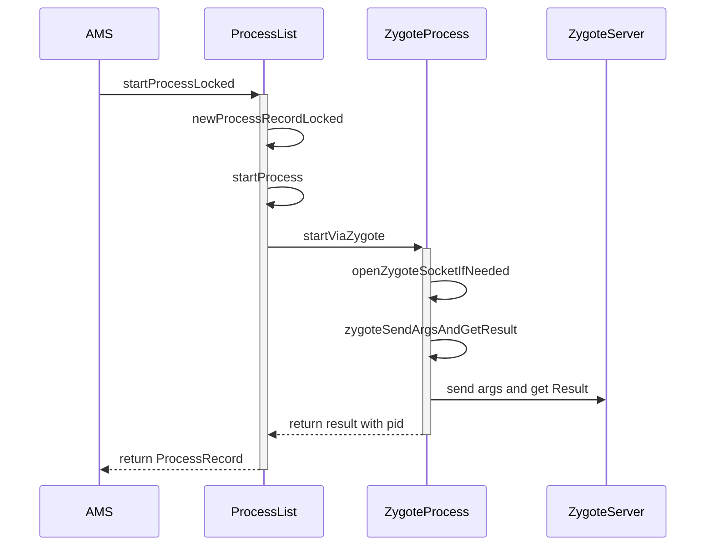
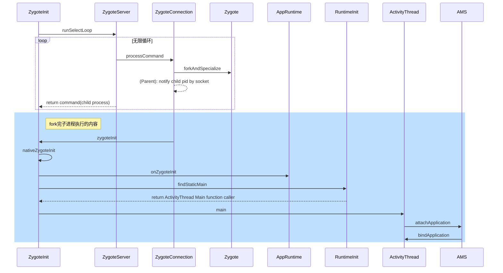

Android应用进程的启动，简单来说就是从zygot进程fork出来一个新进程，并对其进行一些初始化。这样做系统的一些代码和资源等等就不需要重复加载，一些环境变量也都不需要重新设置，可以说是很巧妙的设置。下面就来具体分析一下其初始化过程。
<!--more-->

### 启动时机
应用进程的启动，一般是在创建四大组件，比如说启动Activity，Service，使用ContentProvider，有广播需要处理，这些情况需要创建进程。在我们分析的代码当中，除了这几种情况，BackupAngent也会涉及到创建App进程。

启动进程调用的为`AMS`当中的`startProcessLocked`方法， 我们注意看的话，`AMS`当中还有另一个方法`startIsolatedProcess`也是用来启动进程的，但是这个方法它启动的进程一般是给系统使用的，我们这里不会分析。

### AMS调用启动进程
我们就从`AMS`的`startProcessLocked`这个方法开始看起来:
```java
final ProcessRecord startProcessLocked(String processName,  
        ApplicationInfo info, boolean knownToBeDead, int intentFlags,  
        HostingRecord hostingRecord, int zygotePolicyFlags, boolean allowWhileBooting,  
        boolean isolated) {  
    return mProcessList.startProcessLocked(processName, info, knownToBeDead, intentFlags,  
            hostingRecord, zygotePolicyFlags, allowWhileBooting, isolated, 0 /* isolatedUid */,  
            false /* isSdkSandbox */, 0 /* sdkSandboxClientAppUid */,  
            null /* sdkSandboxClientAppPackage */,  
            null /* ABI override */, null /* entryPoint */,  
            null /* entryPointArgs */, null /* crashHandler */);  
}
```

这里我们传入的参数`intentFlags`为0，`zygotePolicyFlags`为`ZYGOTE_POLICY_FLAG_LATENCY_SENSITIVE`, `allowWhileBooting`为`false`, `isolated`为`false`。之后`startProcessLocked`方法内部用调用了`ProcessList`的同名方法，其中我们关注的核心语句如下：
```java
ProcessRecord app;
...
app = getProcessRecordLocked(processName, info.uid); //从缓存中获取ProcessRecord
...
if (app == null) {
		app = newProcessRecordLocked(info, processName, isolated, isolatedUid, isSdkSandbox,  
        sdkSandboxUid, sdkSandboxClientAppPackage, hostingRecord);
} else {
	app.addPackage(info.packageName, info.longVersionCode, mService.mProcessStats);
}
...
final boolean success =  
        startProcessLocked(app, hostingRecord, zygotePolicyFlags, abiOverride);
```

以上代码可以看到，会先去获取是否有现有的processRecord可用，有的话就拿出来使用，没有的话会创建新的，之后会调用startProcessLocked方法。`ProcessList`中使用`mProcessNames`来存储ProcessRecord与processName和uid的对应关系，查找的逻辑就是从map中查找不再关注。`newProcessRecordLocked`方法则是创建新的`ProcessRecord`，并且会把各种信息保存到这个record当中去。我们这里可以继续看`startProcessLocked`方法，，最终会调用这个方法：
```java
boolean startProcessLocked(ProcessRecord app, HostingRecord hostingRecord,  
        int zygotePolicyFlags, boolean disableHiddenApiChecks, boolean disableTestApiChecks,  
        String abiOverride) {
    //对于从缓存拿到的ProcessRecord，把原来的信息清掉
    if (app.getPid() > 0 && app.getPid() != ActivityManagerService.MY_PID) {  
	    mService.removePidLocked(app.getPid(), app);  
	    app.setBindMountPending(false);  
	    app.setPid(0);  
	    app.setStartSeq(0);  
	}  
	app.unlinkDeathRecipient();  
	app.setDyingPid(0);  
	...
	final IPackageManager pm = AppGlobals.getPackageManager();  
	permGids pm.getPackageGids(app.info.packageName,   =
        MATCH_DIRECT_BOOT_AUTO, app.userId);  
	StorageManagerInternal storageManagerInternal = LocalServices.getService(  
        StorageManagerInternal.class);  
	mountExternal = storageManagerInternal.getExternalStorageMountMode(uid,  
        app.info.packageName);  //检查外部存储访问权限
	externalStorageAccess = storageManagerInternal.hasExternalStorageAccess(uid,  
        app.info.packageName);  
	if (pm.checkPermission(Manifest.permission.INSTALL_PACKAGES,  
        app.info.packageName, userId)  
        == PackageManager.PERMISSION_GRANTED) {  //检查安装应用的权限
		    Slog.i(TAG, app.info.packageName + " is exempt from freezer");  
	    app.mOptRecord.setFreezeExempt(true);  
	} 
	if (app.processInfo != null && app.processInfo.deniedPermissions != null) {  
    for (int i = app.processInfo.deniedPermissions.size() - 1; i >= 0; i--) {  
        int[] denyGids = mService.mPackageManagerInt.getPermissionGids(  
                app.processInfo.deniedPermissions.valueAt(i), app.userId);  
        if (denyGids != null) {  
            for (int gid : denyGids) {  
                permGids = ArrayUtils.removeInt(permGids, gid);  
            }  
        }  
	    }  
	}  
  
	gids = computeGidsForProcess(mountExternal, uid, permGids, externalStorageAccess); //根据前面的权限和相关信息，计算新启动的进程 需要分配的用户
	...
	//读取app的debuggable，profileable等标志位
	boolean debuggableFlag = (app.info.flags & ApplicationInfo.FLAG_DEBUGGABLE) != 0;   
	boolean isProfileableByShell = app.info.isProfileableByShell();  
	boolean isProfileable = app.info.isProfileable();
	if (debuggableFlag) {  
	    runtimeFlags |= Zygote.DEBUG_ENABLE_JDWP;  
	    runtimeFlags |= Zygote.DEBUG_JAVA_DEBUGGABLE;  
	    runtimeFlags |= Zygote.DEBUG_ENABLE_CHECKJNI;  
  

	    if (android.provider.Settings.Global.getInt(mService.mContext.getContentResolver(),  android.provider.Settings.Global.ART_VERIFIER_VERIFY_DEBUGGABLE, 1) == 0) {  
	        runtimeFlags |= Zygote.DISABLE_VERIFIER;  
	    }  
	}
	if (isProfileableByShell) {  
	    runtimeFlags |= Zygote.PROFILE_FROM_SHELL;  
	}  
	if (isProfileable) {  
	    runtimeFlags |= Zygote.PROFILEABLE;  
	} //把标志位信息保存到runtimeFlags中
	...//其他一些flag写入到runtimeFlags中去
	if (debuggableFlag) {  
    //debuggable时候使用wrap.sh去fork进程
	    String wrapperFileName = app.info.nativeLibraryDir + "/wrap.sh";  
	    StrictMode.ThreadPolicy oldPolicy = StrictMode.allowThreadDiskReads();  
	    try {  
	        if (new File(wrapperFileName).exists()) {  
	            invokeWith = "/system/bin/logwrapper " + wrapperFileName;  
	        }  
	    } finally {  
	        StrictMode.setThreadPolicy(oldPolicy);  
	    }  
	}
	String requiredAbi = (abiOverride != null) ? abiOverride : app.info.primaryCpuAbi;  
	if (requiredAbi == null) {  //设置 app native 库使用的abi，如arm或者x86或者armv8等等
	    requiredAbi = Build.SUPPORTED_ABIS[0];  
	}
	String instructionSet = null;  
	if (app.info.primaryCpuAbi != null) {  
	    instructionSet = VMRuntime.getInstructionSet(requiredAbi);  
	}  
  
	app.setGids(gids);  
	app.setRequiredAbi(requiredAbi);  
	app.setInstructionSet(instructionSet); //把信息都设置到ProcessRecord中
	final String seInfo = app.info.seInfo  
        + (TextUtils.isEmpty(app.info.seInfoUser) ? "" : app.info.seInfoUser);  
	final String entryPoint = "android.app.ActivityThread";   //设置进程入口位ActivityThread
  
	return startProcessLocked(hostingRecord, entryPoint, app, uid, gids,  
        runtimeFlags, zygotePolicyFlags, mountExternal, seInfo, requiredAbi,  
        instructionSet, invokeWith, startUptime, startElapsedTime);
	
}
```

以上代码主要是检查应用的各种权限，对其设置对应权限组的groupId，以及设置应用的Abi等信息。之后又会启动一个新的`startProcessLocked`方法，其中仍然是给ProcessRecord设置参数，其中很大篇幅的为设置debug和profilable相关的参数设置，这里就不列出参数设置的代码了，只列以下最后启动调用的代码：
```java
if (mService.mConstants.FLAG_PROCESS_START_ASYNC) {
	mService.mProcStartHandler.post(() -> handleProcessStart(  
        app, entryPoint, gids, runtimeFlags, zygotePolicyFlags, mountExternal,  
        requiredAbi, instructionSet, invokeWith, startSeq));
    return true;
} else {
	final Process.ProcessStartResult startResult = startProcess(hostingRecord,  
        entryPoint, app,  
        uid, gids, runtimeFlags, zygotePolicyFlags, mountExternal, seInfo,  
        requiredAbi, instructionSet, invokeWith, startUptime);  
	handleProcessStartedLocked(app, startResult.pid, startResult.usingWrapper,  
        startSeq, false);
	return app.getPid() > 0;
}

```
这里有两个分支，这个 FLAG_PROCESS_START_ASYNC 默认为True，是通过系统的Setting去设置的。第一个分支是通过Handle把任务抛出去执行，而直接返回了执行成功，另一个分支则是等待任务执行完成，在根据返回的UID检查是否成功。不过两个分支里面都是执行了`startProcess`方法，在这个方法中我们关注以下代码：
```java
if (hostingRecord.usesWebviewZygote()) {  //webview进程的创建
    startResult = startWebView(entryPoint,  
            app.processName, uid, uid, gids, runtimeFlags, mountExternal,  
            app.info.targetSdkVersion, seInfo, requiredAbi, instructionSet,  
            app.info.dataDir, null, app.info.packageName,  
            app.getDisabledCompatChanges(),  
            new String[]{PROC_START_SEQ_IDENT + app.getStartSeq()});  
} else if (hostingRecord.usesAppZygote()) {  
    final AppZygote appZygote = createAppZygoteForProcessIfNeeded(app);  
  
    startResult = appZygote.getProcess().start(entryPoint,  
            app.processName, uid, uid, gids, runtimeFlags, mountExternal,  
            app.info.targetSdkVersion, seInfo, requiredAbi, instructionSet,  
            app.info.dataDir, null, app.info.packageName,  
            /*zygotePolicyFlags=*/ ZYGOTE_POLICY_FLAG_EMPTY, isTopApp,  
            app.getDisabledCompatChanges(), pkgDataInfoMap, allowlistedAppDataInfoMap,  
            false, false,  
            new String[]{PROC_START_SEQ_IDENT + app.getStartSeq()});  
} else {  
    regularZygote = true;  
    startResult = Process.start(entryPoint,  
            app.processName, uid, uid, gids, runtimeFlags, mountExternal,  
            app.info.targetSdkVersion, seInfo, requiredAbi, instructionSet,  
            app.info.dataDir, invokeWith, app.info.packageName, zygotePolicyFlags,  
            isTopApp, app.getDisabledCompatChanges(), pkgDataInfoMap,  
            allowlistedAppDataInfoMap, bindMountAppsData, bindMountAppStorageDirs,  
            new String[]{PROC_START_SEQ_IDENT + app.getStartSeq()});  
}
```
以上可以看到我们在创建新的进程的时候，会有三个分支，我们回看我们创建HostingRecord
时候是调用的如下的构造方法：
```java
public HostingRecord(@NonNull String hostingType, ComponentName hostingName, boolean isTopApp) {  
    this(hostingType, hostingName.toShortString(), REGULAR_ZYGOTE,  
            null /* definingPackageName */, -1 /* mDefiningUid */, isTopApp /* isTopApp */,  
            null /* definingProcessName */, null /* action */, TRIGGER_TYPE_UNKNOWN);  
}
```
### Process启动进程调用
因此上面的代码是走到了regular分支，它调用了`Process`的`start`方法, `Process`中又调用了`ZYGOTE_PROCESS`的`start`方法， `ZYGOTE_PROCESS`为一个`ZygoteProcess`常量，其中又会调用`startViaZygoate`方法,我们来看看这个方法的代码：
```java
private Process.ProcessStartResult startViaZygote(@NonNull final String processClass,  @Nullable final String niceName,  final int uid, final int gid,  @Nullable final int[] gids,  
    int runtimeFlags, int mountExternal,  
     int targetSdkVersion,  
     @Nullable String seInfo,  
      @NonNull String abi,  
     @Nullable String instructionSet,  
     @Nullable String appDataDir,  
      @Nullable String invokeWith,  
    boolean startChildZygote,  
     @Nullable String packageName,  
      int zygotePolicyFlags,  
     boolean isTopApp,  
    @Nullable long[] disabledCompatChanges,  
      @Nullable Map<String, Pair<String, Long>>  pkgDataInfoMap,  
       @Nullable Map<String, Pair<String, Long>>  allowlistedDataInfoList,  
    boolean bindMountAppsData,  
    boolean bindMountAppStorageDirs,  
     @Nullable String[] extraArgs)  throws ZygoteStartFailedEx {  
    ArrayList<String> argsForZygote = new ArrayList<>();
    argsForZygote.add("--runtime-args");  
	argsForZygote.add("--setuid=" + uid);  
	argsForZygote.add("--setgid=" + gid);  
	argsForZygote.add("--runtime-flags=" + runtimeFlags);
	....
	synchronized(mLock) {  
	    return zygoteSendArgsAndGetResult(openZygoteSocketIfNeeded(abi),  
                                      zygotePolicyFlags,  
                                      argsForZygote);  
}   
```

上面的代码就是把我们之前所有的各种参数，都拼接起来放到一个字符数组中，后面的`openZygoteSocketIfNeeded`则是根据abi来于zygote进程建立socket连接，其他的我就要进入`zygoteSendArgsAndGetResult`方法中查看详情了。
```java
if (shouldAttemptUsapLaunch(zygotePolicyFlags, args)) {  
    return attemptUsapSendArgsAndGetResult(zygoteState, msgStr);  
}  
  
return attemptZygoteSendArgsAndGetResult(zygoteState, msgStr);

```


这里有一个判断是否要使用usap进程池(非专门app使用进程池),不过我看了这里`mUsapPoolEnabled`字段默认为false，那我们就不看这个分支了。而`attemptZygoteSendArgsAndGetResult`代码如下：
```java
private Process.ProcessStartResult attemptZygoteSendArgsAndGetResult(  
        ZygoteState zygoteState, String msgStr) throws ZygoteStartFailedEx {  
    try {  
        final BufferedWriter zygoteWriter = zygoteState.mZygoteOutputWriter;  
        final DataInputStream zygoteInputStream = zygoteState.mZygoteInputStream;  
  
        zygoteWriter.write(msgStr);  
        zygoteWriter.flush();  
  
        Process.ProcessStartResult result = new Process.ProcessStartResult();  
        result.pid = zygoteInputStream.readInt();  
        result.usingWrapper = zygoteInputStream.readBoolean();  
  
        if (result.pid < 0) {  
            throw new ZygoteStartFailedEx("fork() failed");  
        }  
  
        return result;  
    } catch (IOException ex) {  
        zygoteState.close();  
        Log.e(LOG_TAG, "IO Exception while communicating with Zygote - "  
                + ex.toString());  
        throw new ZygoteStartFailedEx(ex);  
    }  
}
```

从上面的代码我们可以看到，这里其实很简单，就是通过socket向Zytgote发送了我们启动进程需要的参数，然后再通过socket从Zygote读出创建的进程的pid。

### Zygote进程创建子进程
这个时候我们需要来看ZygoteInit的main方法，具体zygote进程是如何在系统启动的时候创建的就不去关注了，这里来关注zygote进程如何去创建应用进程的,这里摘抄了一些它的main函数的代码：
```java
preload(bootTimingsTraceLog); //zygote启动之后，预加载代码资源等
zygoteServer = new ZygoteServer(isPrimaryZygote); //创建Zygote 的socket server
caller = zygoteServer.runSelectLoop(abiList); // socket server进入监听状态

if (caller != null) {  
    caller.run();  //子进程中的时候caller不为空，会执行，此处会执行我们的ActivityThread的main方法，先分析上面的runSelectLoop，其中会有caller的创建
}
```

runSelectLoop内我们比较关注的代码如下：
```java
Runnable runSelectLoop(String abiList) {
	while (true) {
		pollReturnValue = Os.poll(pollFDs, pollTimeoutMs);
		if (pollReturnValue == 0) {
		 ...
		} else {
			while (--pollIndex >= 0) {
				if (pollIndex == 0) {
					//如果pollIndex为0，则说明没有socket连接，需要创建socket连接
					ZygoteConnection newPeer = acceptCommandPeer(abiList);  
					peers.add(newPeer);  
					socketFDs.add(newPeer.getFileDescriptor());
				} else if (pollIndex < usapPoolEventFDIndex) { //读取Primary socket
					ZygoteConnection connection = peers.get(pollIndex);  
					boolean multipleForksOK = !isUsapPoolEnabled()  && ZygoteHooks.isIndefiniteThreadSuspensionSafe();  
					final Runnable command =  connection.processCommand(this, multipleForksOK); 
					if  (mIsForkChild) {
						return command; //子进程，返回command
					} else {
						//父进程的一些处理
					}
					...
				}
				....
			}
			...
		}
		
	}
}
```
上面的代码省略了一些如果是Usap进程的代码，代码里面有两层的循环，在内层循环中，以pollIndex作为循环的条件，如果pollIndex为0，在acceptCommandPeer中会建立新的Socket Connet，代码里面就是一个`ZygoteConnection`。如果存在Connect的情况下会，会通过判断当前pollIndex是否小于`usapPollEventFDIndex`来判断是否是普通的进程创建，之后会调用`connection.processCommand`来读取socket数据做后续的处理，代码如下：
```java
ZygoteArguments parsedArgs;
try (ZygoteCommandBuffer argBuffer = new ZygoteCommandBuffer(mSocket)) {
	while (true) {
		parsedArgs = ZygoteArguments.getInstance(argBuffer);
		...
		if (parsedArgs.mInvokeWith != null || parsedArgs.mStartChildZygote  
        || !multipleOK || peer.getUid() != Process.SYSTEM_UID) {  
		    pid = Zygote.forkAndSpecialize(parsedArgs.mUid, parsedArgs.mGid,  
	            parsedArgs.mGids, parsedArgs.mRuntimeFlags, rlimits,  
	            parsedArgs.mMountExternal, parsedArgs.mSeInfo, parsedArgs.mNiceName,  
	            fdsToClose, fdsToIgnore, parsedArgs.mStartChildZygote,  
	            parsedArgs.mInstructionSet, parsedArgs.mAppDataDir,  
	            parsedArgs.mIsTopApp, parsedArgs.mPkgDataInfoList,  
	            parsedArgs.mAllowlistedDataInfoList, parsedArgs.mBindMountAppDataDirs,  
	            parsedArgs.mBindMountAppStorageDirs);  //fork子进程的操作
  
		    try {  
		        if (pid == 0) {  //子进程处理分支
		            zygoteServer.setForkChild();  
  
		            zygoteServer.closeServerSocket();  
		            IoUtils.closeQuietly(serverPipeFd);  
		            serverPipeFd = null;  
  
		            return handleChildProc(parsedArgs, childPipeFd,  
                    parsedArgs.mStartChildZygote);  
		        } else {  //父进程处理分支
			        IoUtils.closeQuietly(childPipeFd);  
					childPipeFd = null;  
					handleParentProc(pid, serverPipeFd);
			        return null;
		        }   
		    } finally {  
		        IoUtils.closeQuietly(childPipeFd);  
		        IoUtils.closeQuietly(serverPipeFd);  
		    }  
		} else {
			...
		}
		...
	}
}
```
上面代码是处理socket数据的代码，我这里省略了除了创建进程之外的处理其他操作的代码。其中我们可以看到系统是使用了`ZygoteArguments`来解析我们之前从system_server进程传过来的参数，之后调用`Zygote.forkAndSpecialize`来创建进程，在linux中，fork完进程之后，是通过pid来判断当前是在父进程还是子进程中的，当前为子进程则pid为0。`forkAndSpecialize`方法中主要是调用了`nativeForkAndSpecialize`，这个是native方法，代码在`com_android_internal_os_Zygote.cpp`中，在native中的方法为`com_android_internal_os_Zygote_nativeForkAndSpecialize`我们去看看它的代码。

```c++
...
pid_t pid = zygote::ForkCommon(env, /* is_system_server= */ false, fds_to_close, fds_to_ignore,  true);
if (pid == 0) {  
    SpecializeCommon(env, uid, gid, gids, runtime_flags, rlimits, capabilities, capabilities,  
                     mount_external, se_info, nice_name, false, is_child_zygote == JNI_TRUE,  
                     instruction_set, app_data_dir, is_top_app == JNI_TRUE, pkg_data_info_list,  
                     allowlisted_data_info_list, mount_data_dirs == JNI_TRUE, 
                     mount_storage_dirs == JNI_TRUE);  
}
return pid;
```

上面的代码可以看到，第一行是去fork子进程，后面会判断是否为子进程，如果为子进程则会为子进程做一些处理。其中我省略了前面一部分fds_to_close 和fds_to_ignore赋值的代码，那些为需要关闭或者忽略的文件描述符，会传到这个`ForkCommon`方法中，我们具体看看这个方法：
```c++
SetSignalHandlers(); //设置错误信号监听
BlockSignal(SIGCHLD, fail_fn);  //暂时关闭SIGCHLD信号，方便后面关闭fd
__android_log_close();  //关闭log相关的FD
AStatsSocket_close();
...
pid_t pid = fork(); //调用系统调用执行fork进程

if (pid == 0) {
	...
	PreApplicationInit(); //子进程的初始化，主要是设置当前进程不是zygote进程
	DetachDescriptors(env, fds_to_close, fail_fn); //把传进来的要关闭的fd关掉
	...
} else {
	...
}

UnblockSignal(SIGCHLD, fail_fn); //重新打开之前关闭的SIGCHLD信号
return pid;


```

可以看到上面的代码主要是去调用`fork`系统调用去从zygote进程fork一个新进程作为应用使用的进程，而`SpecializeCommon`，我们根据传入的参数和代码可以知道，其中主要是设置子进程的用户组，以及挂载应用目录，一些其他相关的初始化，就不分析其代码了。然后我们就可以继续会到java代码。

### 创建完子进程后的操作
在前面`processCommand`方法中，我们知道fork成功之后如果是子进程会执行`handleChildProc`方法，如果是父进程会执行`handleParentProc`方法，先来看一下父进程执行的代码：
```java
if (pid > 0) {  
    setChildPgid(pid);  
}
...
mSocketOutStream.writeInt(pid);  
mSocketOutStream.writeBoolean(usingWrapper);

```
这个方法中我们需要关注的就上面这一部分代码，首先是把这个子进程的pid放到进程的当前进程的孩子进程组中去。后面的就是把子进程的pid和是否使用了wrapper写入到socket中，这样我们之前请求创建进程那个地方就能拿到子进程的id了。

再来看子进程所执行的`handleChildProc`方法：
```java
closeSocket();
Zygote.setAppProcessName(parsedArgs, TAG);

if (parsedArgs.mInvokeWith != null) {  
    WrapperInit.execApplication(parsedArgs.mInvokeWith,  
            parsedArgs.mNiceName, parsedArgs.mTargetSdkVersion,  
            VMRuntime.getCurrentInstructionSet(),  
            pipeFd, parsedArgs.mRemainingArgs);  
  
    // Should not get here.  
    throw new IllegalStateException("WrapperInit.execApplication unexpectedly returned");  
} else {  
    if (!isZygote) {  
        return ZygoteInit.zygoteInit(parsedArgs.mTargetSdkVersion,  
                parsedArgs.mDisabledCompatChanges,  
                parsedArgs.mRemainingArgs, null /* classLoader */);  
    } else {  
        return ZygoteInit.childZygoteInit(  
                parsedArgs.mRemainingArgs  /* classLoader */);  
    }  
}

```

首先第一行是关闭socket，前面的native代码其实已经关闭过了socket，但是在java层还是有`LocalSocket`，也需要关闭。
第二行就是给我们这个进程设置名称。
后面的第一个判断是看我们是否使用wrapper，正常流程不会走到这里，else分支中我们这里也不是fork一个新的zygote进程，因此也只需要看`ZygoteInit.zygoteInit`这个方法即可。
```java
RuntimeInit.redirectLogStreams();  //关闭默认的log，设置使用android的print来输出system.out和system.error的log
  
RuntimeInit.commonInit();   
ZygoteInit.nativeZygoteInit();  
return RuntimeInit.applicationInit(targetSdkVersion, disabledCompatChanges, argv,  
        classLoader);
```

### App进程的初始化
`RuntimeInit.commonInit`中是一些初始化，包括错误处理，时区，网络的userAgent等，不看代码了。`nativeZygoteInit`的代码在`AndroidRuntime.cpp`中
```c
static void com_android_internal_os_ZygoteInit_nativeZygoteInit(JNIEnv* env, jobject clazz)  
{  
    gCurRuntime->onZygoteInit();  
}
```
此处调用了`gCurRuntime`的`onZygoteInit()`方法，而这个方法是`AndroidRuntime`中的一个虚方法，在app_main.cpp中我们看到实际上对于应用我们有一个子类`AppRuntime`中实现了这个方法，代码如下：
```c++
virtual void onZygoteInit()  
{  
    sp<ProcessState> proc = ProcessState::self();  
    ALOGV("App process: starting thread pool.\n");  
    proc->startThreadPool();  
}
```
我们之前分析binder的时候，知道`ProcessState`这个类binder是有使用的，调用`self`方法会打开binder驱动，这个代码里面是为binder创建应用进程的线程池，具体这里就不分析了。继续看`RuntimeInit.applicationInit`代码：
```java
protected static Runnable applicationInit(int targetSdkVersion, long[] disabledCompatChanges,  
        String[] argv, ClassLoader classLoader) {  
    nativeSetExitWithoutCleanup(true);  
  
    VMRuntime.getRuntime().setTargetSdkVersion(targetSdkVersion);  
    VMRuntime.getRuntime().setDisabledCompatChanges(disabledCompatChanges);  
  
    final Arguments args = new Arguments(argv);  
  
    return findStaticMain(args.startClass, args.startArgs, classLoader);  
}
```
上面的方面，前面的代码主要是设置targetSdkversion和其他的一些设置，我们主要来看后面的`findStaticMain`方法：
```java
protected static Runnable findStaticMain(String className, String[] argv,  
        ClassLoader classLoader) {  
    Class<?> cl;  
  
    try {  
        cl = Class.forName(className, true, classLoader);  
    } catch (ClassNotFoundException ex) {  
        throw new RuntimeException(  
                "Missing class when invoking static main " + className,  
                ex);  
    }  
  
    Method m;  
    try {  
        m = cl.getMethod("main", new Class[] { String[].class });  
    } catch (NoSuchMethodException ex) {  
        throw new RuntimeException(  
                "Missing static main on " + className, ex);  
    } catch (SecurityException ex) {  
        throw new RuntimeException(  
                "Problem getting static main on " + className, ex);  
    }  
  
    int modifiers = m.getModifiers();  
    if (! (Modifier.isStatic(modifiers) && Modifier.isPublic(modifiers))) {  
        throw new RuntimeException(  
                "Main method is not public and static on " + className);  
    }  
   return new MethodAndArgsCaller(m, argv);  
}
```

可以看到我们通过反射拿到应用的之前设置的应用入口，也就是`ActivityThread`类，之后再获取到它的`main`方法，最后组装成一个`MethodAndArgsCaller`对象，最后返回。从前面的代码我们知道它会在`ZygoteInit`的`main`方法中执行。然后我们就可以来分析`ActivityThread`代码了。

### ActivityThread代码执行

```java
public static void main(String[] args) {
	AndroidOs.install();
	Environment.initForCurrentUser();
	final File configDir = Environment.getUserConfigDirectory(UserHandle.myUserId());  
	TrustedCertificateStore.setDefaultUserDirectory(configDir);
	initializeMainlineModules();

	Looper.prepareMainLooper();
	...
	ActivityThread thread = new ActivityThread();  
	thread.attach(false, startSeq);
	Looper.loop();
	throw new RuntimeException("Main thread loop unexpectedly exited");

}
```

上面的代码可以看到是为应用进程做一些初始化，首先是为sys call使用android的一些定制，其次是指定CA证书的位置，之后安装Mainline的模块，后面是初始化looper进入Looper循环，这样应用的主线程也就完成了初始化。在启动loop之前有一个attach方法，对于应用进程我们传进来的第一个参数为false， 也就是非系统进程，我们来看代码，只看应用进程的分支。

```java
RuntimeInit.setApplicationObject(mAppThread.asBinder());  
final IActivityManager mgr = ActivityManager.getService();  
try {  
    mgr.attachApplication(mAppThread, startSeq);  
} catch (RemoteException ex) {  
    throw ex.rethrowFromSystemServer();  
}

BinderInternal.addGcWatcher(new Runnable() {
	public void run() {
		//监听gc，当可用内存比较小的时候尝试回收一些Activity
	}
}

ViewRootImpl.ConfigChangedCallback configChangedCallback = (Configuration globalConfig) -> {
	//config 变化的回调，用来更新app得而configuration
}
ViewRootImpl.addConfigCallback(configChangedCallback);


```

上面的代码主要做了四件事情，其中两个是注册gc的回调和view configration 变化的回调，我们最关注的是调用ActivityManager的atttachApplication，和RuntimeInit的`setApplicationObject`，它们都用到了`mAppThread`,这个对象为`ApplicationThread`，而它是`IApplicationThread.aidl`的客户端实现。这里首先是把它的IBinder对象传到RuntimeInit中，这样发生一些事情的时候系统可以通知到应用。

### 回到AMS
另外我们再来看一下ActivityManager的attchApplication方法，它实际调用的是`ActivityManagerService`的`attachApplication`方法,在它内部又调用了`attachApplicationLocked`方法，这里只看一下我们比较关心的一部分代码：
```java
boolean normalMode = mProcessesReady || isAllowedWhileBooting(app.info);  
List<ProviderInfo> providers = normalMode  
                                    ? mCpHelper.generateApplicationProvidersLocked(app)  
                                    : null;
...
final ProviderInfoList providerList = ProviderInfoList.fromList(providers);
...
thread.bindApplication(processName, appInfo,  
        app.sdkSandboxClientAppVolumeUuid, app.sdkSandboxClientAppPackage,  
        providerList, null, profilerInfo, null, null, null, testMode,  
        mBinderTransactionTrackingEnabled, enableTrackAllocation,  
        isRestrictedBackupMode || !normalMode, app.isPersistent(),  
        new Configuration(app.getWindowProcessController().getConfiguration()),  
        app.getCompat(), getCommonServicesLocked(app.isolated),  
        mCoreSettingsObserver.getCoreSettingsLocked(),  
        buildSerial, autofillOptions, contentCaptureOptions,  
        app.getDisabledCompatChanges(), serializedSystemFontMap,  
        app.getStartElapsedTime(), app.getStartUptime()); 
...
if (normalMode) {  
    try {  
        didSomething = mAtmInternal.attachApplication(app.getWindowProcessController());   
    } catch (Exception e) {  
        Slog.wtf(TAG, "Exception thrown launching activities in " + app, e);  
        badApp = true;  
    }  
}
if (!badApp) {  
    try {  
        didSomething |= mServices.attachApplicationLocked(app, processName);  
        checkTime(startTime, "attachApplicationLocked: after mServices.attachApplicationLocked");   //检查是否有Service需要在当前进程启动
    } catch (Exception e) {  
        Slog.wtf(TAG, "Exception thrown starting services in " + app, e);  
        badApp = true;  
    }  
}

if (!badApp && isPendingBroadcastProcessLocked(pid)) {  
    try {  
        didSomething |= sendPendingBroadcastsLocked(app);   //发送pending的广播
        checkTime(startTime, "attachApplicationLocked: after sendPendingBroadcastsLocked");  
    } catch (Exception e) {  
        // If the app died trying to launch the receiver we declare it 'bad'  
        Slog.wtf(TAG, "Exception thrown dispatching broadcasts in " + app, e);  
        badApp = true;  
    }  
}
```
上面省略了一些代码，不过我们application需要做的一些核心代码都还在。除了列出的代码外，这里其实还有一些pending service启动，pending 广播的执行，以及ContentProvider的安装等，这些我们先略过。
首先这个normalMode的判断，我们假设当前已经是使用中而不是刚启动手机，而mProcessesReady是在system_server启动之后就赋值为true了，所以对于app启动的状况来说，这里normalMode为true。这里我们需要重点关注的就两个地方，一个是`thread.bindApplication`，另一处是`mAtmInternal.attachApplication`。bindApplication会通过binder调用到应用进程的bindApplication方法。
```java
AppBindData data = new AppBindData();  
data.processName = processName;
....
sendMessage(H.BIND_APPLICATION, data);
```

这里主要就去构建了AppBindData，使用ActivityThread内部的H来发送消息，消息回调处会调用ActivityThread的handleBindApplication方法。这个方法的代码非常多，前面的一些是设置包名，进程名称等等信息，以及configration信息以及调试器相关的东西，这些我们都不关注，这里跳过。

```java

data.info = getPackageInfoNoCheck(data.appInfo, data.compatInfo, isSdkSandbox);   //构建apk信息，创建LoadApk对象。

//创建AppContent，并且把confirmration绑定到Context上
final ContextImpl appContext = ContextImpl.createAppContext(this, data.info);  
mConfigurationController.updateLocaleListFromAppContext(appContext);

//创建Instrumentation
mInstrumentation = new Instrumentation();  
mInstrumentation.basicInit(this);

if (!data.restrictedBackupMode) {   //执行安装ContentProvider
    if (!ArrayUtils.isEmpty(data.providers)) {  
        installContentProviders(app, data.providers);  
    }  
}

//创建程序的Application
app = data.info.makeApplicationInner(data.restrictedBackupMode, null);
//调用Application的onCreate方法
mInstrumentation.callApplicationOnCreate(app);

```

上面的逻辑我们需要关注`makeApplicationInner`， 后面的`callApplicationOnCreate`内部就是调用Application的onCreate方法，不再分析了。
```java
final Application cached = sApplications.get(mPackageName);  
if (cached != null) {
	if (!allowDuplicateInstances) {  
	    mApplication = cached;  
	    return cached;  
	}
}
ContextImpl appContext = ContextImpl.createAppContext(mActivityThread, this);
app = mActivityThread.mInstrumentation.newApplication(  
        cl, appClass, appContext);  
appContext.setOuterContext(app);
```

上面的代码主要是从缓存里面取Application，如果没有则通过Instrumentaion去创建新的Applicaion，我们继续去看`newApplication`的代码
```java
public Application newApplication(ClassLoader cl, String className, Context context)  
        throws InstantiationException, IllegalAccessException,   
        ClassNotFoundException {  
	String appClass = mApplicationInfo.getCustomApplicationClassNameForProcess(  
        myProcessName);
    Application app = getFactory(context.getPackageName())  
            .instantiateApplication(cl, className);  
    app.attach(context);  
    return app;  
}
```

这里的代码比较简单，就是拿到AppComponentFactory然后通过反射创建App的Application对象，之后调用app的attach方法，attach方法内部会调用attachBaseContext方法。就不往里去看代码了。

对于需要启动Activity的情况，我们需要看`ActivityManagerService`的`attachApplication`，我们需要再看一下`mAtmInternal.attachApplication`。它会调用ActivityTaskManagerService的内部类LocalService的方法,内部会调用`mRootWindowContainer.attachApplication(wpc);`，它的内部又会调用`mAttachApplicationHelper.process(app)`,内部又会调用`ensureActivitiesVisible`方法,一路看进去最终会调用`EnsureActivitiesVisibleHelper`的`process`方法,它的内部会调用`setActivityVisibilityState`。
```java
if (!r.attachedToProcess()) {  
    makeVisibleAndRestartIfNeeded(mStarting, mConfigChanges, isTop,  
            resumeTopActivity && isTop, r);  
} else if (r.isVisibleRequested()) {  
    // If this activity is already visible, then there is nothing to do here.  
    if (DEBUG_VISIBILITY) {  
        Slog.v(TAG_VISIBILITY, "Skipping: already visible at " + r);  
    }  
  
    if (r.mClientVisibilityDeferred && mNotifyClients) {  
        r.makeActiveIfNeeded(r.mClientVisibilityDeferred ? null : starting);  
        r.mClientVisibilityDeferred = false;  
    }  
  
    r.handleAlreadyVisible();  
    if (mNotifyClients) {  
        r.makeActiveIfNeeded(mStarting);  
    }  
} else {  
    r.makeVisibleIfNeeded(mStarting, mNotifyClients);  
}
```
这些就是去执行启动Activity相关的逻辑，这里也先略过。

以下是AMS发起创建新进程的时序图：


以下是Zygote侧处理fork进程请求的时序图：


以上就是应用进程启动的完整流程，为了使得流程更加简洁，其中不太重要的步骤有作省略。如果你也对于Android系统源码感兴趣，欢迎与我交流。博文因为个人局限，也难免会出现差错，欢迎大家指正。
