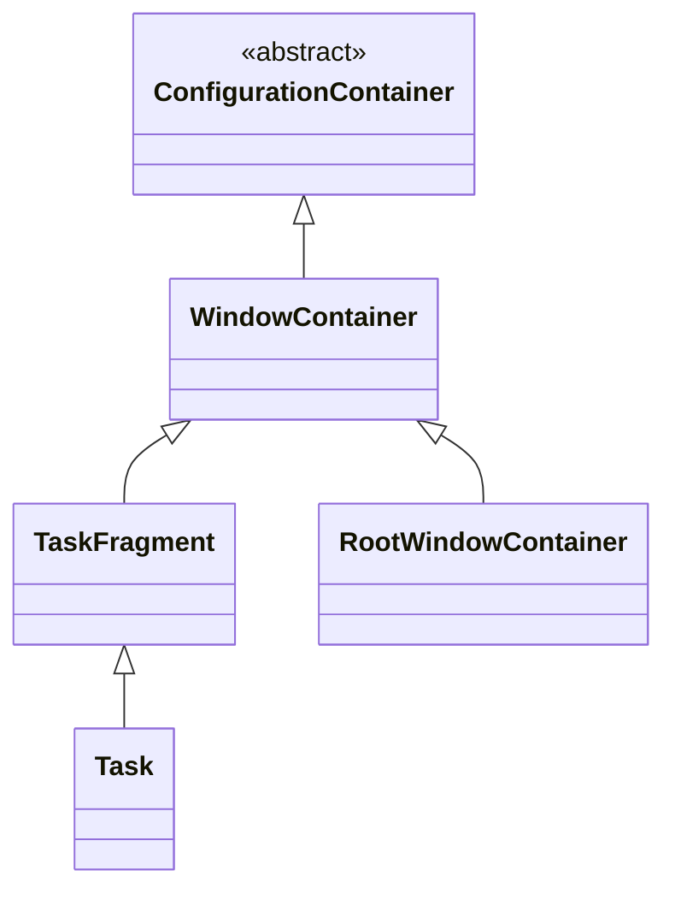
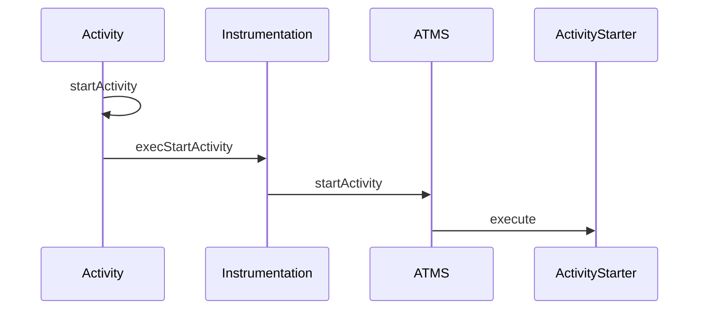
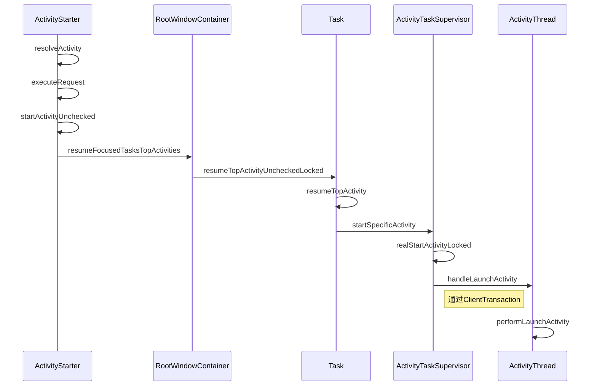

`Activity`是Android中四大组件使用最多的一种，不准确的说，一个`Activity`就是一个独立页面的承载，因此看Android系统的源码，`Activity`的启动也是必须要去阅读的。今天的文章就来介绍`Activity`的启动。因为之前的文章已经分析了[ClientTransaction](https://isming.me/2024-08-13-android-clienttransaction-analysis/)，因此我们对于`AMS`调用Activity的生命周期和启动有所了解。并且我们也已经分析过了[Binder](https://isming.me/2024-09-04-android-binder-overview/),对于跨进程通讯我们也比较清楚了，不需要细看。我们也分析了[应用进程的启动](https://isming.me/2024-09-04-android-binder-overview/)，我们分析Activity启动过程，就不需要去关注应用进程的启动了。有了这些基础，分析Activity的启动会容易一点点。

<!--more-->

### 发起启动Activity
我们首先来看一下启动Activity的调用，我们通常会使用下面的显示调用来启动一个Activity。
```java
Intent intent = new Intent(context, AActivity.class);
startActivity(intent);
```

当然也有可能会使用隐式调用来启动一个Activity，如下：
```java
Intent intent = new Intent(Intent.ACTION_VIEW, Uri.parse("https://isming.me"));
startActivity(intent);
```

不过以上两者在启动过程中，仅仅是查找目标组件有区别，并且对于隐式调用，可能存在多个可以启动的Activity，这个时候需要让用户选择目标的页面。对于这一块，我们在后面这个地方会考虑部分略过。

Activity中最终会走到 `startActivityForResult(intent, requestCode, options)`方法中,这里传入的options我们可以用它设置一些东西，比如App跳转的动画等，我们前面的场景的options为空，并且手机上默认的parent activity也为空，因此会执行这一部分：
```java
Instrumentation.ActivityResult ar = mInstrumentation.execStartActivity(
                    this, mMainThread.getApplicationThread(), mToken, this,
                    intent, requestCode, options);
if (ar != null) {
    mMainThread.sendActivityResult(
                    mToken, mEmbeddedID, requestCode, ar.getResultCode(),
                    ar.getResultData());
}
```


### 发起端的处理
在Instrumentation.execStartActivity中会调用如下代码：
```java
int result = ActivityTaskManager.getService().startActivity(whoThread,
                    who.getOpPackageName(), who.getAttributionTag(), intent,
                    intent.resolveTypeIfNeeded(who.getContentResolver()), token,
                    target != null ? target.mEmbeddedID : null, requestCode, 0, null, options);
            notifyStartActivityResult(result, options);
            checkStartActivityResult(result, intent);
```

早期是直接通过ActivityManagerService去启动新的页面的，在这个[commit](https://android.googlesource.com/platform/frameworks/base/+/65ebd955e1b19a0d3c995e66d1d749bae5dc8575)开始把Activity管理的拆分到ActivityTaskManagerService中去。这里我们看到是去获取`ActivityTaskManagerService`后面简称`ATMS`，获取`ATMS`的代码就不罗列了。

这里传到`ATMS`的参数，包括，发起应用的`ApplicationThread`，包名(对于普通应用来说opPackage和packageName是一样的)，启动的Intent，token和target一般都是空。

### ATMS执行startActivity

最终的执行实际是通过binder调用到`ActivityTaskManagerService`中的`startActivity`方法,这个方法中又直接调用了`startActivityAsUser`，其中会有一些检查，检查调用端的uid和packageName是否匹配和其他一些检查，这里不太关注，我们主要关注以下代码：
```java
userId = getActivityStartController().checkTargetUser(userId, validateIncomingUser,
                Binder.getCallingPid(), Binder.getCallingUid(), "startActivityAsUser");
        return getActivityStartController().obtainStarter(intent, "startActivityAsUser")
                .setCaller(caller)
                .setCallingPackage(callingPackage)
                .setCallingFeatureId(callingFeatureId)
                .setResolvedType(resolvedType)
                .setResultTo(resultTo)
                .setResultWho(resultWho)
                .setRequestCode(requestCode)
                .setStartFlags(startFlags)
                .setProfilerInfo(profilerInfo)
                .setActivityOptions(opts)
                .setUserId(userId)
                .execute();
```

从上面的逻辑可以看到，控制Activity启动的代码都放到ActivityStartController中了，首先是获取用户uid，因为每个应用的都会有一个uid，其后就是获取一个ActivityStarter，再通过构建者模式把启动Activity的参数都传到ActivityStarter中去，最后在ActivityStarter的execute()方法中去执行启动的逻辑。

```java
...
if (mRequest.activityInfo == null) { //如果还没有activitgyInfo去填充
                mRequest.resolveActivity(mSupervisor);
}
...
synchronized (mService.mGlobalLock) {
	res = resolveToHeavyWeightSwitcherIfNeeded(); //检查是否为heavy-weight 进程，系统会限制同一时间只有一个heavy-weight进程
    if (res != START_SUCCESS) {
        return res;
    }
    res = executeRequest(mRequest);
}
```

其中第2行代码就是根据我们的`Intent`去查询我们将要打开的目标Activity信息。
###  解析ActivityInfo
`resolveActivity`中的核心代码如下：
```java
//ActivityStarter.Request
void resolveActivity(ActivityTaskSupervisor supervisor) {
	resolveInfo = supervisor.resolveIntent(intent, resolvedType, userId,  
        0 /* matchFlags */,  
        computeResolveFilterUid(callingUid, realCallingUid, filterCallingUid));
    activityInfo = supervisor.resolveActivity(intent, resolveInfo, startFlags,  
        profilerInfo);
    if (activityInfo != null) {  
	    intentGrants = supervisor.mService.mUgmInternal.checkGrantUriPermissionFromIntent(  
            intent, resolvedCallingUid, activityInfo.applicationInfo.packageName,  
            UserHandle.getUserId(activityInfo.applicationInfo.uid));  
	}
}
```

`resolveActivity`的工作主要由`ActivityTaskSupervisor`来完成，首先是`resolveIntent`来获取`ResolveInfo`，之后调用`resolveActivity`获取`ActivityInfo`，最后再去对Intent中的data Uri做权限检查，我们这里只需要分析前两步骤就可。

`resolveIntent`方法内部，我们看到是调用了`PackageManagerService`的`resolveIntent`方法，代码如下，具体就不深入探究了。

```java
//ActivityTaskSupervisor
return mService.getPackageManagerInternalLocked().resolveIntent(  
        intent, resolvedType, modifiedFlags, privateResolveFlags, userId, true,  
        filterCallingUid);

```

`resolveActivity`代码如下：
```java
ActivityInfo resolveActivity(Intent intent, ResolveInfo rInfo, int startFlags,  
        ProfilerInfo profilerInfo) {  
    final ActivityInfo aInfo = rInfo != null ? rInfo.activityInfo : null;  
    if (aInfo != null) {  
        intent.setComponent(new ComponentName(  
                aInfo.applicationInfo.packageName, aInfo.name));  
        ... 
    }  
    return aInfo;  
}
```
这里所做的事情则比较简单，就是从前面拿到的`ResolveInfo`中拿到`activityInfo`，并且构建一个`ComponentName`放到`Intent`中去。到此为止就拿到了要打开的Activity信息。


### ActivityStarter.executeRequest
在前面拿到`ActivityInfo`，并且我们还构建了一个`Request`，我们就会继续调用`executeRequest`方法，其中是有大段的代码 是检查权限，以及一些系统Activity逻辑的处理，不是我们流程关注的重点，重要的是以下代码：

```java

mInterceptor.setStates(userId, realCallingPid, realCallingUid, startFlags, callingPackage,  
        callingFeatureId);  
if (mInterceptor.intercept(intent, rInfo, aInfo, resolvedType, inTask, inTaskFragment,  
        callingPid, callingUid, checkedOptions)) {  //拦截器对要启动的Activity做预处理
    intent = mInterceptor.mIntent;  
    rInfo = mInterceptor.mRInfo;  
    aInfo = mInterceptor.mAInfo;  
    resolvedType = mInterceptor.mResolvedType;  
    inTask = mInterceptor.mInTask;  
    callingPid = mInterceptor.mCallingPid;  
    callingUid = mInterceptor.mCallingUid;  
    checkedOptions = mInterceptor.mActivityOptions;  
  
    intentGrants = null;  
}

final ActivityRecord r = new ActivityRecord.Builder(mService) //构建ActivityRecord
                .setCaller(callerApp)
                .setLaunchedFromPid(callingPid)
                .setLaunchedFromUid(callingUid)
                .setLaunchedFromPackage(callingPackage)
                .setLaunchedFromFeature(callingFeatureId)
                .setIntent(intent)
                .setResolvedType(resolvedType)
                .setActivityInfo(aInfo)
                .setConfiguration(mService.getGlobalConfiguration())
                ...
                .build();

        mLastStartActivityRecord = r; //保存构建的ActivityRecord

       ...

        mLastStartActivityResult = startActivityUnchecked(r, sourceRecord, voiceSession,
                request.voiceInteractor, startFlags, true /* doResume */, checkedOptions,
                inTask, inTaskFragment, balCode, intentGrants); //执行启动Activity，并保存结果到mLastStartActivityResult中，以及结果中返回这个result

        if (request.outActivity != null) {
            request.outActivity[0] = mLastStartActivityRecord;
        }
        ...
```

这里我们有一些权限检查和系统处理之类的没有贴，不过还是贴了一下`intercept`方法，这里就是给了系统的其他代码来修改Intent的机会。之后就会利用我们传进来的信息去创建`ActivityRecord`，并且调用`startActivityUnchecked`去进入下一步：
```java

private int startActivityUnchecked(final ActivityRecord r, ActivityRecord sourceRecord,...,NeededUriGrants intentGrants) {
        int result = START_CANCELED;
        final Task startedActivityRootTask;

    ......
        try {
            ......
            try {
                .....
                result = startActivityInner(r, sourceRecord, voiceSession, voiceInteractor,
                        startFlags, doResume, options, inTask, inTaskFragment, balCode,
                        intentGrants);
            } finally {
                startedActivityRootTask = handleStartResult(r, options, result, newTransition,  
        remoteTransition); //处理启动Activity的结果
            }
        } finally {
            mService.continueWindowLayout(); //wms处理
        }
        postStartActivityProcessing(r, result, startedActivityRootTask);

        return result;
    }

```

这里又走到了startActivityInner()，startActivityInner()会去计算launch falgs，去判断是否开创建新的Task还是可以复用task，以及调用启动的后续代码，这个方法的代码比较长我们先一点一点的看。

### Task的处理
首先来看其中关于flag的处理，首先就是其中调用的`computeLaunchingTaskFlags`方法：
```java
private void computeLaunchingTaskFlags() {  
	...
    if (mInTask == null) {  
        if (mSourceRecord == null) {  
            if ((mLaunchFlags & FLAG_ACTIVITY_NEW_TASK) == 0 && mInTask == null) {  
                mLaunchFlags |= FLAG_ACTIVITY_NEW_TASK;  
            }  
        } else if (mSourceRecord.launchMode == LAUNCH_SINGLE_INSTANCE) {  
            mLaunchFlags |= FLAG_ACTIVITY_NEW_TASK;  
        } else if (isLaunchModeOneOf(LAUNCH_SINGLE_INSTANCE, LAUNCH_SINGLE_TASK)) {  
            mLaunchFlags |= FLAG_ACTIVITY_NEW_TASK;  
        }  
    }  
  
    if ((mLaunchFlags & FLAG_ACTIVITY_LAUNCH_ADJACENT) != 0  
            && ((mLaunchFlags & FLAG_ACTIVITY_NEW_TASK) == 0 || mSourceRecord == null)) {  
       mLaunchFlags &= ~FLAG_ACTIVITY_LAUNCH_ADJACENT;  
    }  
}
```
这里就是对于我们的启动的`LaunchFlag`做处理，比如说`LAUNCH_SIGLE_INSTANCE`和`LAUNCH_SINGLE_TASK`都给添加`FLAG_ACTIVITY_NEW_TASK`等。

随后则是计算Task：
```java
final Task prevTopRootTask = mPreferredTaskDisplayArea.getFocusedRootTask();  
final Task prevTopTask = prevTopRootTask != null ? prevTopRootTask.getTopLeafTask() : null;  
final Task reusedTask = getReusableTask();

final Task targetTask = reusedTask != null ? reusedTask : computeTargetTask();  
final boolean newTask = targetTask == null;  
mTargetTask = targetTask;
```

`getFocusedRootTask`会尝试去获取首选的Task，如果不存在也会从当前显示屏获取获取最顶部的可触摸并且在展示的Task。而这个`preTopTask`如果能够获取到，它又会去获取的它叶子节点。叶子节点的规则就是没有只节点。Task相关类的继承结果如下：


```java
if (mTargetRootTask == null) {  
    mTargetRootTask = getOrCreateRootTask(mStartActivity, mLaunchFlags, targetTask,  
            mOptions);  
}
```

这里最终会拿到`RootTask`，如果没有也会创建，具体代码这里不分析了。

### 调用Task的 resumeFocusedTasksTopActivities
之后会调用如下代码：


```java
//ActivityStarter
		...
		mTargetRootTask.startActivityLocked(mStartActivity, topRootTask, newTask, isTaskSwitch,  
        mOptions, sourceRecord); //这个名字是startActivityLock但并不是真的打开activity，而是把Activity对应的task放到列表的最前面，以及会展示window动画
        if (mDoResume) {
	        if (!mTargetRootTask.isTopActivityFocusable()  
	        || (topTaskActivity != null && topTaskActivity.isTaskOverlay()  
	        && mStartActivity != topTaskActivity)) { 
	         //对样式pip页面或者其他一些情况的处理
	         ...
			} else {
			...  
		    //真正的启动Activity的代码这里是入口
		    mRootWindowContainer.resumeFocusedTasksTopActivities(  
	            mTargetRootTask, mStartActivity, mOptions, mTransientLaunch);  
			}
			...
			
        }
        ...

        return START_SUCCESS;
    }

```

我们看到首先调用了`startActivityLocked`方法，这里主要做的就是把我们的ActivityReccord放到Task中去，并且展示Activity的启动动画。之后调用的`RootContainer`的`resumeFocsedTasksTopActivities`才是真正的启动，代码如下：

```java
//RootWindowContainer.java
boolean resumeFocusedTasksTopActivities(Task targetRootTask, ActivityRecord target, ActivityOptions targetOptions,  
boolean deferPause) {
	...
	boolean result = false;  
	if (targetRootTask != null && (targetRootTask.isTopRootTaskInDisplayArea()  
        || getTopDisplayFocusedRootTask() == targetRootTask)) {  
		result = targetRootTask.resumeTopActivityUncheckedLocked(
			target,targetOptions,  deferPause);  //执行启动
	}
	...
}
```
后面会走到Task的resumeTopActivityUnCheckedLocked方法
```java
boolean resumeTopActivityUncheckedLocked(ActivityRecord prev, ActivityOptions options,  
        boolean deferPause) {
	...
	if (isLeafTask()) {
                if (isFocusableAndVisible()) { //可触摸可见
                    someActivityResumed = resumeTopActivityInnerLocked(prev, options, deferPause);
                }
            } else {
                int idx = mChildren.size() - 1;
                while (idx >= 0) {
                    final Task child = (Task) getChildAt(idx--);
                    if (!child.isTopActivityFocusable()) {
                        continue;
                    }
                    if (child.getVisibility(null /* starting */)
                            != TASK_FRAGMENT_VISIBILITY_VISIBLE) {
                        if (child.topRunningActivity() == null) {
                            continue;
                        }
                        break;
                    }

                    someActivityResumed |= child.resumeTopActivityUncheckedLocked(prev, options,
                            deferPause);
                    if (idx >= mChildren.size()) {
                        idx = mChildren.size() - 1;
                    }
                }
            }


}
```

此处如果当前的Task本来就是叶子节点，那么会调用resumeTopActivityInnerLocked方法，否则会遍历子的task列表，在子task列表中找到符合条件的去执行`resumeTopActivityUncheckedLocked`方法,如此最后还是会调用到`resumeTopActivityInnerLocked`方法，而我们再跟进去看，可以看到其中的核心逻辑是调用topFragment的`resumeTopActivity`方法。
```java
final boolean resumeTopActivity(ActivityRecord prev, ActivityOptions options,  
        boolean deferPause) {
    ...
    boolean pausing = !deferPause && taskDisplayArea.pauseBackTasks(next);  
	if (mResumedActivity != null) {  
	    pausing |= startPausing(mTaskSupervisor.mUserLeaving, false /* uiSleeping */,  
            next, "resumeTopActivity");   //首先把顶部处于Resumed状态的activity执行pausing
}  
if (pausing) {  
    //检查即将启动的Activity的Activity的进程有没有起来，如果没有进程去创建进程，创建进程的代码需要单独分析，此处略过
    if (next.attachedToProcess()) {   
        next.app.updateProcessInfo(false /* updateServiceConnectionActivities */,  
                true /* activityChange */, false /* updateOomAdj */,  
                false /* addPendingTopUid */);  
    } else if (!next.isProcessRunning()) {  
        final boolean isTop = this == taskDisplayArea.getFocusedRootTask();  
        mAtmService.startProcessAsync(next, false /* knownToBeDead */, isTop,  
                isTop ? HostingRecord.HOSTING_TYPE_NEXT_TOP_ACTIVITY  
                        : HostingRecord.HOSTING_TYPE_NEXT_ACTIVITY);  
    }  
	    ...
	    return true;
	} 
	if (next.attachedToProcess()) { //如何Activity已经在这个进程中了
		...
		final ClientTransaction transaction =  
        ClientTransaction.obtain(next.app.getThread(), next.token); //构建ClientTransaction,传入要打开的Activity对应的applicationThread和IBinder
        ...
        if (next.newIntents != null) {   //把intent放进去，后面会把Activity吊起，并 调用onNewIntent()
		    transaction.addCallback(  
	            NewIntentItem.obtain(next.newIntents, true /* resume */));  
		}
		...
		mAtmService.getLifecycleManager().scheduleTransaction(transaction);
	
	} else {
		...
		mTaskSupervisor.startSpecificActivity(next, true, true); //启动Activity
	}


}
```

上面最后的代码可以看到，Activity已经存在的时候是走到onNewIntent, 调用的代码被包装成了ClientTransaction，通过ClientlifecycleManager 的scheduleTransaction方法，最终其实是调用了IApplicationThread的scheduleTransaction，最终通过binder调用到了app进程中的同名方法，这里要去看ActivityThread， ApplicationThread为它的内部类，看它的代码，它实际调用了ActivityThread的同名方法。而启动Activity，我们一路跟着startSpecificActivity()方法进去最终会看到也是通过ClientTransaction，代码如下：
```java
clientTransaction.addCallback(LaunchActivityItem.obtain(new Intent(r.intent),  
        System.identityHashCode(r), r.info,  
        // TODO: Have this take the merged configuration instead of separate global  
        // and override configs.  
        mergedConfiguration.getGlobalConfiguration(),  
        mergedConfiguration.getOverrideConfiguration(), r.compat,  
        r.getFilteredReferrer(r.launchedFromPackage), task.voiceInteractor,  
        proc.getReportedProcState(), r.getSavedState(), r.getPersistentSavedState(),  
        results, newIntents, r.takeOptions(), isTransitionForward,  
        proc.createProfilerInfoIfNeeded(), r.assistToken, activityClientController,  
        r.shareableActivityToken, r.getLaunchedFromBubble(), fragmentToken));
// Set desired final state.  
final ActivityLifecycleItem lifecycleItem;  
if (andResume) {  
    lifecycleItem = ResumeActivityItem.obtain(isTransitionForward,  
            r.shouldSendCompatFakeFocus());  
} else {  
    lifecycleItem = PauseActivityItem.obtain();  
}  
clientTransaction.setLifecycleStateRequest(lifecycleItem);
mService.getLifecycleManager().scheduleTransaction(clientTransaction);
```


### 目标进程执行performLaunchActivity
我们之前已经分析过ClientTransaction，我们知道这个`LaunchActivityItem`的callback，最后client就是我们的ActivityThread,会执行它的handleLaunchActivity方法，其中最核心的就是如下这一句:
```java
final Activity a = performLaunchActivity(r, customIntent);
```
我们继续往里面看：
```java
//content of performLaunchActivity() function
...
//为Activity创建Base Context
ContextImpl appContext = createBaseContextForActivity(r);  
Activity activity = null;  
...
//创建Activity实例，就是通过反射来实例化一个Activity实例
java.lang.ClassLoader cl = appContext.getClassLoader();  
activity = mInstrumentation.newActivity(  
            cl, component.getClassName(), r.intent);  
...
//拿到Application的实例，如果缓存中有就用，没有就创建一个新的，这里也不看具体代码了
Application app = r.packageInfo.makeApplicationInner(false, mInstrumentation);
...
//为Activity创建配置，如里面有语言，屏幕设置等等参数，不具体分析了
Configuration config =  
        new Configuration(mConfigurationController.getCompatConfiguration());  
if (r.overrideConfig != null) {  
    config.updateFrom(r.overrideConfig);  
}
...
//把Activity和baseContext绑定，并且把一些参数附加到Activity实例上去
appContext.setOuterContext(activity);  
activity.attach(appContext, this, getInstrumentation(), r.token,  
        r.ident, app, r.intent, r.activityInfo, title, r.parent,  
        r.embeddedID, r.lastNonConfigurationInstances, config,  
        r.referrer, r.voiceInteractor, window, r.activityConfigCallback,  
        r.assistToken, r.shareableActivityToken);
...
mInstrumentation.callActivityOnCreate(activity, r.state); //这一步完成，Activity里面会执行完onCreate()
...
r.setState(ON_CREATE);

```

再来具体看一看Activity的attach方法中做了什么
```java
attachBaseContext(context);
mFragments.attachHost(null /*parent*/);
mWindow = new PhoneWindow(this, window, activityConfigCallback);
....
mWindow.setWindowManager(  
        (WindowManager)context.getSystemService(Context.WINDOW_SERVICE),  
        mToken, mComponent.flattenToString(),  
        (info.flags & ActivityInfo.FLAG_HARDWARE_ACCELERATED) != 0);
mWindowManager = mWindow.getWindowManager();  
mCurrentConfig = config;

```

可以看到在里面绑定了baseContext，以及创建了我们的PhoneWindow，以及把window和windowManager进行绑定，还有其他一些Activity内部会用到的参数的传递。

而mInstrumentation里面最终是会调用Activity的performCreate,其中则会调用activity的onCreate。这里就不贴相关代码了。

这样我们的Activity才走完onCreate，而剩余步骤，我们之前还设置了`LifecycleStateRequest`为`ResumeActivityItem`，因此这是要让我们的Activity最终进入到Resume状态，具体的可以参看[ClientTransaction分析](https://isming.me/2024-08-13-android-clienttransaction-analysis/)。两篇文章配合着一起，就是完整的Activity启动流程了。

### 总结


从Activity调用startActivity，一直到A T M S调用ActivityStarter的调用时序图如下：



从ActivityStarter调用到新的进程处理的时序图如下（省略了到Activity部分的流程）：


以上就是一个较为精简的Activity启动的流程。其中省略了不少东西，关于startActivityForResult的情况需要获取到打开的Activity的结果的情况这里还没有讨论。

看代码可以发现Activity的启动过程是非常的复杂的，再加上新版本的Android支持多屏幕，折叠屏，分屏，画中画等等非常多的特性，因而Task的复用，新建就很复杂，因此本文这一部分暂时放下，等到以后在写。

如果你也对于Android系统源码感兴趣，欢迎与我交流。博文因为个人局限，也难免会出现差错，欢迎大家指正。


