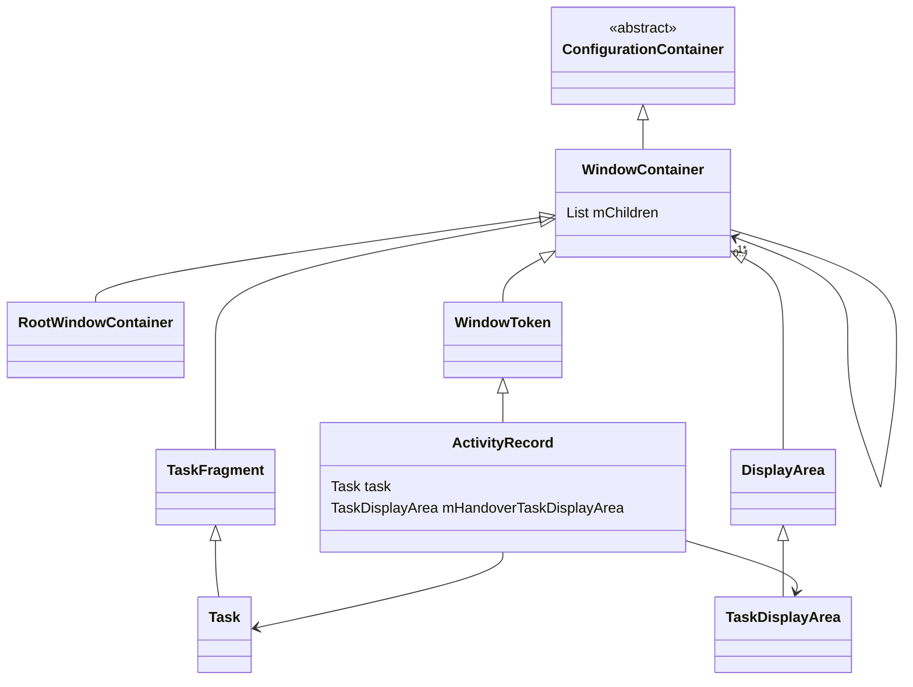

Activity的启动分析，很大一块需要了解的是Activity的Task管理，以及启动过程中Task的决策，在之前分析启动流程中，关于Task处理的部分，我这里是简化掉了很多的，今天再来分析一下。
<!--more-->

### 入口与计算启动参数
在之前分析Activity的启动中，已经看到了关于处理Task的代码是在`ActivityStart`当中的`startActivityInner`方法当中，这个方法有不少入参，先捋一遍：
resultTo为调用的Activity的`mToken(IBinder)`
```
ActivityRecord r, //新创建的Record，包含calling信息和要打开的ActivityInfo等
ActivityRecord sourceRecord, //resultTo不为空的时候才会去使用`ActivityRecord isInAnyTask`读取
IvoiceInteractionSession voiceSession, //startVoiceActivity的时候才会传
IvoiceInteractor voiceInteractor, //同上，一般为系统的语音助手界面
int startFlags, //客户端传过来的startFlags一般为0
boolean doResume, //是否需要去resume activity，对于启动Activity场景总是为true
ActivityOptions options,  //Activity启动的一些参数，页面跳转动画等
Task inTask, //一般为通过AppTaskImpl启动Activity才会设置值，正常app启动不存在
TaskFragment inTaskFragment, //同上，一般情况为空
int balCode, //Activity后台启动的许可Code，默认为BAL_ALLOW_DEFAULT
NeededGrants intentGrants //Intent访问权限授权

```

有了所有的入参可以看看`computeLaunchingTaskFlags`,对于普通应用`mInTask`为空，`mSourceRecord`不为空，关注这个方法内的如下代码：
```java
if (mInTask == null) {  
    if (mSourceRecord == null) {  
        if ((mLaunchFlags & FLAG_ACTIVITY_NEW_TASK) == 0 && mInTask == null) {  
	        //如果获取不到启动来源的ActivityRecord，且当前要启动的Activity还没有设置NEW_TASK flag，则给他添加
            mLaunchFlags |= FLAG_ACTIVITY_NEW_TASK;  
        }  
    } else if (mSourceRecord.launchMode == LAUNCH_SINGLE_INSTANCE) { 
	    //如果来源ActivityRecord是SINGLE INSTANCE，也就是说它是自己独立的任务栈，新启动Activity必须设置NEW_TASK 
        mLaunchFlags |= FLAG_ACTIVITY_NEW_TASK;  
    } else if (isLaunchModeOneOf(LAUNCH_SINGLE_INSTANCE, LAUNCH_SINGLE_TASK)) {  
        //如果新启动的Activity是SingleInstance或者SingleTask，也要添加NEW_TASK flag
        mLaunchFlags |= FLAG_ACTIVITY_NEW_TASK;  
    }  
}  
  
if ((mLaunchFlags & FLAG_ACTIVITY_LAUNCH_ADJACENT) != 0  
        && ((mLaunchFlags & FLAG_ACTIVITY_NEW_TASK) == 0 || mSourceRecord == null)) {  
    //如果要启动的Activity设置了分屏的FLAG，但是却没有设置NEW——FLAG或者没有源ActivityRecord，这个时候就需要忽略掉分屏的这个FLAG
    mLaunchFlags &= ~FLAG_ACTIVITY_LAUNCH_ADJACENT;  
}
```

简化版本的流程图如下：


### 获取当前的顶部Task: getFocusedRootTask
以上是针对LaunchFlag的一部分处理，但并不是全部，暂时继续往后看。随后就是获取task
```java
final Task prevTopRootTask = mPreferredTaskDisplayArea.getFocusedRootTask();  
final Task prevTopTask = prevTopRootTask != null ? prevTopRootTask.getTopLeafTask() : null;  
final Task reusedTask = getReusableTask();
```

首先看这个`mPreferredTaskDisplayArea`,这个表示倾向的Activity显示的TaskDisplay，它的赋值是在前面的`setInitialState`方法中：
```java
mSupervisor.getLaunchParamsController().calculate(inTask, r.info.windowLayout, r,  
        sourceRecord, options, mRequest, PHASE_DISPLAY, mLaunchParams);  
mPreferredTaskDisplayArea = mLaunchParams.hasPreferredTaskDisplayArea()  
        ? mLaunchParams.mPreferredTaskDisplayArea  
        : mRootWindowContainer.getDefaultTaskDisplayArea();
```
我们这里就以它是拿的`DefaultTaskDisplayArea`为例来分析，继续就是看它的`getFocusedRootTask`,看代码之前先看看这些类的关系图，之前画过Task，WindowContainer相关的，但是还不够全，这里再补充完整一点。

当然WindowContainer的子类远不止这些，包括WindowState等等都是它的子类，但是暂时不需要讨论他们，这里暂时先不列出来了。
我们还是先看`getFocusedRootTask`方法的源码：
```java
Task getFocusedRootTask() {  
    if (mPreferredTopFocusableRootTask != null) {  
        return mPreferredTopFocusableRootTask;  
    }  
  
    for (int i = mChildren.size() - 1; i >= 0; --i) {  
        final WindowContainer child = mChildren.get(i);  
        if (child.asTaskDisplayArea() != null) {  
            final Task rootTask = child.asTaskDisplayArea().getFocusedRootTask();  
            if (rootTask != null) {  
                return rootTask;  
            }  
            continue;  
        }  
  
        final Task rootTask = mChildren.get(i).asTask();  
        if (rootTask.isFocusableAndVisible()) {  
            return rootTask;  
        }  
    }  
  
    return null;  
}
```

如果说当前的`TaskDisplayArea`中，`preferredTopFocusableRoot`存在就会直接使用，这个会在postionChildTaskAt的时候，如果child放置到顶部，并且它是可获得焦点的，会把他赋值给这个`preferredTopFocusableRoot`。
我们这里先看它为空的情况。如果它为空，这回到树状结构中查找，遍历树节点如果也是`TaskDisplayArea`,则会 看他们的`focusedRootTask`是否存在，如果就返回。如果节点是Task，就会检查这个Task是否为可获得焦点并且可见的，则返回它。否则就返回空。因为我们当前已经打了Activity，这里一般是可以获得值的。

如果拿到了`prevTopRootTask`，就会去调用`getTopLeafTask`去获取叶子节点的Task，代码如下：
```java
public Task getTopLeafTask() {  
    for (int i = mChildren.size() - 1; i >= 0; --i) {  //从大数开始遍历
        final Task child = mChildren.get(i).asTask();  
        if (child == null) continue;  //如果不是Task就跳过
        return child.getTopLeafTask();  //继续看它的子节点
    }  
    return this;  //没有孩子节点，那就是一个叶子节点 
}
```

以上是获取叶子节点的代码，典型的树的遍历代码。到目前是拿的当前在展示的页面的任务栈。
### 获取可复用的Task:getReusableTask
而之后的`getReusableTask`则是获取可以使用的任务Task：
```java
private Task getReusableTask() {  
    //一般是从最近任务打开的页面才会执行这里，我们可以跳过
    if (mOptions != null && mOptions.getLaunchTaskId() != INVALID_TASK_ID) {  
        Task launchTask = mRootWindowContainer.anyTaskForId(mOptions.getLaunchTaskId());  
        if (launchTask != null) {  
            return launchTask;  
        }  
        return null;  
    }  
	//如果启动的FLAG是 Single Instance或者SingleTask；又或者是虽然设置了NEW_TASK但是没有设置MULTIPLE_TASK。这些情况都会把新的Activity放到已有的任务栈。
    boolean putIntoExistingTask = ((mLaunchFlags & FLAG_ACTIVITY_NEW_TASK) != 0 &&  
            (mLaunchFlags & FLAG_ACTIVITY_MULTIPLE_TASK) == 0)  
            || isLaunchModeOneOf(LAUNCH_SINGLE_INSTANCE, LAUNCH_SINGLE_TASK);  
    //因为mInTask为空，后面的resultTo不为空，因此putIntoExistingTask结果为false。当通过startActivityForResult的且requestCode > 0 时候就不为空
    putIntoExistingTask &= mInTask == null && mStartActivity.resultTo == null;  
    ActivityRecord intentActivity = null;  
    if (putIntoExistingTask) {  
        if (LAUNCH_SINGLE_INSTANCE == mLaunchMode) {  
            //这种情况只有一个实例，就通过intent和activityInfo去找到它。
            intentActivity = mRootWindowContainer.findActivity(mIntent, mStartActivity.info,  
                   mStartActivity.isActivityTypeHome());  
        } else if ((mLaunchFlags & FLAG_ACTIVITY_LAUNCH_ADJACENT) != 0) {  
            //对于分屏的，如果历史栈中有才使用
            intentActivity = mRootWindowContainer.findActivity(mIntent, mStartActivity.info,  
                    !(LAUNCH_SINGLE_TASK == mLaunchMode));  
        } else {  
            // 查找最合适的Task给Activity用  
            intentActivity =  
                    mRootWindowContainer.findTask(mStartActivity, mPreferredTaskDisplayArea);  
        }  
    }  
  
    if (intentActivity != null && mLaunchMode == LAUNCH_SINGLE_INSTANCE_PER_TASK  
            && !intentActivity.getTask().getRootActivity().mActivityComponent.equals(  
            mStartActivity.mActivityComponent)) {  
            //对于singleInstancePreTask，如果Task的根Activity不是要启动的Activity那么还是不能够复用，因此需要把intentActivity设置为空。
        intentActivity = null;  
    }  
  
    if (intentActivity != null  
            && (mStartActivity.isActivityTypeHome() || intentActivity.isActivityTypeHome())  
            && intentActivity.getDisplayArea() != mPreferredTaskDisplayArea) {  
        //
        intentActivity = null;  
    }  
  
    return intentActivity != null ? intentActivity.getTask() : null;  
}
```

以上就是根据条件判断是否可以复用栈，如果可以会去拿已经存在的Activity，如果Activity存在，则回去拿它的Task。其中这里有一个`singleInstancePreTask`的启动模式，这个对于我们很多Android开发这是不熟悉的，它是Android12引入的，它可以说是加强版本的singleInstance，当它是Task栈的根Task的时候就复用，如果不是的就类似singleTask会去打开一个新的Task栈。

这里先来看一下这个`findActivity`，他也是到`RootWindowContainer`中去查找，代码如下：
```java
ActivityRecord findActivity(Intent intent, ActivityInfo info, boolean compareIntentFilters) {  
    ComponentName cls = intent.getComponent();  
    if (info.targetActivity != null) {  
        cls = new ComponentName(info.packageName, info.targetActivity);  
    }  
    final int userId = UserHandle.getUserId(info.applicationInfo.uid);  
  
    final PooledPredicate p = PooledLambda.obtainPredicate(  
            RootWindowContainer::matchesActivity, PooledLambda.__(ActivityRecord.class),  
            userId, compareIntentFilters, intent, cls);  
    final ActivityRecord r = getActivity(p);  
    p.recycle();  
    return r;  
}
```

其中第8行就是创建了一个PooledPredicate，在我们调用`test`方法的时候就 会调用`RootWindowContainer::matchesActivity`这个方法，这个方法的代码如下：
```java
private static boolean matchesActivity(ActivityRecord r, int userId,  
        boolean compareIntentFilters, Intent intent, ComponentName cls) {  
    if (!r.canBeTopRunning() || r.mUserId != userId) return false;  
  
    if (compareIntentFilters) {  
        if (r.intent.filterEquals(intent)) {  
            return true;  
        }  
    } else {  
        if (r.mActivityComponent.equals(cls)) {  
            return true;  
        }  
    }  
    return false;  
}
```

首先检查，对应的`ActivityRecord`是否可以运行在topTask，是否与我们目标要启动的Activity是同样的用户Id，也就是在同一个进程。如果`compareIntentFilters`为true，还是检查他们的intent是否相同，之后会检查是否为同一个Activity类。对于这个有所了解，我们继续看`getActivity`的代码，它首先是会调用`WindowContainer`中的这个方法，代码如下：
```java
ActivityRecord getActivity(Predicate<ActivityRecord> callback, boolean traverseTopToBottom,  
        ActivityRecord boundary) {  
    if (traverseTopToBottom) {  
        for (int i = mChildren.size() - 1; i >= 0; --i) {  
            final WindowContainer wc = mChildren.get(i);  
            if (wc == boundary) return boundary;  
  
            final ActivityRecord r = wc.getActivity(callback, traverseTopToBottom, boundary);  
            if (r != null) {  
                return r;  
            }  
        }  
    } else {  
        ...
    }  
  
    return null;  
}
```

如果单看上面的代码，我们似乎永远都拿不到`ActivityRecord`，但是呢`ActivityRecord`也是`WindowContainer`的子类，在它当中我们也有同名方法，代码如下：
```java
@Override  
ActivityRecord getActivity(Predicate<ActivityRecord> callback, boolean traverseTopToBottom,  
        ActivityRecord boundary) {  
    return callback.test(this) ? this : null;  
}
```

这里可以看到，他就是调用了我们刚刚传入的那个`PooledPredicate`来测试自己是否符合要求，从而我们可以拿到对应的`ActivityRecord`。

### 计算目标Task: computeTargetTask
到这里我们可以继续看`startActivityInner`方法中的如下代码：
```java
final Task targetTask = reusedTask != null ? reusedTask : computeTargetTask();  
final boolean newTask = targetTask == null;  
mTargetTask = targetTask;
```

如果我们刚刚已经拿到reusedTask，那么目标的task就会使用它，如果拿不到则会调用`computeTargetTask`去获取Task，代码如下：
```java
private Task computeTargetTask() {  
    if (mStartActivity.resultTo == null && mInTask == null && !mAddingToTask  
            && (mLaunchFlags & FLAG_ACTIVITY_NEW_TASK) != 0) {  
        // 同时满足这些条件的情况，不复用task，直接返回空
        return null;  
    } else if (mSourceRecord != null) {  
	    //调用源ActivityRecord，直接复用调用源的Task
        return mSourceRecord.getTask();  
    } else if (mInTask != null) {  
        //inTask一般是AppTaskImpl指定的，就直接用它，它有可能还没创建这里去创建
        if (!mInTask.isAttached()) {  
            getOrCreateRootTask(mStartActivity, mLaunchFlags, mInTask, mOptions);  
        }  
        return mInTask;  
    } else {  
	    //获取或者创建Task
        final Task rootTask = getOrCreateRootTask(mStartActivity, mLaunchFlags, null /* task */,  
                mOptions);  
        final ActivityRecord top = rootTask.getTopNonFinishingActivity();  
        if (top != null) {  
            return top.getTask();  
        } else {  
            rootTask.removeIfPossible("computeTargetTask");  
        }  
    }  
    return null;  
}
```

这里我们继续去看一下`getOrCreateRootTask`，代码如下：
```java
private Task getOrCreateRootTask(ActivityRecord r, int launchFlags, Task task,  
        ActivityOptions aOptions) {  
    final boolean onTop =  
            (aOptions == null || !aOptions.getAvoidMoveToFront()) && !mLaunchTaskBehind;  
    final Task sourceTask = mSourceRecord != null ? mSourceRecord.getTask() : null;  
    return mRootWindowContainer.getOrCreateRootTask(r, aOptions, task, sourceTask, onTop,  
            mLaunchParams, launchFlags);  
}
```
这里还是先拿到调用端的`sourceTask`以及是否需要`onTop`,之后调用了`RootWindowContainer`的`getOrCreateRootTask`方法，代码如下：
```java
Task getOrCreateRootTask(@Nullable ActivityRecord r,  
        @Nullable ActivityOptions options, @Nullable Task candidateTask,  
        @Nullable Task sourceTask, boolean onTop,  
        @Nullable LaunchParamsController.LaunchParams launchParams, int launchFlags) {  
    ...
    TaskDisplayArea taskDisplayArea = null;  
    
    final int activityType = resolveActivityType(r, options, candidateTask);  
    Task rootTask = null;  
    ...
    int windowingMode = launchParams != null ? launchParams.mWindowingMode  
            : WindowConfiguration.WINDOWING_MODE_UNDEFINED;  
    ....
    if (taskDisplayArea == null) {  
        taskDisplayArea = getDefaultTaskDisplayArea();  
    }  
    return taskDisplayArea.getOrCreateRootTask(r, options, candidateTask, sourceTask,  
            launchParams, launchFlags, activityType, onTop);  
}
```

因为我们没有设置什么参数，因此会执行到最后的fallback流程，我们只分析这一部分。默认我们拿到的`activityType`为`Activity_TYPE_STANDARD`， `getDefaultTaskDisplayArea`会拿到默认的`TaskDisplayArea`这个之前已经分析过了，最后就是通过它去调用`getOrCreateRootTask`，代码如下：
```java
Task getOrCreateRootTask(int windowingMode, int activityType, boolean onTop,  
        @Nullable Task candidateTask, @Nullable Task sourceTask,  
        @Nullable ActivityOptions options, int launchFlags) {  
    final int resolvedWindowingMode =  
            windowingMode == WINDOWING_MODE_UNDEFINED ? getWindowingMode() : windowingMode;  
    if (!alwaysCreateRootTask(resolvedWindowingMode, activityType)) {  
        Task rootTask = getRootTask(resolvedWindowingMode, activityType);  
        if (rootTask != null) {  
            return rootTask;  
        }  
    } else if (candidateTask != null) {  
        ....
    }  
    return new Task.Builder(mAtmService)  
            .setWindowingMode(windowingMode)  
            .setActivityType(activityType)  
            .setOnTop(onTop)  
            .setParent(this)  
            .setSourceTask(sourceTask)  
            .setActivityOptions(options)  
            .setLaunchFlags(launchFlags)  
            .build();  
}
```
因为我们传进来的`windowingMode`是`WINDOWING_MODE_UNDEFINED`，因此这里会调用`getWindowingMode`来设置Mode，这里就是调用系统设置了，不需要看代码。

因为ActivityType是`ACTIVITY_TYPE_STAND`，所以这里`alwaysCreateRootTask`为true,因为我们传进来的`candidateTask`也是空，因此最后就是会创建一个新的Task。但是因为是创建的新task，这个Task里面没有运行中的Activity，因此computeTargetTask还是会返回空。

### 获取PriorAboveTask和task回收检查
继续回来看`startActivityInner`内部的代码：
```java
if (targetTask != null) {   //在DisplayArea中获取在targetTask Root上面的其他root task
    mPriorAboveTask = TaskDisplayArea.getRootTaskAbove(targetTask.getRootTask());  
}  
//如果newTask为false，则看看目标task 顶部的未finish的ActivityRecord
final ActivityRecord targetTaskTop = newTask  
        ? null : targetTask.getTopNonFinishingActivity();  
if (targetTaskTop != null) {  
    startResult = recycleTask(targetTask, targetTaskTop, reusedTask, intentGrants);  
    if (startResult != START_SUCCESS) {  
        return startResult;  
    }  
} else {  
    mAddingToTask = true;  
}
```


在可以复用栈的情况下，targetTaskTop不为空，比如`singleTask`的模式，这个时候会去执行`recycleTask`。其他情况设置`mAddingToTask`，表示我们的ActivityRecord需要添加到Task。
```java
final Task topRootTask = mPreferredTaskDisplayArea.getFocusedRootTask();  
if (topRootTask != null) {  
    startResult = deliverToCurrentTopIfNeeded(topRootTask, intentGrants);  
    if (startResult != START_SUCCESS) {  
        return startResult;  
    }  
}
```

如果我们检查topRootTask不为空的情况，这里如果我们的启动模式是`singleTask`，首先会检查task栈顶未启动的Activity是否与当前要启动的相同，如果相同，则不启动当前Activity，仅仅去执行它的`newIntent`，具体代码就不分析了。

### 创建RootTask，处理新Activity的Task
再往后看代码,之后就该创建RootTask了，代码如下：
```java
if (mTargetRootTask == null) {  
    mTargetRootTask = getOrCreateRootTask(mStartActivity, mLaunchFlags, targetTask,  
            mOptions);  
}  
if (newTask) {  
    final Task taskToAffiliate = (mLaunchTaskBehind && mSourceRecord != null)  
            ? mSourceRecord.getTask() : null;  
    setNewTask(taskToAffiliate);  
} else if (mAddingToTask) {  
    addOrReparentStartingActivity(targetTask, "adding to task");  
}
```

上面调用了`getOrCreateRootTask`,来创建了新的RootTask，与我们之前分析的类似。同时因为我们之前没有成功创建`targetTask`，因此这里会执行到`setNewTask`，而taskToAffiliate没有特殊参数，默认我们先按照空来对待吧。
```java
private void setNewTask(Task taskToAffiliate) {  
    final boolean toTop = !mLaunchTaskBehind && !mAvoidMoveToFront;  
    final Task task = mTargetRootTask.reuseOrCreateTask(  
            mStartActivity.info, mIntent, mVoiceSession,  
            mVoiceInteractor, toTop, mStartActivity, mSourceRecord, mOptions);  
    task.mTransitionController.collectExistenceChange(task);  
    //把新的ActivityRecord放置到Task列表的顶部
    addOrReparentStartingActivity(task, "setTaskFromReuseOrCreateNewTask");  
    if (taskToAffiliate != null) {  
        mStartActivity.setTaskToAffiliateWith(taskToAffiliate);  
    }  
}
```

这里大多数情况，`toTop`会是true，我们去看一下这个`reuseOrCreateTask`方法：
```java
Task reuseOrCreateTask(ActivityInfo info, Intent intent, IVoiceInteractionSession voiceSession,  
        IVoiceInteractor voiceInteractor, boolean toTop, ActivityRecord activity,  
        ActivityRecord source, ActivityOptions options) {  
  
    Task task;  
    if (canReuseAsLeafTask()) {  //如果没有Task子节点或者不是组织创建的
        task = reuseAsLeafTask(voiceSession, voiceInteractor, intent, info, activity);  
    } else {  
        // 创建taskId
        final int taskId = activity != null  
                ? mTaskSupervisor.getNextTaskIdForUser(activity.mUserId)  
                : mTaskSupervisor.getNextTaskIdForUser();  
        final int activityType = getActivityType();  
        //创建task，并且当前Task设置为这个Task的Parent，在build当中，把当前的Task放置到Parent的mChildren当中，根据toTop决定是否放置到顶部
        task = new Task.Builder(mAtmService)  
                .setTaskId(taskId)  
                .setActivityType(activityType != ACTIVITY_TYPE_UNDEFINED ? activityType  
                        : ACTIVITY_TYPE_STANDARD)  
                .setActivityInfo(info)  
                .setActivityOptions(options)  
                .setIntent(intent)  
                .setVoiceSession(voiceSession)  
                .setVoiceInteractor(voiceInteractor)  
                .setOnTop(toTop)  
                .setParent(this)  
                .build();  
    }  
  
    int displayId = getDisplayId();  
    if (displayId == INVALID_DISPLAY) displayId = DEFAULT_DISPLAY;  
    final boolean isLockscreenShown = mAtmService.mTaskSupervisor.getKeyguardController()  
            .isKeyguardOrAodShowing(displayId);  
    if (!mTaskSupervisor.getLaunchParamsController()  
            .layoutTask(task, info.windowLayout, activity, source, options)  
            && !getRequestedOverrideBounds().isEmpty()  
            && task.isResizeable() && !isLockscreenShown) {  
            //设置task的布局边界
        task.setBounds(getRequestedOverrideBounds());  
    }  
  
    return task;  
}
```

上面代码我们就可以复用或者创建新的task，详见注释。拿到Task，或者我们之前已经有Task的情况下（mAddingToTask为true）的时候，还需要执行`addOrReparentStartingActivity`，代码如下：
```java
private void addOrReparentStartingActivity(@NonNull Task task, String reason) {  
    TaskFragment newParent = task;  
    if (mInTaskFragment != null) {  
        //我们的场景不涉及InTaskFragment不为空，忽略
        ...
    } else {  
	    //当clearTop的时候，并且是可嵌入的，这个时候会保存TaskFragment到mAddingToTaskFragment
        TaskFragment candidateTf = mAddingToTaskFragment != null ? mAddingToTaskFragment : null;  
        if (candidateTf == null) {  
	        //获取目标Task的topRunningActivity，新建的Task不存在
            final ActivityRecord top = task.topRunningActivity(false /* focusableOnly */,  
                    false /* includingEmbeddedTask */);  
            if (top != null) {  
                candidateTf = top.getTaskFragment();  
            }  
        }  
        if (candidateTf != null && candidateTf.isEmbedded()  
                && canEmbedActivity(candidateTf, mStartActivity, task) == EMBEDDING_ALLOWED) {  
                //如果拿到了topTask，并且对应的Task是可嵌入的，并且要打开的ActivityRecord也可被嵌入，这把拿到的这个Task作为新的父Task
            newParent = candidateTf;  
        }  
    }  
    //新的ActivityRecord的TaskFragment为空，或者和新的Parent一样，就把这个ActivityRecord放到Task的顶部
    if (mStartActivity.getTaskFragment() == null  
            || mStartActivity.getTaskFragment() == newParent) {  
        newParent.addChild(mStartActivity, POSITION_TOP);  
    } else {  
        mStartActivity.reparent(newParent, newParent.getChildCount() /* top */, reason);  
    }  
}
```

这里会检查如果新的父Task和我们可以复用的Task是否相同，如果相同，或者`ActivityRecord`中还没有parent，这个时候就把`ActivityRecord`添加到Task的孩子列表的顶部。而如果`ActivityRecord`已经存在了parent并且不是我们将要设置的这个，就需要做reparent，这个步骤代码比较复杂，前面调用检查判断的调用省略，直接看最后的调用，代码如下：
```java
//WindowContainer.java
void reparent(WindowContainer newParent, int position) {  
    final DisplayContent prevDc = oldParent.getDisplayContent();  
    final DisplayContent dc = newParent.getDisplayContent();  
  
    mReparenting = true;  
    //从旧的parent中移除自己，并把自己添加到新parent的指定位置
    oldParent.removeChild(this);  
    newParent.addChild(this, position);  
    mReparenting = false;  
  
    // 重新布局layout
    dc.setLayoutNeeded();  
    //如果新旧的DisplayContent不同，还需要做displayChange的处理
    if (prevDc != dc) {  
        onDisplayChanged(dc);  
        prevDc.setLayoutNeeded();  
    }  
    getDisplayContent().layoutAndAssignWindowLayersIfNeeded();  
  
    onParentChanged(newParent, oldParent);  
    onSyncReparent(oldParent, newParent);  
}
```

以上的代码我们看到有做parent的替换，但是复杂点在后面的`onParentChanged`里面，这里会做`SurfaceControl`的创建或者reparent，这里就不深入了。除此之外，这里还涉及到动画的处理，我们这里也 不深入了。

继续往后看
```java
if (!mAvoidMoveToFront && mDoResume) {  
    mTargetRootTask.getRootTask().moveToFront("reuseOrNewTask", targetTask);  
    ... 
}
```

这里会在检查我们的TargetRootTask相比与它的RootTask如果不是在顶部的，需要把它移动到顶部。再往后面就是调用`TargetRootTask`去启动Activity，以及确认Activity显示出来。
```java
final boolean isTaskSwitch = startedTask != prevTopTask && !startedTask.isEmbedded();  
//启动Activity
mTargetRootTask.startActivityLocked(mStartActivity, topRootTask, newTask, isTaskSwitch,  
        mOptions, sourceRecord);  
if (mDoResume) {  
    final ActivityRecord topTaskActivity = startedTask.topRunningActivityLocked();  
    if (!mTargetRootTask.isTopActivityFocusable()  
            || (topTaskActivity != null && topTaskActivity.isTaskOverlay()  
            && mStartActivity != topTaskActivity)) { 
            //如果当前要启动的Activity还没有启动，没有在栈顶端，执行下面的代码
        mTargetRootTask.ensureActivitiesVisible(null /* starting */,  
                0 /* configChanges */, !PRESERVE_WINDOWS);  
        mTargetRootTask.mDisplayContent.executeAppTransition();  
    } else {  
        if (mTargetRootTask.isTopActivityFocusable()  
                && !mRootWindowContainer.isTopDisplayFocusedRootTask(mTargetRootTask)) {  
            mTargetRootTask.moveToFront("startActivityInner");  
        }  
        mRootWindowContainer.resumeFocusedTasksTopActivities(  
                mTargetRootTask, mStartActivity, mOptions, mTransientLaunch);  
    }  
}  
mRootWindowContainer.updateUserRootTask(mStartActivity.mUserId, mTargetRootTask);   //更新用户的rootTask
  
// 更新系统的最近任务
mSupervisor.mRecentTasks.add(startedTask);
```

到此位置才算是完成了所有Task计算以及Activity的启动。

### 通过Adb shell看Activity Task栈
前面都是在解读Android的源码可能比较抽象，其中涉及到了挺多WindowContainer和Task等等相关的查找创建的，为了更加形象。我写了个小demo，主页面是普通的launchMode，另外一次打开了一个singleTask启动Mode的和一个singleInstance 启动Mode的页面，然后我们用一下命令进行Activity Task的dump：
```shell
adb shell dumpsys activity activities > ~/activitytasks.txt
```

我们就得到了如下的内容(为方便解读，做了删减)：
```
Display #0 (activities from top to bottom):
  * Task{8ed7532 #40 type=standard A=10116:com.example.myapplication U=0 visible=true visibleRequested=true mode=fullscreen translucent=false sz=1}
    topResumedActivity=ActivityRecord{3653c00 u0 com.example.myapplication/.SimpleInstanceActivity} t40}
    * Hist  #0: ActivityRecord{3653c00 u0 com.example.myapplication/.SimpleInstanceActivity} t40}

  * Task{ac77886 #39 type=standard A=10116:com.example.myapplication U=0 visible=false visibleRequested=false mode=fullscreen translucent=true sz=2}
    mLastPausedActivity: ActivityRecord{6c019a5 u0 com.example.myapplication/.SingleTaskActivity} t39}
    * Hist  #1: ActivityRecord{6c019a5 u0 com.example.myapplication/.SingleTaskActivity} t39}
    * Hist  #0: ActivityRecord{ef92174 u0 com.example.myapplication/.MainActivity} t39}

  * Task{d8527c1 #1 type=home U=0 visible=false visibleRequested=false mode=fullscreen translucent=true sz=1}
    * Task{d60ff49 #33 type=home I=com.android.launcher3/.uioverrides.QuickstepLauncher U=0 rootTaskId=1 visible=false visibleRequested=false mode=fullscreen translucent=true sz=1}
      mLastPausedActivity: ActivityRecord{868b56f u0 com.android.launcher3/.uioverrides.QuickstepLauncher} t33}
      * Hist  #0: ActivityRecord{868b56f u0 com.android.launcher3/.uioverrides.QuickstepLauncher} t33}


  * Task{2c52978 #36 type=standard A=10044:com.android.documentsui U=0 visible=false visibleRequested=false mode=fullscreen translucent=true sz=1}
    mLastPausedActivity: ActivityRecord{f9c48b6 u0 com.android.documentsui/.files.FilesActivity} t36}
    mLastNonFullscreenBounds=Rect(338, 718 - 1103, 2158)
    isSleeping=false
    * Hist  #0: ActivityRecord{f9c48b6 u0 com.android.documentsui/.files.FilesActivity} t36}


  * Task{e38c1d6 #35 type=standard A=10044:com.android.documentsui U=0 visible=false visibleRequested=false mode=fullscreen translucent=true sz=1}
    mLastPausedActivity: ActivityRecord{32a5344 u0 com.android.documentsui/.files.FilesActivity} t35}
    mLastNonFullscreenBounds=Rect(338, 718 - 1103, 2158)
    isSleeping=false
    * Hist  #0: ActivityRecord{32a5344 u0 com.android.documentsui/.files.FilesActivity} t35}

  * Task{1d65c74 #3 type=undefined U=0 visible=false visibleRequested=false mode=fullscreen translucent=true sz=2}
    mCreatedByOrganizer=true
    * Task{41cb5e3 #5 type=undefined U=0 rootTaskId=3 visible=false visibleRequested=false mode=multi-window translucent=true sz=0}
      mBounds=Rect(0, 2960 - 1440, 4440)
      mCreatedByOrganizer=true
      isSleeping=false
    * Task{1cdca12 #4 type=undefined U=0 rootTaskId=3 visible=false visibleRequested=false mode=multi-window translucent=true sz=0}
      mCreatedByOrganizer=true
      isSleeping=false
```

这上面就是我们的`mRootContainer`它当中的的`display`下面的所有的Task记录，因为我的手机只有一块屏幕，这里只有一个display0， 并且展示了他们的存储关系，这里我们可以看到我们的`SimpleInstanceActivity`它是在独立的Task当中的。用图表简单描绘一下，结构如下所示：


### 总结
以上就是Activity Task管理的分析，因为这个流程真的是非常复杂，因此中间的很多步骤还是进行了部分省略。Android系统迭代了这么多年，作为UI展示的组件，Activity承载了太多东西，多屏幕，折叠屏什么的都要支持，因此引入的东西就越来越多。官方也是意识到了这一块的，Activity的管理从AMS抽出来单独的ATMS，ActivityTaskSupervisor的功能也在慢慢抽离到其他的代码中，当前代码里面也添加了很多注释，只要花时间还是能够给搞明白的。

本文仅为一家之言，因为个人疏忽，可能文中也会出现一些错误，欢迎大家指正。