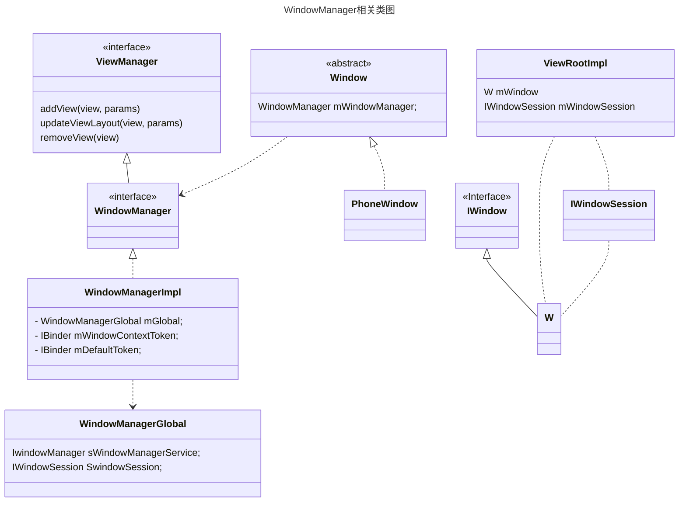
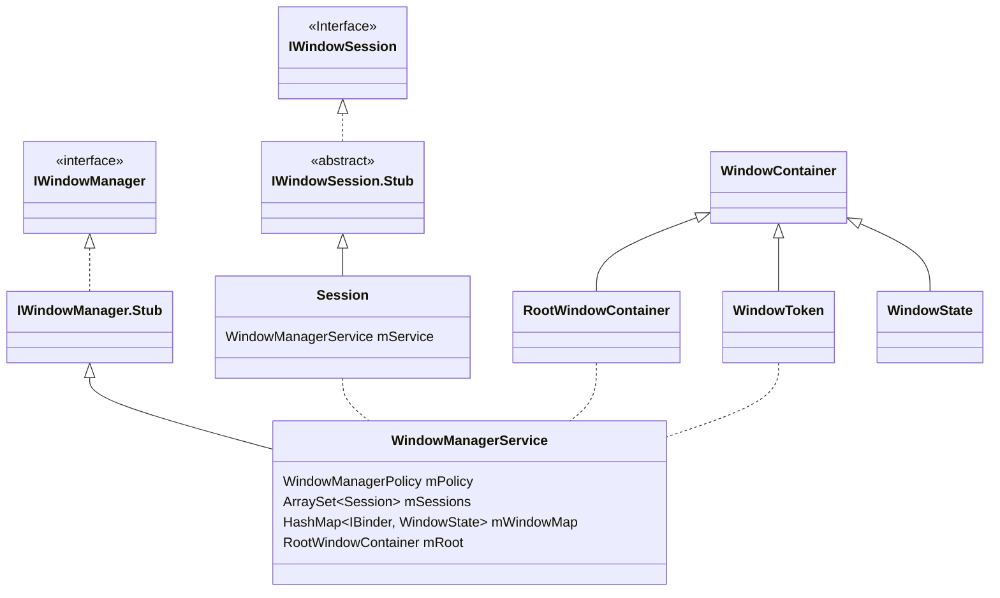

Activity是四大组件中和UI相关的那个，应用开发过程中，我们所有的界面基本都需要使用Activity才能去渲染和绘制UI，即使是ReactNative，Flutter这种跨平台的方案，在Android中，也需要一个Activity来承载。但是我们的Activity内我们设置的View又是怎么渲染到屏幕上的呢，这背后又有WindowManager和SurfaceFlinger来进行工作。本文就来看看WindowManger如何管理Window，以及Window如何与Activity产生关系的呢。
<!--more-->

### Activity与Window的初见
Activity的创建是在`ActivityThread`的`performLaunchActivity`中，这里会创建要启动的Activity，并且会调用Activity的`attach`方法，在这个方法当中就会创建Window，其中和Window相关的代码如下：
```java
mWindow = new PhoneWindow(this, window, activityConfigCallback);  
mWindow.setWindowControllerCallback(mWindowControllerCallback);  
mWindow.setCallback(this);  
mWindow.setOnWindowDismissedCallback(this);  
mWindow.getLayoutInflater().setPrivateFactory(this);  
if (info.softInputMode != WindowManager.LayoutParams.SOFT_INPUT_STATE_UNSPECIFIED) {  
    mWindow.setSoftInputMode(info.softInputMode);  
}  
if (info.uiOptions != 0) {  
    mWindow.setUiOptions(info.uiOptions);  
}
mWindow.setWindowManager(  
        (WindowManager)context.getSystemService(Context.WINDOW_SERVICE),  
        mToken, mComponent.flattenToString(),  
        (info.flags & ActivityInfo.FLAG_HARDWARE_ACCELERATED) != 0);  
if (mParent != null) {  
    mWindow.setContainer(mParent.getWindow());  
}  
mWindowManager = mWindow.getWindowManager();
```

这里我们可以看到为Activity创建了Window，目前Android上面的Window实例为`PhoneWindow`，同时还给Window设置了WindowManager，不过这里的WindowManager仅仅是一个本地服务，它的实现为`WindowManagerImpl`，它的注册代码在`SystemServiceRegister.java`中，代码如下：
```java
registerService(Context.WINDOW_SERVICE, WindowManager.class,  
        new CachedServiceFetcher<WindowManager>() {  
    @Override  
    public WindowManager createService(ContextImpl ctx) {  
        return new WindowManagerImpl(ctx);  
    }});
```
而我们这个WindowManagerImpl内部持有持有了一个`WindowManagerGlobal`，看名字就知道它应该会涉及到跨进程通讯，去看它代码就知道它内部有两个成员，分别是`sWindowManagerService`和`sWindowSession`，这两个成员就用于跨进程通讯。这里我们先知道有这几个类，后面到用处再继续分析。


这里只可出了App进程相关的一些类，System_Server相关未列出，后面涉及到相关部分的时候再进行分析。

### Window与View的邂逅
我们一般情况下会在Activity的`onCreate`当中去调用`setContentView`,只有这样我们的View才能够显示出来。因此我们直接看这个方法的调用：
```java
public void setContentView(@LayoutRes int layoutResID) {  
    getWindow().setContentView(layoutResID);  
    initWindowDecorActionBar();  
}
```
其中就是调用了`window`的同名方法：
```java
public void setContentView(int layoutResID) {  
    if (mContentParent == null) {  
        installDecor();  
    } else if (!hasFeature(FEATURE_CONTENT_TRANSITIONS)) {  
        mContentParent.removeAllViews();  
    }  
  
    if (hasFeature(FEATURE_CONTENT_TRANSITIONS)) {  
        final Scene newScene = Scene.getSceneForLayout(mContentParent, layoutResID,  
                getContext());  
        transitionTo(newScene);  //执行页面Transition动画
    } else {  
        mLayoutInflater.inflate(layoutResID, mContentParent);  
    }  
    mContentParent.requestApplyInsets();  
    final Callback cb = getCallback();  
    if (cb != null && !isDestroyed()) {  
        cb.onContentChanged();  
    }  
    mContentParentExplicitlySet = true;  
}
```

这里我们主要是将我们的ContentView添加到`mContentParent`当中去，这个`mContentParent`有可能为空，需要我们通过`installDecor`来创建，代码如下：
```java
private void installDecor() {  
    mForceDecorInstall = false;  
    if (mDecor == null) {  
        mDecor = generateDecor(-1);  
        mDecor.setDescendantFocusability(ViewGroup.FOCUS_AFTER_DESCENDANTS);  
        mDecor.setIsRootNamespace(true);  
        if (!mInvalidatePanelMenuPosted && mInvalidatePanelMenuFeatures != 0) {  
            mDecor.postOnAnimation(mInvalidatePanelMenuRunnable);  
        }  
    } else {  
        mDecor.setWindow(this);  
    }  
    if (mContentParent == null) {  
        mContentParent = generateLayout(mDecor);  
  
        // Set up decor part of UI to ignore fitsSystemWindows if appropriate.  
        mDecor.makeFrameworkOptionalFitsSystemWindows();  
  
        final DecorContentParent decorContentParent = (DecorContentParent) mDecor.findViewById(  
                R.id.decor_content_parent);  
  
        if (decorContentParent != null) {  
            mDecorContentParent = decorContentParent;  
            mDecorContentParent.setWindowCallback(getCallback());  
            if (mDecorContentParent.getTitle() == null) {  
                mDecorContentParent.setWindowTitle(mTitle);  
            }  
  
            final int localFeatures = getLocalFeatures();  
            for (int i = 0; i < FEATURE_MAX; i++) {  
                if ((localFeatures & (1 << i)) != 0) {  
                    mDecorContentParent.initFeature(i);  
                }  
            }  
  
            mDecorContentParent.setUiOptions(mUiOptions);  
  
            ...
  
             PanelFeatureState st = getPanelState(FEATURE_OPTIONS_PANEL, false);  
            if (!isDestroyed() && (st == null || st.menu == null) && !mIsStartingWindow) {  
                invalidatePanelMenu(FEATURE_ACTION_BAR);  
            }  
        } else {  
            mTitleView = findViewById(R.id.title);  
            if (mTitleView != null) {  
                //title view的设置
            }  
        }  
  
        if (mDecor.getBackground() == null && mBackgroundFallbackDrawable != null) {  
            mDecor.setBackgroundFallback(mBackgroundFallbackDrawable);  
        }  
  
        if (hasFeature(FEATURE_ACTIVITY_TRANSITIONS)) {  
            ...
            //页面动画的读取和设置    
        }  
    }  
}
```

这里我们可以看到主要做的就是创建了decorView和ContentParent，还有一些动画，标题之类的初始化我们这里就跳过了。DecorView就是App Activity页面最底层的容器，它为我们封装了状态栏，底部导航栏，App页面的内容的展示。而ContentParent的初始化，则是根据Activity的设置，根据是否展示状态栏，是否展示标题栏等，进行加载相应的布局，加载到DecorView当中，最后`com.android.internal.R.id.content`对应的FrameLayout就会成为ContentParent。
当这一切做完，我们的页面View就成功的添加到Window当中了，但是它是如何展示出来的呢，还需要继续往后看。我们需要前往ActivityThread的`handleResumeActivity`方法：
```java
//调用Activity的onResume方法
if (!performResumeActivity(r, finalStateRequest, reason)) {  
    return;  
}
//r为ActivityClientRecord
final Activity a = r.activity;
//检查当前的Activity是否能显示
boolean willBeVisible = !a.mStartedActivity;  
if (!willBeVisible) {  
    willBeVisible = ActivityClient.getInstance().willActivityBeVisible(  
            a.getActivityToken());  
}  
if (r.window == null && !a.mFinished && willBeVisible) {  
    r.window = r.activity.getWindow();  //把activity的window保存到r.window中
    View decor = r.window.getDecorView();  
    decor.setVisibility(View.INVISIBLE);  
    ViewManager wm = a.getWindowManager();  
    WindowManager.LayoutParams l = r.window.getAttributes();  
    a.mDecor = decor;  
    l.type = WindowManager.LayoutParams.TYPE_BASE_APPLICATION;  
    l.softInputMode |= forwardBit;  
    if (r.mPreserveWindow) {  
        a.mWindowAdded = true;  
        r.mPreserveWindow = false;  
        ViewRootImpl impl = decor.getViewRootImpl();  
        if (impl != null) {  
            impl.notifyChildRebuilt();  
        }  
    }  
    if (a.mVisibleFromClient) {  
        if (!a.mWindowAdded) {  
            a.mWindowAdded = true;  
            wm.addView(decor, l);  //调用windowManager添加decorView
        } else {  
            a.onWindowAttributesChanged(l); 
        }  
    }  
} else if (!willBeVisible) {  
    r.hideForNow = true;  
}
```

可以看到上面的代码把window保存到了ActivityClientRecord当中，同时调用了WindowManager的addView方法，去添加view。我们继续往后看代码：
```java
if (!r.activity.mFinished && willBeVisible && r.activity.mDecor != null && !r.hideForNow) {  
    ViewRootImpl impl = r.window.getDecorView().getViewRootImpl();  
    WindowManager.LayoutParams l = impl != null  
            ? impl.mWindowAttributes : r.window.getAttributes();  
    if ((l.softInputMode  
            & WindowManager.LayoutParams.SOFT_INPUT_IS_FORWARD_NAVIGATION)  
            != forwardBit) {  
        l.softInputMode = (l.softInputMode  
                & (~WindowManager.LayoutParams.SOFT_INPUT_IS_FORWARD_NAVIGATION))  
                | forwardBit;  
        if (r.activity.mVisibleFromClient) {  
            ViewManager wm = a.getWindowManager();  
            View decor = r.window.getDecorView();  
            wm.updateViewLayout(decor, l);  
        }  
    }  
  
    r.activity.mVisibleFromServer = true;  
    mNumVisibleActivities++;  
    if (r.activity.mVisibleFromClient) {  
        r.activity.makeVisible();  
    }  
  
    if (shouldSendCompatFakeFocus) {  
        if (impl != null) {  
            impl.dispatchCompatFakeFocus();  
        } else {  
            r.window.getDecorView().fakeFocusAfterAttachingToWindow();  
        }  
    }  
}
```

上面的代码中，我们看到主要做了两件事情，一个是调用updateViewLayout去更新视图的属性，但是`updateViewLayout`也要属性发生变化，并且有输入法的时候才会执行，另外就是调用activity的makeVisible方法去展示View。

这个过程我们需要分析如下两步。
1. 调用addView添加decorView
2. 调用activity.makeVisible来显示
我们分别看一下这两个方法的实现
### WMS与ViewRootImpl的遇见：调用WindowManger的addView

```java
public void addView(@NonNull View view, @NonNull ViewGroup.LayoutParams params) {  
    applyTokens(params);  
    mGlobal.addView(view, params, mContext.getDisplayNoVerify(), mParentWindow,  
            mContext.getUserId());  
}
```
这里就是调用`mGlobal`的`addView`方法：
```java
public void addView(View view, ViewGroup.LayoutParams params,  
        Display display, Window parentWindow, int userId) {  

    final WindowManager.LayoutParams wparams = (WindowManager.LayoutParams) params;  
    ....
  
    ViewRootImpl root;  
    View panelParentView = null;  
  
    synchronized (mLock) {  
  
        int index = findViewLocked(view, false);  
        ...
  
        if (windowlessSession == null) {  
            root = new ViewRootImpl(view.getContext(), display);  
        } else {  
            root = new ViewRootImpl(view.getContext(), display,  
                    windowlessSession, new WindowlessWindowLayout());  
        }  
  
        view.setLayoutParams(wparams);  
  
        mViews.add(view);  
        mRoots.add(root);  
        mParams.add(wparams);  

        try {  
            root.setView(view, wparams, panelParentView, userId);  
        } catch (RuntimeException e) {  
            final int viewIndex = (index >= 0) ? index : (mViews.size() - 1);  
            // BadTokenException or InvalidDisplayException, clean up.  
            if (viewIndex >= 0) {  
                removeViewLocked(viewIndex, true);  
            }  
            throw e;  
        }  
    }  
}
```

在正常的App页面，`windowlessSession`会一直为空，这里就会创建一个`ViewRootImpl`,并且把我们的DecorView以及WindowParams都传进去。并且`view`、`root`、`wparams`都会按照顺序存到List当中。这里我们需要去看ViewRootImpl的`setView`方法,其中和添加到屏幕相关的代码如下：
```java
requestLayout(); //测量布局
res = mWindowSession.addToDisplayAsUser(mWindow, mWindowAttributes,  
        getHostVisibility(), mDisplay.getDisplayId(), userId,  
        mInsetsController.getRequestedVisibilities(), inputChannel, mTempInsets,  
        mTempControls, attachedFrame, compatScale);
...
view.assignParent(this); //将ViewRootImpl设置为DecorView的parent
```

这里的`mDisplay`为外面从Context中所获取的，用于指定当前的UI要显示到哪一个显示器上去。这里的`mWindowSession`的获取代码如下：
```java
//WindowManagerGlobal.java
@UnsupportedAppUsage  
public static IWindowSession getWindowSession() {  
    synchronized (WindowManagerGlobal.class) {  
        if (sWindowSession == null) {  
            try {  
                @UnsupportedAppUsage  
	InputMethodManager.ensureDefaultInstanceForDefaultDisplayIfNecessary();  
                IWindowManager windowManager = getWindowManagerService();  
                sWindowSession = windowManager.openSession(  
                        new IWindowSessionCallback.Stub() {  
                            @Override  
                            public void onAnimatorScaleChanged(float scale) {  
                                ValueAnimator.setDurationScale(scale);  
                            }  
                        });  
            } catch (RemoteException e) {  
                throw e.rethrowFromSystemServer();  
            }  
        }  
        return sWindowSession;  
    }  
}
```

可以看到就是通过`IWindowManger`这个Binder服务调用了`openSession`来获取了一个`WindowSession`。其代码如下：
```java
//WindowManagerService.java
public IWindowSession openSession(IWindowSessionCallback callback) {  
    return new Session(this, callback);  
}
```
在System_Server端，创建了一个Session对象来提供相关的服务。它的`addToDisplayAsUser`方法又调用了`WMS`的`addWindow`方法，这个方法比较长我们只看其中和UI展示相关的部分，并且UI类型不是App的普通UI的也都给省略掉。
```java
int res = mPolicy.checkAddPermission(attrs.type, isRoundedCornerOverlay, attrs.packageName,  
        appOp);
final DisplayContent displayContent = getDisplayContentOrCreate(displayId, attrs.token);
```

第一行代码首先是去检查我们当前要展示的view，它的类型是否支持去展示。第3行代码的内容如下：
```java
private DisplayContent getDisplayContentOrCreate(int displayId, IBinder token) {  
    if (token != null) {  
        final WindowToken wToken = mRoot.getWindowToken(token);  
        if (wToken != null) {  
            return wToken.getDisplayContent();  
        }  
    }  
  
    return mRoot.getDisplayContentOrCreate(displayId);  
}
```

mRoot为一个`RootWindowContainer`对象，之前我们在分析Activity的启动过程中已经见到了它，我们的ActivityRecord和Task都存在它当中。这里`wToken`初始情况一般为null因此会执行下面的`getDisplayContentOrCreate`方法，代码如下：
```java
DisplayContent getDisplayContentOrCreate(int displayId) {  
    DisplayContent displayContent = getDisplayContent(displayId);  
    if (displayContent != null) {  
        return displayContent;  
    }  
    ...
    final Display display = mDisplayManager.getDisplay(displayId);  
    ... 
    displayContent = new DisplayContent(display, this);  
    addChild(displayContent, POSITION_BOTTOM);  
    return displayContent;  
}
```
这里就是根据displayId从列表中去拿`DisplayContent`如果不存在就去创建一个并且保存到列表中，方便下次使用。

```java
//WindowManagerService.addWindow
WindowToken token = displayContent.getWindowToken(  
        hasParent ? parentWindow.mAttrs.token : attrs.token);
if (token == null) {
{  
	...
    final IBinder binder = attrs.token != null ? attrs.token : client.asBinder();  
    token = new WindowToken.Builder(this, binder, type)  
            .setDisplayContent(displayContent)  
                      .setOwnerCanManageAppTokens(session.mCanAddInternalSystemWindow)  
            .setRoundedCornerOverlay(isRoundedCornerOverlay)  
            .build();  
}
```

继续看`addWindow`的内容，如果displayContent是新创建的，那么这里拿到的token就会为空，因此这里调用了`client.asBinder`来获取IBinder，或者直接拿'attr'中的token，这个client为`IWindow`类型，它在应用侧为`W`的实例，它是ViewRootImpl的一个内部类。这里创建完`WindowToken`之后，我们可以继续往后看。
```java
//WindowManagerService.addWindow
final WindowState win = new WindowState(this, session, client, token, parentWindow,  
        appOp[0], attrs, viewVisibility, session.mUid, userId,  
        session.mCanAddInternalSystemWindow);
final DisplayPolicy displayPolicy = displayContent.getDisplayPolicy();  
displayPolicy.adjustWindowParamsLw(win, win.mAttrs);  
attrs.flags = sanitizeFlagSlippery(attrs.flags, win.getName(), callingUid, callingPid);  
attrs.inputFeatures = sanitizeSpyWindow(attrs.inputFeatures, win.getName(), callingUid,  
        callingPid);  
win.setRequestedVisibilities(requestedVisibilities);  
  
res = displayPolicy.validateAddingWindowLw(attrs, callingPid, callingUid);
```
这里创建的`WindowState`用于保存Window的状态，可以说是Window在WMS中存储的一个章台。随后从`DisplayContent`中拿到了`DisplayPolicy`这个类主要是用于控制显示的一些行为，比如状态栏，导航栏的显示状态之类的。这里会根据`WindowParams`来调整DisplayPolicy的参数，以及调用`validateAddingWindowLw`检查当前的window是否能够添加的系统界面中，这个app普通type不涉及。
```java
//WindowManagerService.addWindow
win.attach();  
mWindowMap.put(client.asBinder(), win);  
win.initAppOpsState();

```
`win.attach`方法如下：
```java
void attach() {  
    mSession.windowAddedLocked();  
}
```
其中就调用了`Session`的`windowAddedLocked`方法，代码如下：
```java
void windowAddedLocked() {  
    if (mPackageName == null) {  
        final WindowProcessController wpc = mService.mAtmService.mProcessMap.getProcess(mPid);  
        if (wpc != null) {  
            mPackageName = wpc.mInfo.packageName;  
            mRelayoutTag = "relayoutWindow: " + mPackageName;  
        } else {  
        }  
    }  
    if (mSurfaceSession == null) {  
        mSurfaceSession = new SurfaceSession();  
        mService.mSessions.add(this);  
        if (mLastReportedAnimatorScale != mService.getCurrentAnimatorScale()) {  
            mService.dispatchNewAnimatorScaleLocked(this);  
        }  
    }  
    mNumWindow++;  
}
```

对于每个进程第一次使用`openSession`创建的Session这个地方都会执行，主要就是创建了`SurfaceSession`，并且保存到`WMS`的`mSessions`当中去。之后又把client作为key，WindowState为value存放到`mWindowMap`当中。
```java
//WindowManagerService.addWindow
win.mToken.addWindow(win);
displayPolicy.addWindowLw(win, attrs);
```
先看这个`WindowToken.addWindow`方法：
```java
void addWindow(final WindowState win) {  
   if (mSurfaceControl == null) {  
        createSurfaceControl(true /* force */);  

        reassignLayer(getSyncTransaction());  
    }  
    if (!mChildren.contains(win)) {  
        addChild(win, mWindowComparator);  
        mWmService.mWindowsChanged = true;  
    }  
}
```

这里创建了一个`SurfaceControl`,并且保存到了WindowList当中去。随后再看`displayyPolicy.addWindowLw`,其中主要用于处理inset相关的处理，这里也先跳过。到此位置`addView`的代码基本就看完了。

###  调用activity.makeVisible来显示
```java
void makeVisible() {  
    if (!mWindowAdded) {  
        ViewManager wm = getWindowManager();  
        wm.addView(mDecor, getWindow().getAttributes());  
        mWindowAdded = true;  
    }  
    mDecor.setVisibility(View.VISIBLE);  
}
```

我们之前已经分析过addView了，这里`mWindowAdded`也是为true，这里的addView因此是不会被执行的。我们看一下下面的`setVisibility`，这个就是我们的普通View的方法，还是直接看源码：
```java
//View.java
public void setVisibility(@Visibility int visibility) {  
    setFlags(visibility, VISIBILITY_MASK);  
}
```
这里是直接调用了`setFlags`方法,其中和设置显示相关的部分如下：
```java
final int newVisibility = flags & VISIBILITY_MASK;  
if (newVisibility == VISIBLE) {  
    if ((changed & VISIBILITY_MASK) != 0) {  
        mPrivateFlags |= PFLAG_DRAWN;  
        invalidate(true);  
  
        needGlobalAttributesUpdate(true);  
        shouldNotifyFocusableAvailable = hasSize();  
    }  
}

if ((changed & VISIBILITY_MASK) != 0) {  
    if (mParent instanceof ViewGroup) {  
        ViewGroup parent = (ViewGroup) mParent;  
        parent.onChildVisibilityChanged(this, (changed & VISIBILITY_MASK),  
                newVisibility);  
        parent.invalidate(true);  
    } else if (mParent != null) { 
        mParent.invalidateChild(this, null);  
    }
}
```
DecorView的parent为ViewRootImpl，因此上面会调用`ViewRootImpl`的`invalidateChild`方法，内部会调用如下代码：
```java
public ViewParent invalidateChildInParent(int[] location, Rect dirty) {  
    checkThread();  
  
    if (dirty == null) {  
        invalidate();  
        return null;  
    } else if (dirty.isEmpty() && !mIsAnimating) {  
        return null;  
    }  
  
    if (mCurScrollY != 0 || mTranslator != null) {  
        mTempRect.set(dirty);  
        dirty = mTempRect;  
        if (mCurScrollY != 0) {  
            dirty.offset(0, -mCurScrollY);  
        }  
        if (mTranslator != null) {  
            mTranslator.translateRectInAppWindowToScreen(dirty);  
        }  
        if (mAttachInfo.mScalingRequired) {  
            dirty.inset(-1, -1);  
        }  
    }  
  
    invalidateRectOnScreen(dirty);  
  
    return null;  
}
```

这段代码会检查需要从新绘制的区域，并且放在dirty当中，最后调用`invalidateRectOnScreen`方法：
```java
private void invalidateRectOnScreen(Rect dirty) {  
    final Rect localDirty = mDirty;  
  
    // Add the new dirty rect to the current one  
    localDirty.union(dirty.left, dirty.top, dirty.right, dirty.bottom);  
    final float appScale = mAttachInfo.mApplicationScale;  
    final boolean intersected = localDirty.intersect(0, 0,  
            (int) (mWidth * appScale + 0.5f), (int) (mHeight * appScale + 0.5f));  
    if (!intersected) {  
        localDirty.setEmpty();  
    }  
    if (!mWillDrawSoon && (intersected || mIsAnimating)) {  
        scheduleTraversals();  
    }  
}
```
这里仍然检查dirty区域，并且去做Traversal。
```java
void scheduleTraversals() {  
    if (!mTraversalScheduled) {  
        mTraversalScheduled = true;  
        mTraversalBarrier = mHandler.getLooper().getQueue().postSyncBarrier();  
        mChoreographer.postCallback(  
                Choreographer.CALLBACK_TRAVERSAL, mTraversalRunnable, null);  
        notifyRendererOfFramePending();  
        pokeDrawLockIfNeeded();  
    }  
}
```
这里就是启动线程去不断的页面的刷新重绘，就不分析了。最终会执行到`performTraversals`方法，其中有如下代码我们比较关注：
```java
if (mFirst || windowShouldResize || viewVisibilityChanged || params != null  
        || mForceNextWindowRelayout) {
	relayoutResult = relayoutWindow(params, viewVisibility, insetsPending);
}
```

当首次执行这个方法的时候`mFirst`为true,除了这个条件之外，window需要从新计算size，view的可见性变化，windowParams变化等任一条件满足就会执行这里。我们在继续看里面的代码：
```java
if (relayoutAsync) {  
    mWindowSession.relayoutAsync(mWindow, params,  
            requestedWidth, requestedHeight, viewVisibility,  
            insetsPending ? WindowManagerGlobal.RELAYOUT_INSETS_PENDING : 0, mRelayoutSeq,  
            mLastSyncSeqId);  
} else {  
    relayoutResult = mWindowSession.relayout(mWindow, params,  
            requestedWidth, requestedHeight, viewVisibility,  
            insetsPending ? WindowManagerGlobal.RELAYOUT_INSETS_PENDING : 0, mRelayoutSeq,  
            mLastSyncSeqId, mTmpFrames, mPendingMergedConfiguration, mSurfaceControl,  
            mTempInsets, mTempControls, mRelayoutBundle);  
        ...
}
```

当view为本地进行Layout且一些其他的条件符合，并且它的位置大小没有变化的时候，才会是relayoutAsync，不过两个最终的在服务端都会调用`relayout`方法，区别就是这里relayout的时候传过去了一个`mSurfaceControl`，这个接口是AIDL定义的，这个参数定义的为out，服务端会传输值到这个对象里，我们随后会看到，因为非异步是大多数情况的调用，这里也对他进行分析。在Session的relayout方法中调用了如下代码：
```java
int res = mService.relayoutWindow(this, window, attrs,  
        requestedWidth, requestedHeight, viewFlags, flags, seq,  
        lastSyncSeqId, outFrames, mergedConfiguration, outSurfaceControl, outInsetsState,  
        outActiveControls, outSyncSeqIdBundle);
```
这里就是调用了`WMS`的`relayoutWindow`方法，其中我们关注的有一下代码：
```java
final WindowState win = windowForClientLocked(session, client, false);
if (shouldRelayout && outSurfaceControl != null) {  
    try {  
        result = createSurfaceControl(outSurfaceControl, result, win, winAnimator);  
    } catch (Exception e) {  
        ...
        return 0;  
    }  
}
```

### 为应用提供画布容器
这里看一下这个`createSurfaceControl`的代码：
```java
WindowSurfaceController surfaceController;  
try {  
    surfaceController = winAnimator.createSurfaceLocked();  
} finally {  

}  
if (surfaceController != null) {  
    surfaceController.getSurfaceControl(outSurfaceControl);  
  
} else {  
    outSurfaceControl.release();  
}
```

第三行主要是创建一个`WindowSurfaceController`对象，第8行则是使用这个对象去获取`SurfaceControl`，我们看一下它的代码：
```java
void getSurfaceControl(SurfaceControl outSurfaceControl) {  
    outSurfaceControl.copyFrom(mSurfaceControl, "WindowSurfaceController.getSurfaceControl");  
}
```

`SurfaceControl`的`copyFrom`方法代码如下：
```java
public void copyFrom(@NonNull SurfaceControl other, String callsite) {  
    mName = other.mName;  
    mWidth = other.mWidth;  
    mHeight = other.mHeight;  
    mLocalOwnerView = other.mLocalOwnerView;  
    assignNativeObject(nativeCopyFromSurfaceControl(other.mNativeObject), callsite);  
}
```
最主要的是最后的`assignNativeObject`赋值到我们从app进程传过来的`SurfaceControl`当中。native层的SurfaceControl有如下几个成员变量：
```c++
sp<SurfaceComposerClient>   mClient;  
sp<IBinder>                 mHandle;  
sp<IGraphicBufferProducer>  mGraphicBufferProducer;  
mutable Mutex               mLock;  
mutable sp<Surface>         mSurfaceData;  
mutable sp<BLASTBufferQueue> mBbq;
```
其中就有Surface，而我们在服务端拿到的这个`SurfaceControl`随后会写回客户端，这样App进程就可以把UI元素绘制到这个Surface上面了。

前面有列过客户端WindowManager相关的类，这里在列一下system_server进程中相关的类：



### 总结
我们在调用WMS的addWindow的时候，并没有把View直接传过来，所传过来的`WindowLayoutParams`当中，宽和高是比较重要的信息，因为在对调用这个方法之前，代码中先是执行了`requestLayout`去测量的布局的尺寸，并且在返回参数中通过Rect返回了画布的尺寸。我们也知道通过SurfaceControl为我们提供了Surface，这样客户端就能够把UI数据写上去了。而这样，这个Window与View就能够与系统的其他服务一起，把我们的UI显示到屏幕上了。

在与WMS初始通信的时候，WMS服务端为App创建了Session这个对象，App通过这个对象来与服务端进行Binder通讯。同时，App进程在创建ViewRootImpl的时候创建了`W`这个对象，它是`IWindow`的binder对象，服务端可以通过这个对象来与app进程通讯。为了方便理解，关于服务端和客户端，我又画了如下图，希望对你理解它们有所帮助。


以上就应用的窗口与Activity相关的分析，整体流程还是比较复杂的，如果哪里存在疏漏，也欢迎读者朋友们评论指点。另外关于应用的事件分发也会涉及到WMS和ViewRootImpl，为了使得文章不至于太长，就留到下次再进行分析。