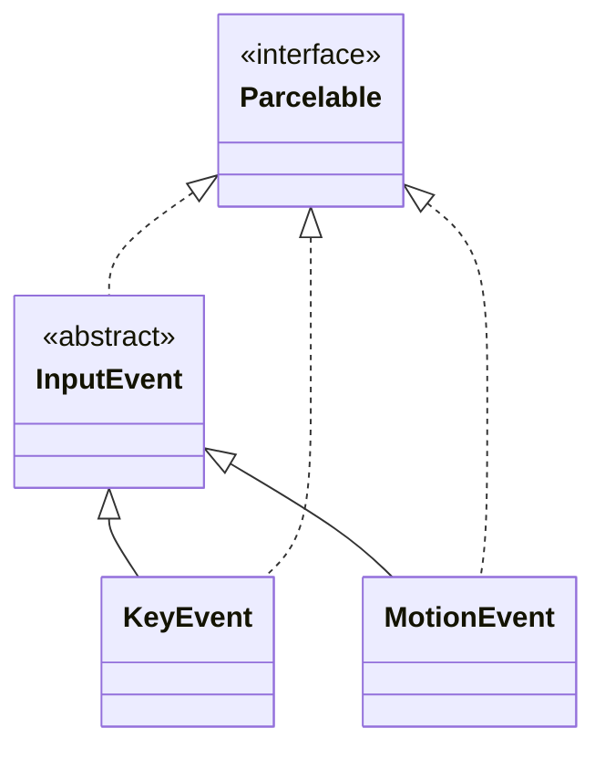
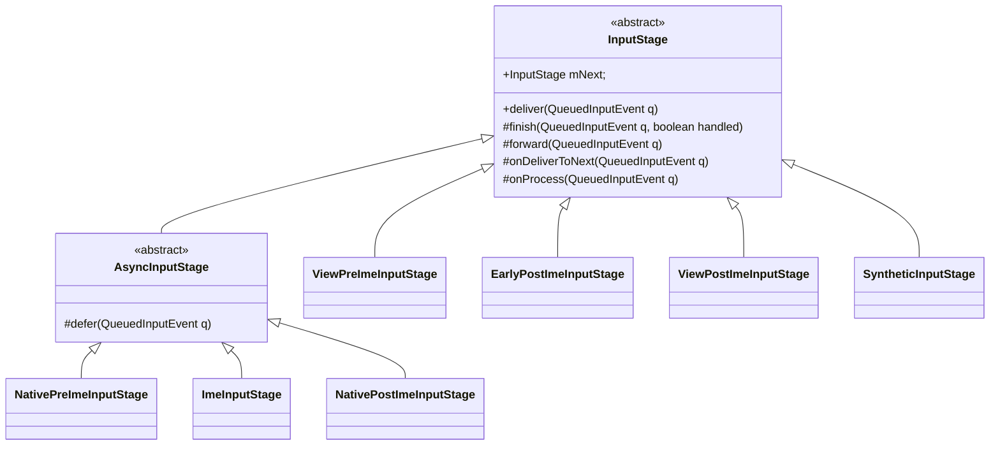
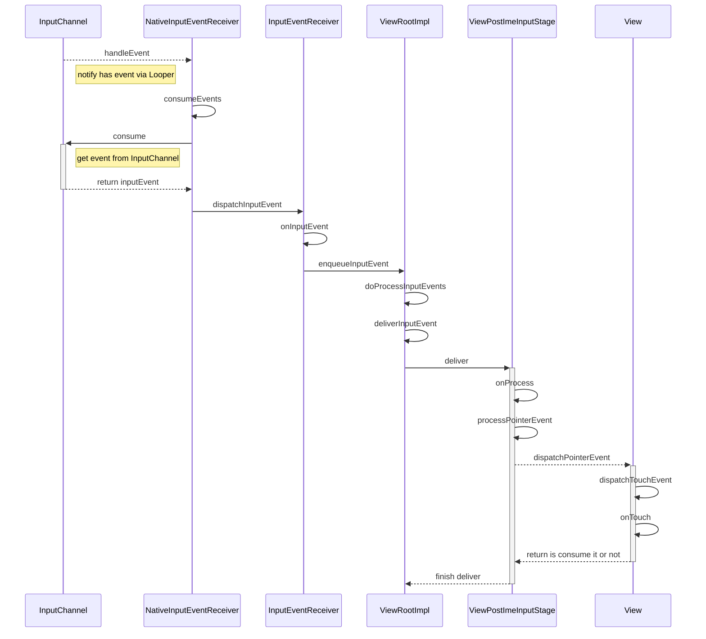

对于应用开发者的我们来说，经常会处理按钮点击，键盘输入等事件，而我们的处理一般都是在Activity中或者View中去做的。我们在上一篇文章中分析了View和Activity与Window的关系，其中的ViewRootImpl和我们的事件传递息息相关，上文未能分析，本文将对其进行分析。

<!--more-->

### 事件介绍
事件是什么呢，广义上事件的发生可能在软件也可能在硬件层，在Android设备当中，我们会有可能有键盘触发，触摸触发，鼠标触发的各种事件。我们关注的通常有两种事件：
按键事件（KeyEvent)：
这种色包括物理的按键，Home键，音量键，也包括软键盘触发的事件。
触摸事件（TouchEvent):
手指在屏幕上触摸触发的事件，可能是点击，也可能是拖动。

对于按键事件，一般有`ACTION_DOWN`和`ACTION_UP`两种状态，对于`KeyEvent`所支持的所有keyCode，我们都可以在`KeyEvent`当中找到。

而对于触摸事件来说，除了`DOWN`和`UP`两种状态之外，还有`ACTION_MOVE`，`ACTION_CANCEL`等状态。

应用层的事件类图如下图所示：


###  事件传递到View
我们一般处理View的onClick事件，而这个事件是在View的`onTouchEvent`中进行处理并执行的，在View中我们可以向上追溯到`dispatchPointerEvent`方法当中，这个方法就是外部向View传递事件的调用。我们知道Android的UI界面中的所有View是一个树形的结构，因此这些事件也就会通过`dispatchTouchEvent`一层一层的往下传，从而每一个View都能够接收到事件，并决定是否处理。

而`dispatchPointerEvent`是在`ViewRootImpl`当中调用，代码如下：
```java
private int processPointerEvent(QueuedInputEvent q) {  
    final MotionEvent event = (MotionEvent)q.mEvent;  
    ...
    boolean handled = mView.dispatchPointerEvent(event);  
    maybeUpdatePointerIcon(event);  
    maybeUpdateTooltip(event);  
    ...
    return handled ? FINISH_HANDLED : FORWARD;  
}
```

在Activity中，它的根视图为`DecorView`，`ViewRootImpl`在执行它的`dispatchPointerEvent`方法，它再向下把触摸事件依次向下传递。

除了触摸事件，按键事件也是类似，ViewRootImpl当中会调用View的`dispatchKeyEvent`方法，View当中会做相应的处理或者向下传递。

### ViewRootImpl中对事件的处理
对于`ViewRootImpl`当中是如何获取事件，并且向后传递的，我们这里以触摸事件为主进行分析，其他事件也类似。

在`ViewRootImpl`中，定义写一些内部类，大概如下：


上面这几个类就`ViewRootImpl`中处理事件的类，其初始化代码如下：
```java
//ViewRootImpl.java
public void setView(...) {
	...
	CharSequence counterSuffix = attrs.getTitle();  
	mSyntheticInputStage = new SyntheticInputStage();  
	InputStage viewPostImeStage = new ViewPostImeInputStage(mSyntheticInputStage);  
	InputStage nativePostImeStage = new NativePostImeInputStage(viewPostImeStage,  
        "aq:native-post-ime:" + counterSuffix);  
	InputStage earlyPostImeStage = new EarlyPostImeInputStage(nativePostImeStage);  
	InputStage imeStage = new ImeInputStage(earlyPostImeStage,  
        "aq:ime:" + counterSuffix);  
	InputStage viewPreImeStage = new ViewPreImeInputStage(imeStage);  
	InputStage nativePreImeStage = new NativePreImeInputStage(viewPreImeStage,  
        "aq:native-pre-ime:" + counterSuffix);  
  
	mFirstInputStage = nativePreImeStage;  
	mFirstPostImeInputStage = earlyPostImeStage;
}
```
以上代码创建了多个`InputStage`，它们一起组成了输入事件处理的流水线。其中`ViewPostImeInputStage`中就会处理与触摸相关的事件，它的`onProcess`方法代码如下：
```java
protected int onProcess(QueuedInputEvent q) {  
    if (q.mEvent instanceof KeyEvent) {  
        return processKeyEvent(q);  
    } else {  
        final int source = q.mEvent.getSource();  
        if ((source & InputDevice.SOURCE_CLASS_POINTER) != 0) {  
            return processPointerEvent(q);  
        } else if ((source & InputDevice.SOURCE_CLASS_TRACKBALL) != 0) {  
            return processTrackballEvent(q);  
        } else {  
            return processGenericMotionEvent(q);  
        }  
    }  
}
```

可以看到，当我们的输入源为`POINTER`，触摸屏和鼠标的触发都是这一类。这个时候就会执行上面我们提到的 `processPointerEvent`方法，之后事件也就会传递到`View`当中。

这里我们知道了是通过`InputStage`的流水线拿到的事件，但是这个事件从何处来的呢，我们需要继续向上溯源。

### ViewRootImpl从何处获得事件

关于这一点，我们仍然需要关注`ViewRootImpl`的`setView`方法中的如下代码：

```java
//VieRootImpl.java
InputChannel inputChannel = null;  
if ((mWindowAttributes.inputFeatures  
        & WindowManager.LayoutParams.INPUT_FEATURE_NO_INPUT_CHANNEL) == 0) {  
    inputChannel = new InputChannel();  
}
...
res = mWindowSession.addToDisplayAsUser(mWindow, mWindowAttributes,  
        getHostVisibility(), mDisplay.getDisplayId(), userId,  
        mInsetsController.getRequestedVisibilities(), inputChannel, mTempInsets,  
        mTempControls, attachedFrame, compatScale);
...
if (inputChannel != null) {  
    
    mInputEventReceiver = new WindowInputEventReceiver(inputChannel,  
            Looper.myLooper());  
  
}

```

在这里，我们创建了一个`InputChannel`,但是我们创建的`InputChannel`仅仅是java层的一个类，没法去获取到事件，随后我们调用`WindowSession`的`addToDisplayAsUser`他就会获得`mPtr`，也就是Native层的`InputChannel`，具体内容随后再看相关代码。在15行，这里创建了一个`WindowInputEventReceiver`，它的参数为`inputChannel`和`Looper`，这里一起看一下`InputEventReceiver`的构造方法，代码如下：
```java
public InputEventReceiver(InputChannel inputChannel, Looper looper) {  
    mInputChannel = inputChannel;  
    mMessageQueue = looper.getQueue();  
    mReceiverPtr = nativeInit(new WeakReference<InputEventReceiver>(this),  
            inputChannel, mMessageQueue);  
  
    mCloseGuard.open("InputEventReceiver.dispose");  
}
```

### InputEventReceiver的初始化
这里主要是调用了`nativeInit`方法，并且获取到`mReceivePtr`，native的代码在`android_view_InputEventReceiver.cpp`当中：
```c++
static jlong nativeInit(JNIEnv* env, jclass clazz, jobject receiverWeak,  
        jobject inputChannelObj, jobject messageQueueObj) {  
    std::shared_ptr<InputChannel> inputChannel =  
            android_view_InputChannel_getInputChannel(env, inputChannelObj);  //获取Native成的InputChannel
    sp<MessageQueue> messageQueue = android_os_MessageQueue_getMessageQueue(env, messageQueueObj);  //获取native层的消息队列

    sp<NativeInputEventReceiver> receiver = new NativeInputEventReceiver(env,  
            receiverWeak, inputChannel, messageQueue);  
    status_t status = receiver->initialize();  
    receiver->incStrong(gInputEventReceiverClassInfo.clazz); // 增加引用计数
    return reinterpret_cast<jlong>(receiver.get());  
}
```

在上面的代码中，先是分别获取了Native层的InputChannel和MessageQueue，之后创建了`NativeInputEventReceiver`，并且调用了它的`initialize`方法：
```c++
status_t NativeInputEventReceiver::initialize() {  
    setFdEvents(ALOOPER_EVENT_INPUT);  
    return OK;  
}
```

内部调用了`setFdEvents`方法，参数`ALOOPER_EVENT_INPUT`，这个参数表示监听文件描述符的读操作，其内部代码如下：
```c++
void NativeInputEventReceiver::setFdEvents(int events) {  
    if (mFdEvents != events) {  
        mFdEvents = events;  
        int fd = mInputConsumer.getChannel()->getFd();  
        if (events) {  
            mMessageQueue->getLooper()->addFd(fd, 0, events, this, nullptr);  
        } else {  
            mMessageQueue->getLooper()->removeFd(fd);  
        }  
    }  
}
```

这里就是拿到`InputChannel`的文件描述符，并且添加到Looper中去监听它的输入事件。我们暂时不会去阅读硬件层面的触发，以及事件如何发送到`InputChannel`当中，这里就大胆的假设，`InputChannel`当中有一个文件描述符，当有事件发生时候，会写入到这个文件当中去。而文件变化，Looper就会收到通知，事件也就发送出来了。

### NativeInputEventReceiver 接收事件并分发

这个时候我们可以看一下`NativeInputEventReceiver`所实现的`LooperCallback`的`handleEvent`方法，代码如下：
```c++
int NativeInputEventReceiver::handleEvent(int receiveFd, int events, void* data) {  

    constexpr int REMOVE_CALLBACK = 0;  
    constexpr int KEEP_CALLBACK = 1;  

    if (events & ALOOPER_EVENT_INPUT) {  
        JNIEnv* env = AndroidRuntime::getJNIEnv();  
        status_t status = consumeEvents(env, false /*consumeBatches*/, -1, nullptr);  
        mMessageQueue->raiseAndClearException(env, "handleReceiveCallback");  
        return status == OK || status == NO_MEMORY ? KEEP_CALLBACK : REMOVE_CALLBACK;  
    }  
    ... 
    return KEEP_CALLBACK;  
}
```

其中核心代码如上，就是判断如果事件为`ALOOPER_EVENT_INPUT`，则会调用`consumeEvents`方法，代码如下：
```c++
status_t NativeInputEventReceiver::consumeEvents(JNIEnv* env,  
        bool consumeBatches, nsecs_t frameTime, bool* outConsumedBatch) {  
    ...
    ScopedLocalRef<jobject> receiverObj(env, nullptr);  
    bool skipCallbacks = false;  
    for (;;) {  
        uint32_t seq;  
        InputEvent* inputEvent;  
  
        status_t status = mInputConsumer.consume(&mInputEventFactory,  
                consumeBatches, frameTime, &seq, &inputEvent);  
        ...    
        assert(inputEvent);  
  
        if (!skipCallbacks) {  
            if (!receiverObj.get()) {  
                receiverObj.reset(jniGetReferent(env, mReceiverWeakGlobal));  
                if (!receiverObj.get()) {  
                    ...
                    return DEAD_OBJECT;  
                }  
            }  
  
            jobject inputEventObj;  
            switch (inputEvent->getType()) {  
            case AINPUT_EVENT_TYPE_MOTION: {  
                MotionEvent* motionEvent = static_cast<MotionEvent*>(inputEvent);  
                if ((motionEvent->getAction() & AMOTION_EVENT_ACTION_MOVE) && outConsumedBatch) {  
                    *outConsumedBatch = true;  
                }  
                inputEventObj = android_view_MotionEvent_obtainAsCopy(env, motionEvent);  
                break;  
            }  
            ...
            default:  
                assert(false); // InputConsumer should prevent this from ever happening  
                inputEventObj = nullptr;  
            }  
  
            if (inputEventObj) {  
                env->CallVoidMethod(receiverObj.get(),  
                        gInputEventReceiverClassInfo.dispatchInputEvent, seq, inputEventObj);  
                ...
                env->DeleteLocalRef(inputEventObj);  
            } else {  
                ...
            }  
        }  
    }  
}
```

上面的代码做过简化，switch的case只保留了一个。首先在第10行，我们看到这里调用了`mInputConsumer`的`consume`方法。这个`InputConsumer`是在Receiver创建的时候创建它，它用于到`InputChannel`中获取消息，并且按照类型包装成`InputEvent`的具体子类，并写入到`inputEvent`当中。在后面的Switch判断处，就可以根据它的类型做处理，从而封装成java类型的InputEvent。而`receiverObj`在第17行，通过`jniGetReferent`拿到java层的`InputEventReceiver`的引用，在41行调用了它的`dispatchInputEvent`方法，从而调用了java层的同名方法，代码如下：
```java
private void dispatchInputEvent(int seq, InputEvent event) {  
    mSeqMap.put(event.getSequenceNumber(), seq);  
    onInputEvent(event);  
}
```

我们再到`WindowInputEventReceiver`中看`onInputEvent`方法：
```java
public void onInputEvent(InputEvent event) {  
    List<InputEvent> processedEvents;  
    try {  
        processedEvents =  
            mInputCompatProcessor.processInputEventForCompatibility(event);  
    } finally {  
    }  
    if (processedEvents != null) {  
        if (processedEvents.isEmpty()) {  
            finishInputEvent(event, true);  
        } else {  
            for (int i = 0; i < processedEvents.size(); i++) {  
                enqueueInputEvent(  
                        processedEvents.get(i), this,  
                        QueuedInputEvent.FLAG_MODIFIED_FOR_COMPATIBILITY, true);  
            }  
        }  
    } else {  
        enqueueInputEvent(event, this, 0, true);  
    }  
}
```

其中第4行代码，是为了兼容低版本设计的，只有应用的TargetSDKVersion小于23才会生效，这里我们就不关注它了。因此这里就只会执行第19行的代码，其内容如下：
```java
void enqueueInputEvent(InputEvent event,  
        InputEventReceiver receiver, int flags, boolean processImmediately) {  
    QueuedInputEvent q = obtainQueuedInputEvent(event, receiver, flags);  
    if (event instanceof MotionEvent) {  
        MotionEvent me = (MotionEvent) event;  
    }    
    QueuedInputEvent last = mPendingInputEventTail;  
    if (last == null) {  
        mPendingInputEventHead = q;  
        mPendingInputEventTail = q;  
    } else {  
        last.mNext = q;  
        mPendingInputEventTail = q;  
    }  
    mPendingInputEventCount += 1;  
    if (processImmediately) {  
        doProcessInputEvents();  
    } else {  
        scheduleProcessInputEvents();  
    }  
}
```

这里的代码，把我们的Event包装成一个`QueuedInputEvent`，并且放置到`mQueuedInputEventPool`这个链表中，具体可以自行看`obtainQueuedInputEvent`方法。而根据我们之前传递的参数，可以看到这里后面会调用到`doProcessInputEvents`方法：
```java
void doProcessInputEvents() {  
    // Deliver all pending input events in the queue.  
    while (mPendingInputEventHead != null) {  
        QueuedInputEvent q = mPendingInputEventHead;  
        mPendingInputEventHead = q.mNext;  
        if (mPendingInputEventHead == null) {  
            mPendingInputEventTail = null;  
        }  
        q.mNext = null;  
  
        mPendingInputEventCount -= 1;  	mViewFrameInfo.setInputEvent(mInputEventAssigner.processEvent(q.mEvent));  
  
        deliverInputEvent(q);  
    }  
	//除了我们收到调用来把事件队列的所有事件消费，还有一些消息本来是准备通过Handler发送消息来处理的，既然我们已经手动把所有消息都处理掉了，那么如果有等待处理的消息事件，也就不需要了，下面的代码就是把他们删掉
    if (mProcessInputEventsScheduled) {  
        mProcessInputEventsScheduled = false;  
        mHandler.removeMessages(MSG_PROCESS_INPUT_EVENTS);  
    }  
}
```
这里的代码主要就是遍历之前的链表，把每一条消息都取出来，并且调用`deliverInputEvent`方法来把它分发掉，同时会把它从链表中删除。
```java
private void deliverInputEvent(QueuedInputEvent q) {  
    try {  
        if (mInputEventConsistencyVerifier != null) {  
            try {  //事件一致性检查，避免外面传过来应用无法处理的事件
                mInputEventConsistencyVerifier.onInputEvent(q.mEvent, 0);  
            } finally {  
            }  
        }  
  
        InputStage stage;  //选择要使用的入口InputStage
        if (q.shouldSendToSynthesizer()) {  
            stage = mSyntheticInputStage;  
        } else {  
            stage = q.shouldSkipIme() ? mFirstPostImeInputStage : mFirstInputStage;  
        }  
        ...
        if (stage != null) {  
            handleWindowFocusChanged();  
            stage.deliver(q);  //InputStage 开始分发事件
        } else {  
            finishInputEvent(q);  
        }  
    } finally {  

    }  
}
```

在这个方法中，主要就是根据事件的属性选择入口的`InputStage`，之后调用它的`deliver`方法，在这个方法中就会按照链式调用，最终能够处理掉的一个`InputStage`会将它处理，也就是把事件分发到应用中去。

到这里我们就完成了从InputChannel中获取事件，并且通过InputEventReceiver传递到Java层，并且通过InputStage转发到应用的View当中。

### InputChannel的初始化
刚刚我们已经基本把事件处理在ViewRootImpl中的部分看完了，而我们在其中创建的InputChannel只是一个壳，想要看看它的真正的初始化，我们沿着之前调用的`addToDisplayAsUser`继续往后看。`IWindowSession`是一个AIDL定义的Binder服务，在它的定义中`InputChannel`使用了out进行修饰，表示它会被binder服务端修改，并写入数据。而这个`addToDisplayAsUser`方法内部最终会调用WMS的`addWindow`方法，其中和InputChannel相关代码如下：
```java
final WindowState win = new WindowState(this, session, client, token, parentWindow,  
        appOp[0], attrs, viewVisibility, session.mUid, userId,  
        session.mCanAddInternalSystemWindow);
        final boolean openInputChannels = (outInputChannel != null  
        && (attrs.inputFeatures & INPUT_FEATURE_NO_INPUT_CHANNEL) == 0);  
if  (openInputChannels) {  
    win.openInputChannel(outInputChannel);  
}
```

这里`outInputChannel`就是我们从客户端传过来的那个`InputChannel`的壳，随后便调用了`WindowState`的`openInputChannel`方法，代码如下：
```java
void openInputChannel(InputChannel outInputChannel) {   
    String name = getName();   //获取window的name
    mInputChannel = mWmService.mInputManager.createInputChannel(name);  //创建
    mInputChannelToken = mInputChannel.getToken();  
    mInputWindowHandle.setToken(mInputChannelToken);  
    mWmService.mInputToWindowMap.put(mInputChannelToken, this);  
    if (outInputChannel != null) {  
        mInputChannel.copyTo(outInputChannel);  //将Native Channel写入我们传入的InputChannel
    } else {  
    }  
}
```
这里就是调用`InputManager`去创建`InputChannel`，并且把它和我们的WIndow关联，以及保存到我们传入的InputChannel当中，这样我们的View层面就可以通过InputChannel获取到事件了。`InputManagerService`创建InputChannel的部分这里就不讨论了，留待以后讨论。

### 总结
到此为止，就分析完了应用侧从WMS到View，如何初始化InputEventReceiver，InputEventReceiver和InputChannel关联起来，事件如何从InputChannel一直传递到我们的View的了。


之前的分析涉及到了InputChannel的初始化和InputEventReceiver的初始化，直接看可以会比较绕人，上面从事件分发角度画了一下事件从InputChannel一直流转到View的一个时序图，希望对于你理解这个流程有所理解。如果哪里存在疏漏，也欢迎读者朋友们评论指点。

